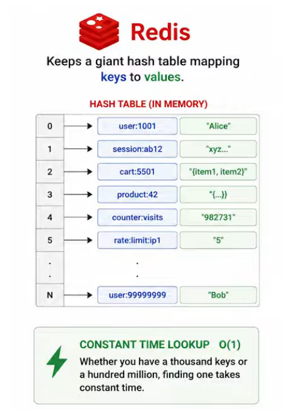
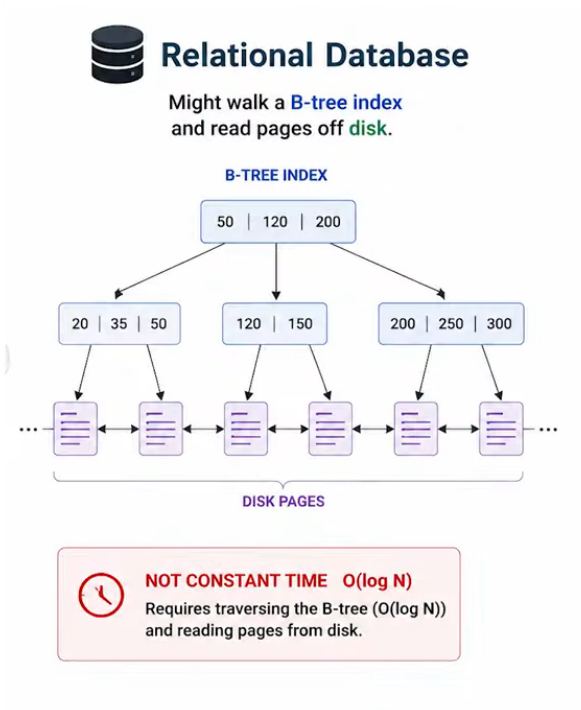
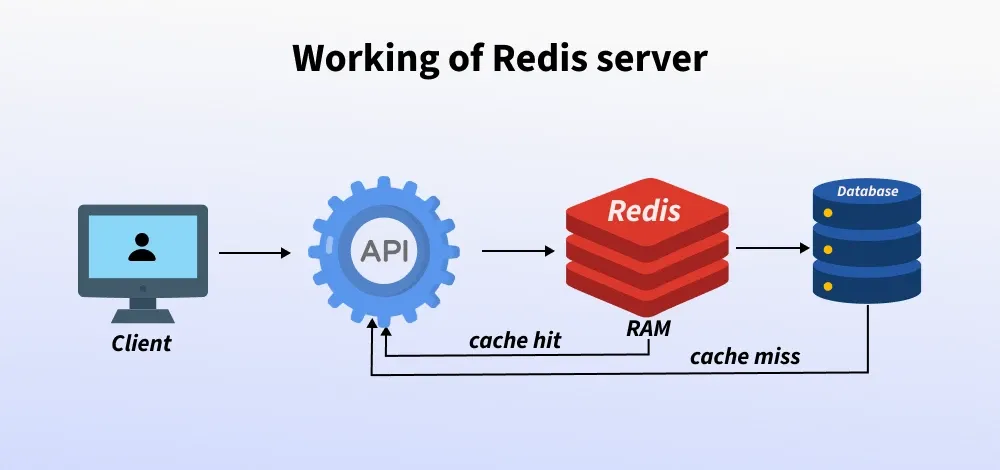
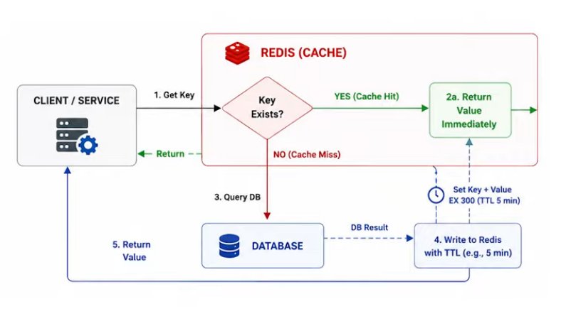
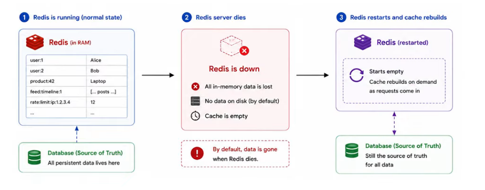

## install docker-desktop

> docker run --name my-redis -p 6379:6379 -d redis
```
PS C:\WINDOWS\System32> docker run --name my-redis -p 6379:6379 -d redis
Unable to find image 'redis:latest' locally
latest: Pulling from library/redis
3b3d036990fd: Pull complete
5096a4b992f4: Pull complete
b682f1c4b938: Pull complete
12cf9316ae87: Pull complete
f6e607ad0f52: Pull complete
e95a6c7ea7d4: Pull complete
4f4fb700ef54: Pull complete
45983244b0aa: Download complete
5457d5da3ec8: Download complete
Digest: sha256:2838d5524559494f6f1cd66e97e76b200d64a633a8614200620755ed395daf32
Status: Downloaded newer image for redis:latest
22e95c24fbd119ad437b47388b589cbdca99a88bd58774f01a0a32c53aace3a2
PS C:\WINDOWS\System32>
```

then in desktop app
you see container running at http://localhost:6379/ (but it cant connect by web browser as its dont have HTML so do by redis-cli)

click on my-redis container
go to exec then type redis-cli 

> redis-cli
127.0.0.1:6379> ping
PONG
127.0.0.1:6379>

ping gives pong TESTED


## Why Redis

> like HashMap data structure But every instance will have its own giant HashMap(HashTable In-Memory key-Val) But Redis is Ultra fast Single One Automic Consistent View of Data 

 vs 

#### Redis (Remote Dictionary Server) is an in-memory database that stores data in RAM instead of disk, making it extremely fast. It is mainly used to cache frequently used data and reduce the load on the main database, which improves system performance and response time.
#### Stores frequently accessed data so applications can retrieve it quickly without querying the main database, improving performance and response time.
#### Used to store user sessions for fast authentication and helps manage queues, leaderboards, and analytics in applications requiring quick updates.

 or 

### In Case failure


```
import redis
r = redis.Redis(host='localhost', port=6379, db=0)

r.set('name', 'Alia')
print(r.get('name').decode('utf-8'))  

r.set('name', 'Riya')
print(r.get('name').decode('utf-8')) 

r.delete('name')
print(r.get('name'))  
```

## Use Cases of Redis
#### Redis is useful when an application needs very fast data access and frequent database queries can slow down the system. It is commonly used to store temporary or frequently accessed data in memory so that the main database does not need to be queried every time.
#### Caching Frequently Used Data: If an application repeatedly queries a database like MySQL for the same data, the results can be stored in Redis. Instead of waiting 100–1000 ms for a database response, the application can fetch the cached result from Redis in a few milliseconds.
#### Session Management: Redis can store user sessions for web applications, allowing quick access to login or session data.
Real-time Applications: It is useful for leaderboards, queues, notifications, and chat systems that require very fast updates.
#### Example: In a messaging application, Redis can store the last few messages of a conversation using its list data structure so that users can quickly see recent messages without repeatedly querying the main database.


# Redis Interview Questions & Answers

### 1. What is Redis and why is it used?
<details>
<summary><b>Click to view Answer</b></summary>

Redis is an in-memory data structure store that supports different data structures such as strings, hashes, lists, sets, and sorted sets. We use it because it provides high performance for both reads and writes by keeping data in memory, which is perfect for scenarios like caching, session management, pub/sub applications, and leaderboards.
</details>

---

### 2. How does Redis differ from traditional databases like MySQL?
<details>
<summary><b>Click to view Answer</b></summary>

Redis differs from traditional databases because it primarily operates in-memory, which allows for much faster data access. Unlike MySQL, which is disk-based and offers a wide range of SQL operations for CRUD, Redis supports basic operations suited for accessing and manipulating key-value data quickly.
</details>

---

### 3. What are Redis hashes?
<details>
<summary><b>Click to view Answer</b></summary>

Redis hashes are a type of data structure that store mappings of string fields to string values. I use hashes when I need to represent objects, for example, storing the attributes of a user, because they are memory efficient.
</details>

---

### 4. Can Redis be used in a multi-threaded application, and how does it handle concurrency?
<details>
<summary><b>Click to view Answer</b></summary>

Redis is single-threaded, which simplifies the architecture by avoiding concurrency issues common in multi-threaded applications. It handles concurrency by using non-blocking I/O multiplexing and atomic operations to serve multiple clients.
</details>

---

### 5. What is pub/sub in Redis?
<details>
<summary><b>Click to view Answer</b></summary>

Pub/sub in Redis refers to the publish/subscribe messaging paradigm where producers (publishers) send messages that are not directed to specific receivers but are instead categorized into channels. Consumers (subscribers) can subscribe to channels and receive messages sent to those channels. I use this feature for implementing real-time messaging services.
</details>

---

### 6. How do you ensure persistence in Redis?
<details>
<summary><b>Click to view Answer</b></summary>

Redis provides two mechanisms for persistence: RDB (Redis Database Backups) and AOF (Append Only File). I typically configure both for data durability: RDB for point-in-time snapshots of the data, and AOF to log every write operation received by the server, which can be replayed to reconstruct the database.
</details>

---

### 7. Explain the concept of Redis transactions.
<details>
<summary><b>Click to view Answer</b></summary>

Redis transactions allow the execution of a group of commands in a single atomic step. Using commands like MULTI, EXEC, DISCARD, and WATCH, I can group commands so that either all of them succeed or none. This ensures integrity and atomicity without traditional transactional controls like rollbacks.
</details>

---

### 8. What are the main differences between RDB and AOF?
<details>
<summary><b>Click to view Answer</b></summary>

The main difference between RDB and AOF in Redis is their approach to persistence. RDB takes snapshots at specified intervals, which is efficient and fast but can result in data loss for changes made since the last snapshot. AOF, however, logs every write operation as it happens, which provides a higher level of durability but can be slower and result in larger files.
</details>

---

### 9. How can you scale Redis?
<details>
<summary><b>Click to view Answer</b></summary>

Scaling Redis can be achieved through various methods, such as replication, using Redis Sentinel for high availability, and clustering through Redis Cluster to distribute data across multiple nodes. I often use replication to create read replicas that help distribute read load.
</details>

---

### 10. What are Redis data types and their use cases?
<details>
<summary><b>Click to view Answer</b></summary>

Redis supports data types like strings (for storing text or binary data), lists (for collections of elements sorted by insertion order), sets (for unordered collections of unique strings), and sorted sets (similar to sets but where every member has a score). Each type fits different needs; for example, I use lists for queues, sets for unique collections, and sorted sets for leaderboards.
</details>

---

### 11. Explain how Redis uses keys?
<details>
<summary><b>Click to view Answer</b></summary>

In Redis, keys are used to access the data stored in various structures. Keys are binary safe, which means they can be any binary sequence, including strings. Proper key naming and management are crucial for maintaining efficient access and organization.
</details>

---

### 12. What is Key Eviction, and how is it configured?
<details>
<summary><b>Click to view Answer</b></summary>

Key eviction in Redis occurs when the memory limit set is reached, and Redis needs to remove keys to make room for new writes. I configure key eviction policies based on the specific needs of the application, like volatile-lru (least recently used among keys with an expire set) or allkeys-lru (least recently used among all keys), depending on whether I prioritize data with expiry times or not.
</details>

---

### 13. How does Redis manage memory?
<details>
<summary><b>Click to view Answer</b></summary>

Redis manages memory through its allocator (which can be jemalloc or libc) and internally through data structures optimized for low overhead. It provides direct control over memory usage through configuration settings that define limits and eviction policies.
</details>

---

### 14. What is Redis clustering, and why is it important?
<details>
<summary><b>Click to view Answer</b></summary>

Redis Cluster provides a way to run a Redis installation where data is automatically sharded across multiple Redis nodes. It's important because it allows for data partitioning, which helps in scaling out the database across multiple machines, enhancing performance and availability.
</details>

---

### 15. Describe a scenario where Redis is not the appropriate choice.
<details>
<summary><b>Click to view Answer</b></summary>

Redis might not be suitable for applications that require durable storage with complex transaction support or where the dataset size exceeds the memory capacity of the servers. In such cases, a disk-based database with support for complex transactions might be more appropriate.
</details>

---

### 16. How can you monitor and debug Redis performance issues?
<details>
<summary><b>Click to view Answer</b></summary>

Monitoring and debugging Redis can be effectively done using tools like Redis CLI's monitor command to watch commands being executed in real-time, slowlog to log slow operations, and info for statistics about operation performance. External monitoring tools like Prometheus can also be integrated for detailed analysis.
</details>

---

### 17. What security features does Redis offer?
<details>
<summary><b>Click to view Answer</b></summary>

Redis offers basic security features like client authentication (via requirepass directive), command renaming or disabling (to avoid dangerous commands being used), and encrypted connections (using SSL in newer versions). However, for maximum security, it should be run in a trusted network environment.
</details>

---

### 18. Explain how Lua scripting is used in Redis.
<details>
<summary><b>Click to view Answer</b></summary>

Lua scripting in Redis allows for atomic execution of complex operations on the server. I use Lua scripts to perform multiple operations on different keys in a single atomic step, reducing network round trips and enhancing transactional integrity.
</details>

---

### 19. How do you handle caching in a distributed environment using Redis?
<details>
<summary><b>Click to view Answer</b></summary>

In a distributed environment, I handle caching by setting up Redis instances as a caching layer in front of my database. Using consistent hashing to distribute keys across the cache nodes ensures even load distribution and reduces cache misses.
</details>

---

### 20. What is the impact of persistence settings on Redis performance?
<details>
<summary><b>Click to view Answer</b></summary>

The choice between RDB and AOF can significantly affect Redis performance. RDB is generally faster and consumes less CPU when saving snapshots less frequently, but at the risk of losing some data. AOF provides better data durability but can impact performance due to the cost of logging every command.
</details>

---

### 21. Describe Redis Sentinel and its role.
<details>
<summary><b>Click to view Answer</b></summary>

Redis Sentinel provides high availability for Redis. It monitors Redis instances, detecting failures and handling automatic failover to a replica. This is crucial for production environments where minimal downtime is essential.
</details>

---

### 22. What are Redis Modules, and how do they enhance functionality?
<details>
<summary><b>Click to view Answer</b></summary>

Redis Modules extend Redis's capabilities beyond its original data types and commands. Modules like RediSearch, RedisGraph, and RedisJSON add functionalities such as full-text search, graph databases, and JSON handling, allowing Redis to be used for a broader range of use cases.
</details>

---

### 23. How do you optimize Redis for high read volumes?
<details>
<summary><b>Click to view Answer</b></summary>

For high read volumes, I optimize Redis by setting up replication with one master and multiple read replicas. Using read replicas allows the read load to be distributed effectively across the cluster.
</details>


