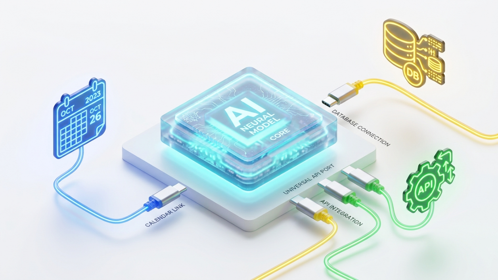
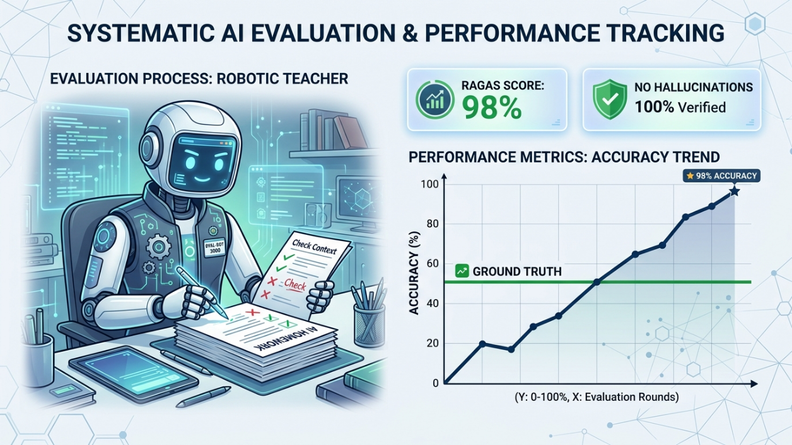
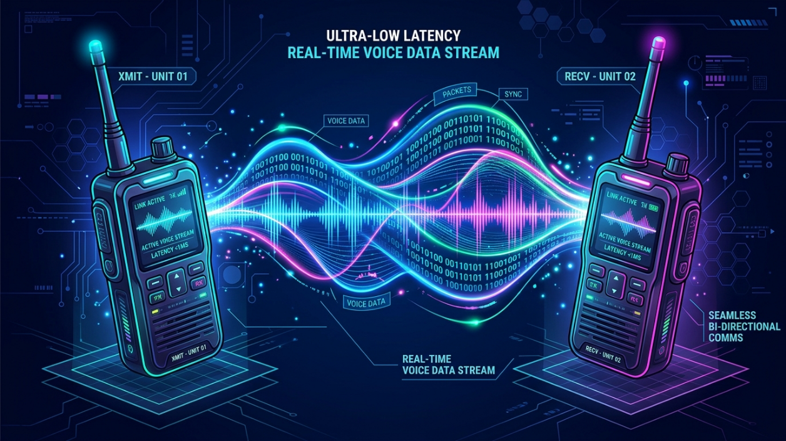
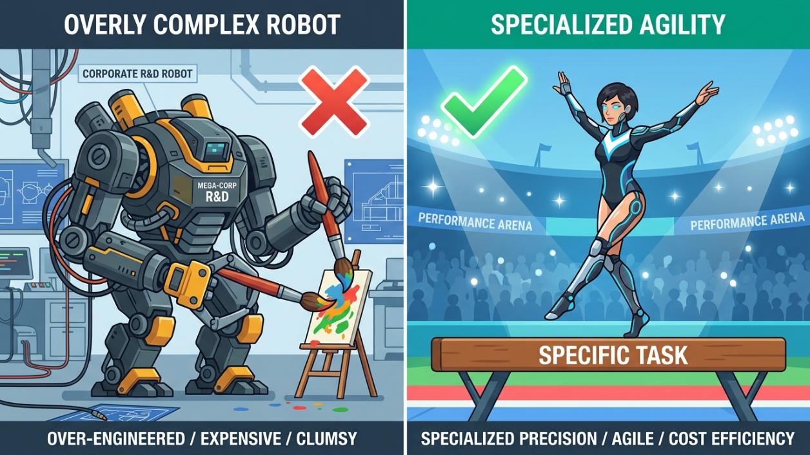

# 🚀 6 Production-Grade AI Engineering Blueprints (2026 Edition)

An enterprise-ready architectural deep dive optimized for senior AI Software Engineering interviews and academic system-design assessments.

---

## 🛠️ Project 1: Model Context Protocol (MCP) Server

### 🧠 Mental Model

**"The USB-C Port for AI"** — A decoupled, bidirectional gateway interface that isolates client applications from underlying tools and data mutations (1:06).

```
┌──────────────┐         JSON-RPC          ┌──────────────┐      Native DB Driver      ┌─────────────────┐
│  MCP Client  │ ────────────────────────► │  MCP Server  │ ─────────────────────────► │ Secure Resource │
│ (Cursor/LLM) │ ◄──────────────────────── │ (Your App)   │ ◄───────────────────────── │ (SQLite/APIs)   │
└──────────────┘   Context / Schema Wire   └──────────────┘   Read/Write/Fetch Pipe    └─────────────────┘
```

### 📋 Deep-Dive Architecture & Core Engineering Concepts

**The Paradigm Shift:** Classic agent tool calling relies on monolithic code integrations or fragile, API-specific function-calling loops. The Model Context Protocol (MCP)—introduced by Anthropic in late 2024—standardises these tools (0:59). It separates the reasoning engine (client) from data-layer implementation details (server) using a unified architectural design (0:59).

**Protocol Core Primitives:**

- **Resources:** Readable, deterministic data strings exposed to the host model (e.g., database schemas, system log trails).
- **Tools:** Executable functions that the model can invoke to mutate state or pull external network resources (0:59).
- **Prompts:** Pre-structured context templates exposed to help anchor the model's intent.

**Under the Hood Communication:** Communication operates over standardized, state-neutral JSON-RPC 2.0 over standard inputs/outputs (stdio) or Server-Sent Events (SSE). This ensures strict language agnostic interoperability between Python and TypeScript code stacks (1:48).

### 💻 Production Reference Implementation

```python
# mcp_server.py
import json
import sqlite3
from mcp.server.fastmcp import FastMCP

# Instantiate production server context wrapper
mcp = FastMCP("Secure-Enterprise-Storage")

DB_PATH = "/var/data/analytics.db"

@mcp.resource("analytics://db_schema")
def get_db_schema() -> str:
    """Retrieves internal SQLite table definitions to guide LLM contextual schema generation."""
    conn = sqlite3.connect(DB_PATH)
    cursor = conn.cursor()
    cursor.execute("SELECT sql FROM sqlite_master WHERE type='table';")
    schema_rows = cursor.fetchall()
    conn.close()
    return "\n".join([row[0] for row in schema_rows if row[0]])

@mcp.tool()
def execute_readonly_query(sql_query: str) -> str:
    """Executes structural SQL queries against the local DB. Input must be raw SELECT statements only."""
    # Defend against malicious injections at the systems layer
    normalized = sql_query.strip().upper()
    if any(mutation in normalized for mutation in ["INSERT", "DROP", "DELETE", "UPDATE", "ALTER"]):
        return json.dumps({"error": "Security Restriction: Write mutations are rejected."})
        
    try:
        conn = sqlite3.connect(DB_PATH)
        cursor = conn.cursor()
        cursor.execute(sql_query)
        results = cursor.fetchall()
        columns = [description[0] for description in cursor.description]
        conn.close()
        return json.dumps([dict(zip(columns, row)) for row in results])
    except Exception as e:
        return json.dumps({"error": str(e)})

if __name__ == "__main__":
    # Runs the instance over stdio transport mechanism for native IDE hook integration
    mcp.run()
```

### 🎯 Enterprise Use-Cases & Application Targets

- Real-time querying of sandboxed data fabrics like university course databases or transaction ledgers (1:36).
- Building automated file-system routers that clean and catalog system documents locally.

### 🛡️ Production Edge-Cases & Security Hardening

**The Threat:** Data execution vulnerability through Prompt Injection. An agent could be manipulated into passing destructive mutations like DROP TABLE to the server tool payload.

**The Mitigation:** Enforce absolute read-only database connections (`connect('file:analytics.db?mode=ro', uri=True)`), apply input regex string blacklists, and enforce strict execution time-outs.


---

## 🔒 Project 2: Privacy-First Offline AI App

### 🧠 Mental Model

**"The Submarine"** — An isolated application designed to function at 100% capacity and handle highly secure calculations while completely submerged and severed from the outside internet (2:24).

```
┌────────────────────────────────────────────────────────────────────────┐
│ HOST MACHINE ENVIRONMENT BOUNDARY (Air-gapped)                         │
│                                                                        │
│  ┌──────────────────────┐   Local HTTP Loopback   ┌──────────────────┐ │
│  │ User UI Front-End    │ ──────────────────────► │  Ollama Daemon   │ │
│  │ (React/Python Script)│ ◄────────────────────── │  (Model Server)  │ │
│  └──────────────────────┘  Streamed Native Token  └────────┬─────────┘ │
│                                                            │           │
│                                                            ▼           │
│                                                   [Quantized Weights]  │
│                                                   [Gemma-2 / Llama3 ]  │
└────────────────────────────────────────────────────────────────────────┘
```

### 📋 Deep-Dive Architecture & Core Engineering Concepts

**System Constraints:** Regulated operational spheres (e.g., healthcare systems under HIPAA or financial trading floors) prohibit data transit to multi-tenant cloud gateways (2:01). The entire system design must rely on localized execution layers (2:13).

**Understanding Quantization (AWQ vs. GGUF):**

- **GGUF (GPT-Generated Unified Format):** Optimized for localized CPU-bound or mixed CPU/GPU inferences. It packages structural metadata and tensor weights into a single binary file.
- **AWQ (Activation-aware Weight Quantization):** Preserves model accuracy at low bitrates (4-bit/8-bit) by identifying and protecting critical "salient" weights (3:11). This reduces memory usage while maintaining reasoning capabilities.

**Context Eviction Management:** On-device compute environments face hardware memory limits. Local architectures need a way to manage context when a conversation grows too long. Using a Sliding Window Context Cache with Token Truncation keeps memory usage stable by dropping old messages.

### 💻 Production Reference Implementation

```python
# local_engine.py
import requests
import json

OLLAMA_ENDPOINT = "http://localhost:11434/api/generate"

def execute_isolated_inference(prompt: str, system_instruction: str) -> str:
    """Executes data processing against a local, quantized model endpoint over loopback."""
    payload = {
        "model": "gemma2:9b", # Optimized on-device model footprint
        "prompt": prompt,
        "system": system_instruction,
        "stream": True,
        "options": {
            "temperature": 0.0,      # Deterministic processing execution
            "num_ctx": 4096,         # Strict allocation of context memory window
            "num_predict": 512        # Limit generation lengths to preserve local resource bounds
        }
    }
    
    try:
        response = requests.post(OLLAMA_ENDPOINT, json=payload, stream=True)
        response.raise_for_status()
        
        full_response = []
        for line in response.iter_lines():
            if line:
                decoded_line = json.loads(line.decode('utf-8'))
                token = decoded_line.get("response", "")
                # Yield tokens live to keep the UI feeling fast and responsive
                full_response.append(token)
                
        return "".join(full_response)
    except requests.exceptions.ConnectionError:
        return "System Failure: Ensure Ollama daemon is running locally."

# Example Invocation
if __name__ == "__main__":
    clinical_note = "Patient exhibits acute hypertension. Prescribed 10mg Lisinopril."
    instruction = "Extract structural entity maps. Return JSON only. Do not output metadata or notes."
    print(execute_isolated_inference(clinical_note, instruction))
```

### 🎯 Enterprise Use-Cases & Application Targets

- Scanning local repositories of proprietary source code to catch bugs and architecture vulnerabilities (2:36).
- Processing sensitive legal discovery filings and summarizing health logs locally on edge machines (2:01).

### 🛡️ Production Edge-Cases & Security Hardening

**The Threat:** Resource exhaustion crashes caused by context memory growth. Running large inference loops can freeze background operating system processes.

**The Mitigation:** Pin memory limits inside the model loader, add system-level thread limits, and use strict token truncating on user inputs before processing.


---

## 📊 Project 3: RAG Pipeline with Evaluation & Telemetry

### 🧠 Mental Model

**"The AI Regression Test"** — Setting up an automated grading matrix to evaluate your AI pipeline's homework against an absolute ground-truth dataset, entirely eliminating human "vibes-based" evaluation (3:46).

```
User Query ───┬──► [ BM25 Lexical Parser ] ────┐
              │                                ├──► [ Cross-Encoder ] ──► Validated Context
              └──► [ Dense Vector Index ] ─────┘       (Re-Ranker)
                                                            │
                                                            ▼
                                                [ OpenTelemetry / Phoenix ]
                                                (Logs Faithfulness & Recall)
```

### 📋 Deep-Dive Architecture & Core Engineering Concepts

**The Production Pitfall:** Standard vector searches match items based on mathematical proximity in the embedding space (4:06). However, "closest vector match" does not automatically mean "most useful data snippet" for an LLM to answer a prompt (4:11).

**Hybrid Retrieval (Dense + Sparse):**

- **Dense Retrieval:** Captures semantic intent and conceptual matches via vector distance tracking.
- **Sparse Retrieval (BM25):** Matches exact keyword strings, codes, serial IDs, or specific product names using term frequency algorithms.
- **Cross-Encoder Re-Ranking:** Deep neural networks evaluate the exact semantic relationship between a query and a retrieved text block together. This provides a highly accurate relevance score, allowing you to filter out noisy or low-quality data chunks before prompting the LLM (5:03).

**The Evaluation Matrix:**

- **Faithfulness:** Is the generated answer derived only from the retrieved data chunks? (Catches hallucinations) (3:38).
- **Answer Relevance:** Does the generated text directly resolve the user's core question? (4:22).
- **Context Recall:** Did the retrieval step gather all the necessary data points required to answer the prompt? (4:22).

### 💻 Production Reference Implementation

```python
# rag_telemetry_pipeline.py
import uuid
from phoenix.trace import OpenInferenceTracer
from phoenix.trace.exporter.otlp import HttpOpenInferenceTraceExporter
from opentelemetry import trace as otel_trace
from opentelemetry.sdk.trace import TracerProvider
from opentelemetry.sdk.trace.export import SimpleSpanProcessor

# Setup enterprise OpenTelemetry logging stack for AI metrics
tracer_provider = TracerProvider()
otel_trace.set_tracer_provider(tracer_provider)
exporter = HttpOpenInferenceTraceExporter(endpoint="http://localhost:6006/v1/traces")
tracer_provider.add_span_processor(SimpleSpanProcessor(exporter))
tracer = otel_trace.get_tracer(__name__)

class TelemetryRAGSystem:
    def __init__(self, vector_store, bm25_index):
        self.vector_store = vector_store
        self.bm25_index = bm25_index

    def retrieve_hybrid_context(self, query: str) -> list:
        # Trace implementation via explicit telemetry spans
        with tracer.start_as_current_span("hybrid_retrieval") as span:
            span.set_attribute("query_text", query)
            
            # Step 1: Semantic Dense Pull
            dense_res = self.vector_store.similarity_search(query, k=5)
            # Step 2: Lexical Keyword Sparse Pull
            sparse_res = self.bm25_index.search(query, n=5)
            
            # Step 3: De-duplicate and combine candidates
            combined_candidates = list({doc.page_content: doc for doc in (dense_res + sparse_res)}.values())
            
            span.set_attribute("total_candidates_retrieved", len(combined_candidates))
            return combined_candidates

    def execute_pipeline(self, query: str) -> str:
        with tracer.start_as_current_span("rag_pipeline_execution") as span:
            context_docs = self.retrieve_hybrid_context(query)
            context_str = "\n".join([d.page_content for d in context_docs])
            
            # Mocking generation call step
            generation = f"Synthesized answer based on: {context_str[:50]}"
            
            span.set_attribute("input_context_length", len(context_str))
            span.set_attribute("pipeline_output", generation)
            return generation
```

### 🎯 Enterprise Use-Cases & Application Targets

- Automated internal customer service systems that answer technical product questions directly from engineering documentation manuals (4:00).
- Financial parsing engines that look up specific data points within quarterly business earnings reports.

### 🛡️ Production Edge-Cases & Security Hardening

**The Threat:** Data leakage from mixed access privileges. A user could craft a query that retrieves sensitive internal documents they are not authorized to view.

**The Mitigation:** Add strict metadata filters (e.g., `{"tenant_id": 451, "security_clearance": "level_1"}`) directly into the vector database query rather than relying on the LLM to sort it out later.


---

## 🤖 Project 4: Robust Multi-Agent System

### 🧠 Mental Model

**"The Corporate Review Pipeline"** — A multi-layered office workspace where a strict project manager intercepts a junior analyst's flawed notes, flags the mistakes, and forces them to rewrite the work rather than passing bad information to the client (5:27).

```
┌──────────────┐       Init Task        ┌──────────────┐
│ User Request │ ──────────────────────► │ Planner Node │ ◄──────────────────┐
└──────────────┘                        └──────┬───────┘                    │
                                                │                            │
                                                ▼                            │
                                         ┌──────────────┐                    │ Rewrite Request
                                         │  Researcher  │                    │ (Loop back if bad)
                                         └──────┬───────┘                    │
                                                │                            │
                                                ▼                            │
                                         ┌──────────────┐                    │
                                         │  Validator   │ ───────────────────┘
                                         └──────┬───────┘  Conditional Path Fail
                                                │
                                                ▼ Conditional Path Pass
                                         ┌──────────────┐
                                         │ Synthesizer  │ ──► [Structured Output]
                                         └──────────────┘
```

### 📋 Deep-Dive Architecture & Core Engineering Concepts

**The Compounding Error Vulnerability:** Linear prompt chains are fragile: if an early step returns inaccurate or missing data, subsequent steps inherit that error and amplify it (5:21).

**State Machine Orchestration:** Using LangGraph, you can structure an agent workflow as an explicit state machine graph (6:34). Processes run inside controlled loops where state transitions are managed by code, rather than letting the LLM guess what to do next (6:34).

**Deterministic Routing & Guardrails:** Instead of relying on open-ended chat configurations, runtime loops use clear validation scripts to verify data structures before passing inputs downstream (6:22).

### 💻 Production Reference Implementation

```python
# multi_agent_orchestrator.py
from typing import List, TypedDict, Literal
from langgraph.graph import StateGraph, END

class ResearchState(TypedDict):
    target_topic: str
    search_queries: List[str]
    raw_scraped_data: List[str]
    iteration_count: int
    validation_status: bool
    compiled_report: str

def planning_agent(state: ResearchState):
    """Generates execution plan queries based on target topic state values."""
    # Deterministic generation logic mock
    return {
        "search_queries": [f"{state['target_topic']} market cap", f"{state['target_topic']} competitors"],
        "iteration_count": state.get("iteration_count", 0) + 1
    }

def research_execution_agent(state: ResearchState):
    """Executes network calls against target search queries generated by planning agent."""
    latest_query = state["search_queries"][-1] if state["search_queries"] else "generic"
    # Mocking a transient tool failure (e.g. rate limit error hit)
    return {"raw_scraped_data": state.get("raw_scraped_data", []) + [f"Error 429: Rate Limit Exceeded for {latest_query}"]}

def state_validation_router(state: ResearchState) -> Literal["retry_loop", "continue_to_synthesis"]:
    """Evaluates data freshness and determines graph edge routing directions."""
    latest_data = state["raw_scraped_data"][-1] if state["raw_scraped_data"] else ""
    
    # Catch failure signatures and trigger automated self-correction loops
    if "Error 429" in latest_data or len(latest_data) < 50:
        if state["iteration_count"] < 3:
            return "retry_loop"
            
    return "continue_to_synthesis"

def synthesis_agent(state: ResearchState):
    """Compiles all verified data assets into the final markdown document."""
    return {"compiled_report": "# Market Intelligence Briefing\nVerified structural analysis content asset."}

# Build out the system graph architecture
workflow = StateGraph(ResearchState)
workflow.add_node("planner", planning_agent)
workflow.add_node("researcher", research_execution_agent)
workflow.add_node("synthesizer", synthesis_agent)

workflow.set_entry_point("planner")
workflow.add_edge("planner", "researcher")

# Inject the self-correction router directly after research tool outputs
workflow.add_conditional_edges(
    "researcher",
    state_validation_router,
    {
        "retry_loop": "planner",
        "continue_to_synthesis": "synthesizer"
    }
)
workflow.add_edge("synthesizer", END)
compiled_agent_system = workflow.compile()
```

### 🎯 Enterprise Use-Cases & Application Targets

- Automated competitive research scrapers that monitor competitor feature launches and pricing changes (5:58).
- Multi-step code generation systems that write, run, test, and automatically patch errors in software builds.

### 🛡️ Production Edge-Cases & Security Hardening

**The Threat:** Infinite execution loops. If an external API remains broken, the validator agent can get stuck in a continuous retry loop, draining API budgets rapidly.

**The Mitigation:** Set a strict max-counter limit (`state["iteration_count"] >= 3`) inside the conditional routing node to force-abort the loop and escalate to a graceful fallback state.


---

## 🎙️ Project 5: Real-Time Voice AI Study Coach

### 🧠 Mental Model

**"The Walkie-Talkie Walk"** — A continuous conversation where data is streamed back and forth in quick, low-latency bursts, rather than waiting for long, awkward silence periods before responding (7:04).

```
User Voice ──► [ Audio Chunk Stream ] ──► [ Whisper STT ] ──► [ Streaming LLM Engine ]
                                                                  │
                                                                  ▼
User Ear  ◄─── [ Audio Chunk Playback ] ◄─── [ Cartisia TTS ] ◄───────┘
```

### 📋 Deep-Dive Architecture & Core Engineering Concepts

**The Latency Challenge:** Traditional voice apps stitch steps together end-to-end: record entire file → send to Speech-To-Text API → wait for full LLM text generation → process Text-To-Speech → play file. This introduces an awkward 4-8 second delay that disrupts natural conversation.

**Chunk-Based Audio Streaming:** Audio inputs and outputs are processed as continuous binary stream chunks via persistent WebSockets or WebRTC channels.

**Architecture Components:**

- **STT (Speech-to-Text):** OpenAI Whisper or Groq API nodes process live incoming audio chunks on the fly (7:29).
- **Reasoning Engine:** A fast language model generates text tokens chunk by chunk, streaming them directly into the output layer as they appear.
- **TTS (Text-to-Speech):** High-speed engines like Cartisia or ElevenLabs accept incoming text tokens and instantly generate playable audio chunks, targeting a sub-200ms turnaround time (7:15).

### 💻 Production Reference Implementation

```python
# real_time_audio_bridge.py
import asyncio
import websockets
import json

CARTISIA_API_URL = "wss://://cartisia.com"
CARTISIA_API_KEY = "mock_api_key_for_production"

async def stream_text_to_voice_chunks(text_generator_stream):
    """Connects to a low-latency TTS socket and streams text tokens into playable voice chunks."""
    async with websockets.connect(f"{CARTISIA_API_URL}?api_key={CARTISIA_API_KEY}") as websocket:
        
        # Configure the target low-latency audio format
        config_handshake = {
            "context_id": "session-coaching-001",
            "model_id": "sonic-english",
            "voice": {"mode": "id", "id": "21m00Tcm4TlvDq8ikWAM"},
            "output_format": {"container": "raw", "encoding": "pcm_16000", "sample_rate": 16000}
        }
        await websocket.send(json.dumps(config_handshake))

        async def send_tokens_loop():
            # Process incoming LLM text tokens live as they generate
            for token in text_generator_stream:
                chunk_payload = {"text": token}
                await websocket.send(json.dumps(chunk_payload))
                await asyncio.sleep(0.02) # Simulate generator cadence
            
            # Send EOS flag once generation concludes
            await websocket.send(json.dumps({"status": "completed"}))

        async def receive_audio_loop():
            try:
                while True:
                    response = await websocket.recv()
                    data = json.loads(response)
                    if "audio" in data:
                        # Extract raw base64 audio byte chunks
                        raw_pcm_chunk = data["audio"]
                        # Push data to local audio hardware device line
                        _write_to_audio_output_buffer(raw_pcm_chunk)
                    if data.get("status") == "finished":
                        break
            except websockets.exceptions.ConnectionClosed:
                pass

        # Execute concurrent IO tasks over websocket pipe
        await asyncio.gather(send_tokens_loop(), receive_audio_loop())

def _write_to_audio_output_buffer(base64_audio):
    pass # Hardware device interface execution wrapper
```

### 🎯 Enterprise Use-Cases & Application Targets

- Automated hands-free interview prep coaches that talk through technical systems assessments out loud (6:47).
- Real-time customer support voice assistants that handle bookings and reservations fluently without keyboard inputs (7:04).

### 🛡️ Production Edge-Cases & Security Hardening

**The Threat:** User Interruption. If the user starts speaking while the AI is still playing audio, the AI will keep talking over them, ruining the flow of conversation.

**The Mitigation:** Implement an active Acoustic Echo Cancellation (AEC) listener on the input microphone loop. If user voice activity is detected during AI playback, immediately clear the output buffer and reset the generation stream.


---

## 🎯 Project 6: Task-Constrained Fine-Tuned Model

### 🧠 Mental Model

**"The Olympic Specialist"** — Training a lightweight athlete to do exactly one hyper-focused routine perfectly, rather than paying for a giant, expensive generalist for basic tasks (8:21).

```
[ Base Foundation Model ] (Llama-3-8B / Gemma-2B)
             │
             ├──► [ Apply LoRA Adapters ] (Freeze Base Weights)
             │
             ▼
  [ Fine-Tuned Specialist ] (Matches frontier accuracy on targeted format)
```

### 📋 Deep-Dive Architecture & Core Engineering Concepts

**The Economic/Scale Trade-off:** Running massive models (like GPT-4o) for high-volume, simple structured tasks creates unsustainably high API bills (8:21). Fine-tuning a smaller, open-source model allows it to match frontier performance on a specific task at a fraction of the inference cost (8:21).

**LoRA (Low-Rank Adaptation):** Instead of updates modifying all parameters across a deep neural network, LoRA freezes the original model weights and injects small, trainable rank decomposition matrices into the attention layers (8:48). This slashes trainable parameter counts by up to 99%, making training fast and inexpensive (8:48).

**QLoRA (Quantized LoRA):** Takes LoRA a step further by quantizing the base model down to a highly efficient 4-bit memory representation, allowing engineers to fine-tune large models on standard hardware or affordable cloud GPUs (8:48).

### 💻 Production Reference Implementation

```python
# train_lora_spec.py
# This blueprint uses Unsloth framework optimizations for fast training execution
from unsloth import FastLanguageModel
import torch
from datasets import Dataset

max_seq_length = 2048
dtype = None # Auto-detect GPU architecture settings
load_in_4bit = True # Enforce QLoRA 4-bit memory quantization configuration

# 1. Initialize model and efficient tokenizer wrapper assets
model, tokenizer = FastLanguageModel.from_pretrained(
    model_name = "unsloth/llama-3-8b-Instruct",
    max_seq_length = max_seq_length,
    dtype = dtype,
    load_in_4bit = load_in_4bit,
)

# 2. Inject LoRA parameter adaptation configurations
model = FastLanguageModel.get_peft_model(
    model,
    r = 16, # Target Rank sizing dimension (Determines capacity vs memory footprint)
    target_modules = ["q_proj", "k_proj", "v_proj", "o_proj", "gate_proj", "up_proj", "down_proj"],
    lora_alpha = 16,
    lora_dropout = 0, # Standardized optimized configurations
    bias = "none",
    use_gradient_checkpointing = "unsloth",
)

# 3. Format pristine calibration datasets
# Data purity is critical: 100 high-quality target records outperform 1000 noisy samples
training_dataset_format = [
    {"input": "ERR_502: Bad Gateway on DB", "output": "{'incident_severity': 'CRITICAL', 'routing_queue': 'INFRASTRUCTURE'}"},
    {"input": "UI_BUG: Button overlap on mobile", "output": "{'incident_severity': 'LOW', 'routing_queue': 'FRONTEND'}"}
]

def format_prompt_template(batch):
    texts = []
    for i, o in zip(batch["input"], batch["output"]):
        text = f"### System: Map inputs to JSON targets.\n### Input: {i}\n### Output: {o}"
        texts.append(text)
    return { "text" : texts }

dataset = Dataset.from_list(training_dataset_format).map(format_prompt_template, batched = True)

# Proceed to configure standard HuggingFace SFTTrainer nodes here...
```

### 🎯 Enterprise Use-Cases & Application Targets

- Training lightweight 7B models to perfectly convert unformatted text streams into strict, production-ready JSON schemas (8:15).
- Hardening specific corporate brand tones, operational behaviors, or unique vocabulary rules into customer-facing support models.

### 🛡️ Production Edge-Cases & Security Hardening

**The Threat:** Catastrophic Forgetting. Fine-tuning a model on a narrow task can degrade its general reasoning capabilities, causing it to fail at basic logic outside its training data.

**The Mitigation:** Always mix general-domain conversation datasets (like OpenOrca or ShareGPT) into your specialized training data, and run evaluation comparisons against the base model after training (9:27).


---

## 🎓 Systems Design Exam & Interview Prep Summary Check

When presenting these systems to engineering managers or technical panels, explicitly separate your answers into three architectural lenses:

1. **The Constraints Layer:** Explain why the architectural pattern was chosen over basic setups (e.g., rate limits, privacy laws, API costs) (2:06).

2. **The State & Data Layer:** Trace how information moves through your system, how components talk to each other, and where state variables are stored (6:34).

3. **The Telemetry & Verification Layer:** Show how you track performance and measure success (e.g., using automated grading frameworks or OpenTelemetry dashboards), proving your system is reliable enough for production deployment (3:27).