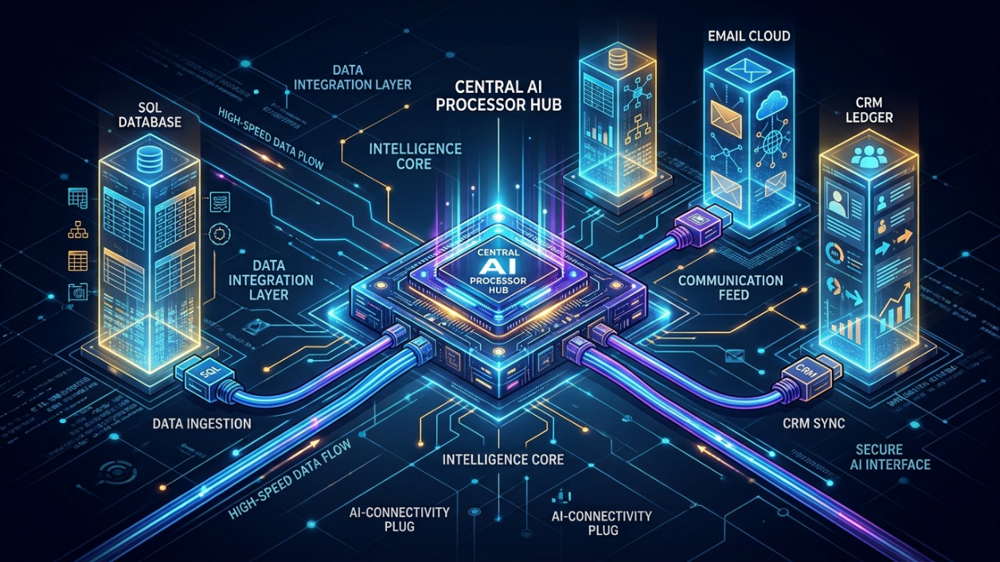
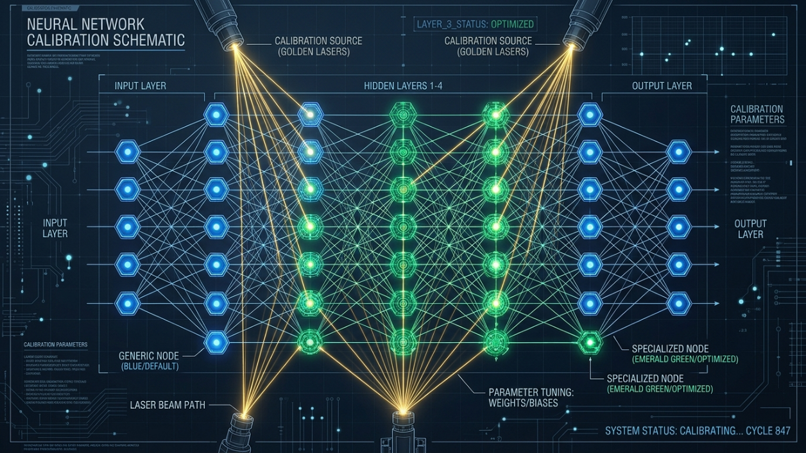
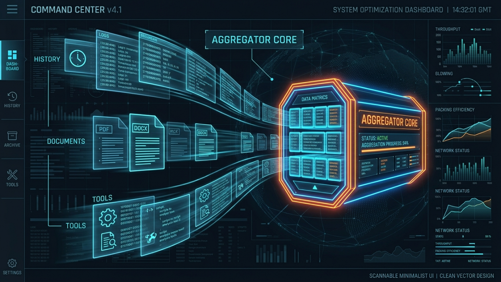
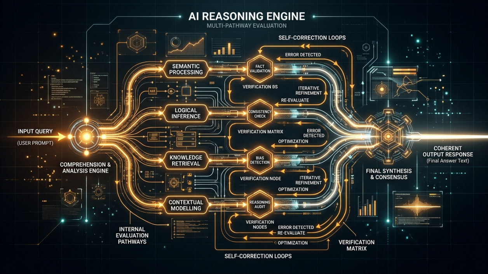
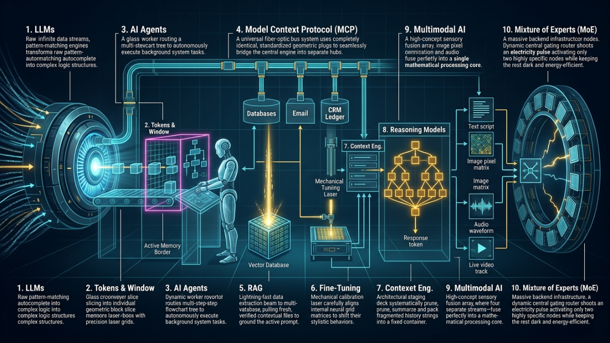

# Fundamental AI Engineering Concepts (2026 Edition)

To build production-grade AI integrations and ace technical system design interviews, engineers must master the core foundational primitives of Artificial Intelligence. These 10 concepts bridge the gap between high-level buzzwords and deep-level execution.

---

## 1. Large Language Models (LLMs)

*   **Mental Model**: **The Internet-Scale Autocomplete Engine.** 
*   **What it is**: A deep neural network architecture scaled to billions of parameters and trained on massive textual datasets to optimize a single objective function: predicting the next most probable token in a sequence.
*   **Where to use it**: As the core reasoning, transformation, generation, and extraction engine behind modern software products.
*   **Why use it**: Massive parameter scaling surfaces **emergent abilities**. The network moves beyond basic text autocomplete to develop advanced semantic capabilities, such as code generation, abstract reasoning, and human-like conversation.
*   **Example**: Providing a prompt fragment like `"The capital of France is"`, which causes the model's weight matrices to mathematically resolve to `"Paris"` as the highest-probability next token string.
*   **Trade-offs**: 
    *   **Downside**: *Nondeterministic Execution*. Because outputs are determined by probability weights, the same input can yield slightly different text distributions, making strict functional testing highly complex.

---

## 2. Tokens & Context Windows

*   **Mental Model**: **A Model’s Short-Term Memory Buffer.**
*   **What it is**: **Tokens** are the foundational semantic fragments (words or sub-word characters) that text strings are converted into via a tokenizer before processing. The **Context Window** defines the rigid capacity boundary of the maximum total input/output tokens a network can hold in its active memory layer during a single runtime call.
*   **Where to use it**: Critical when calculating VRAM compute allocation budgets, engineering complex prompts, and managing multi-turn application history.
*   **Why use it**: Dictates the limits of what an AI can read and retain simultaneously. Early models were restricted to ~4,000 tokens, whereas modern architectures handle over 1,000,000 tokens.
*   **Example**: The string `"unbelievable"` is broken by the tokenizer into three distinct processing fragments: `["un", "believe", "able"]`.
*   **Trade-offs**:
    *   **Downside**: *Context Exhaustion & Attention Degradation*. Pushing a model to its maximum context boundary degrades retrieval accuracy (referred to as the "Lost in the Middle" phenomenon) and exponentially inflates Key-Value (KV) cache storage costs.

---

## 3. AI Agents

*   **Mental Model**: **An Autonomous Workflow Execution Worker.**
*   **What it is**: An autonomous software system that uses an LLM as its central reasoning engine to formulate multi-step plans, interact with environment states, and call external tools to independently accomplish a macro objective without manual human step-by-step guidance.
*   **Where to use it**: Task automation, autonomous workspace tooling, complex codebase debugging pipelines, and live database triage engines.
*   **Why use it**: Breaks past static chat interfaces. An agent moves beyond simply explaining an execution step by actively executing the step on behalf of the user.
*   **Example**: **OpenClaw**—the open-source local agent that integrates directly into native workspaces (Slack, Discord, Email) to automatically triage customer requests and patch bugs while developers sleep.
*   **Trade-offs**:
    *   **Downside**: *Infinite Loop Risk & Runaway Compute Costs*. If an agent misinterprets a tool failure or environment change, it can fall into an expensive execution loop, repeatedly querying backend models and draining API token budgets.

---

## 4. Model Context Protocol (MCP)

*   **Mental Model**: **The USB Universal Adapter for AI Tools.**
*   **What it is**: An open-source protocol (stewardshipped under the Agentic AI Foundation within the Linux Foundation) that standardizes a uniform transport interface for secure communication between AI models and external data sources or local development tools.
*   **Where to use it**: Enterprise application infrastructures where multi-model orchestrators must seamlessly query internal databases, CRMs, file directories, or external SaaS networks.
*   **Why use it**: Resolves integration scaling issues. Before MCP, connecting an AI model to three separate applications required writing three brittle, custom integrations. MCP offers a universal adapter contract.
*   **Example**: An agent queries a secure corporate PostgreSQL instance using a standardized MCP client adapter without rewriting custom SQL driver wrappers for every separate LLM vendor.
*   **Trade-offs**:
    *   **Downside**: *Security Perimeter Risk*. Granting an autonomous agent universal read/write access to internal infrastructure tools via MCP requires highly rigid edge-permission mapping to prevent accidental data corruption or unauthorized information exposure.

---

## 5. Retrieval-Augmented Generation (RAG)

*   **Mental Model**: **An Open-Book Exam Check.**
*   **What it is**: An architecture that adds an information retrieval step prior to triggering model execution. It maps unstructured text to mathematical coordinates (**embeddings**), stores them in a **Vector Database**, and uses semantic similarity matching to inject fresh context into the prompt payload.
*   **Where to use it**: Corporate knowledge bases, proprietary documentation search, customer support ticket routers, and highly dynamic or fresh news systems.
*   **Why use it**: Overcomes **training cut-off date** limits and mitigates **hallucinations**. It ensures the model bases its reasoning on verified corporate facts rather than frozen data patterns.
*   **Example**: A user asks `"What is our corporate policy on refund matching?"` The RAG layer retrieves relevant policy texts from a vector store based on semantic meaning (even if the document uses keywords like `"money back"` or `"returns"`) and feeds them directly into the LLM context window.
*   **Trade-offs**:
    *   **Downside**: *Retrieval Quality Dependency*. If the semantic retrieval step fails to pull the correct document pieces, the downstream LLM will confidently reason and generate an incorrect response based on irrelevant data.

---

## 6. Fine-Tuning

*   **Mental Model**: **Sending a Medical Graduate to a Specialized Surgical Residency.**
*   **What it is**: The process of taking a generic, pre-trained foundational model and performing additional gradient descent optimization passes on a curated, domain-specific dataset to alter its internal neural weight parameters.
*   **Where to use it**: Strict formatting enforcement (e.g., forcing output to match a specific JSON schema), teaching specialized vertical vernacular (e.g., legal or medical terminology), or shaping a distinct company brand voice.
*   **Why use it**: Reduces runtime prompt payload costs by permanently baking structural formatting behaviors, language tones, and foundational domain concepts directly into the model's weights.
*   **Example**: Training a foundational model on 20,000 code samples to ensure it always outputs data as valid, error-free TypeScript object structures without requiring massive instructional prompt text.
*   **Trade-offs**:
    *   **Downside**: *Catastrophic Forgetting & High Compute Overhead*. Fine-tuning requires intense GPU computation phases. If over-optimized on a narrow dataset, the model can degrade its generalized reasoning and logical capabilities.

---

## 7. Context Engineering

*   **Mental Model**: **Curating the Optimal Information Environment for a Executive.**
*   **What it is**: The systematic engineering practice of structuring, organizing, prioritizing, and condensing the complete matrix of data injected into an LLM's context window during an individual runtime execution loop.
*   **Where to use it**: In complex production orchestration frameworks that manage live RAG document lookups, active conversation memory caches, and multi-tool availability profiles.
*   **Why use it**: Prompt engineering focuses on individual phrasing. Context engineering optimizes the entire informational state. Because an LLM's output quality is directly bounded by its context quality, this is the primary skill enterprise engineering teams build for.
*   **Example**: Designing an optimization pipeline that automatically condenses long chat logs, extracts semantic text fragments via RAG, lists active MCP tools, and fits them perfectly within a token-restricted window.
*   **Trade-offs**:
    *   **Downside**: *Complex Logic Tracking*. Requires writing detailed backend state machinery to handle dynamic token tracking, real-time pruning, and priority ranking across multiple data sources.

---

## 8. Reasoning Models

*   **Mental Model**: **Thinking Step-by-Step Before Speaking.**
*   **What it is**: An advanced class of LLMs (such as OpenAI's `o` series or DeepSeek) trained via specialized **Reinforcement Learning** to generate an explicit, internal **Chain of Thought (CoT)** hidden from the final user response.
*   **Where to use it**: Complex system verification, multi-layer mathematical computations, advanced software code writing, and logic planning for multi-step agent actions.
*   **Why use it**: Standard LLMs compute next-token outputs sequentially without planning pauses. Reasoning models pause to decompose complex problems, analyze alternative solution paths, check logic internally, and catch processing mistakes before outputting a final answer.
*   **Example**: An AI pauses to display `"Thinking..."` for 12 seconds while running thousands of internal reasoning tokens to check edge cases before returning an algorithmic fix.
*   **Trade-offs**:
    *   **Downside**: *High Operational Latency & Compute Cost*. Because the model generates thousands of hidden reasoning tokens behind the scenes, user latency (Time-to-First-Token) increases and compute consumption per request rises significantly.

---

## 9. Multimodal AI

*   **Mental Model**: **An Omnipresent Sensory Processor.**
*   **What it is**: An aligned deep learning architecture trained natively from scratch to accept, combine, process, and generate multiple distinct data streams (e.g., text, image pixels, audio waves, video tracks) simultaneously within a single model.
*   **Where to use it**: Medical scan analysis paired with patient charts, automotive computer vision processing, meeting recording transcription with visual mapping, and accessibility tooling.
*   **Why use it**: The physical world does not communicate solely via text string parameters. Furthermore, training a model across multiple distinct data categories generates a richer internal semantic representation space than text-only processing allows.
*   **Example**: Feeding an image of a handwritten whiteboard architecture diagram along with a spoken audio file of a meeting directly into a single model to produce a fully documented code repository.
*   **Trade-offs**:
    *   **Downside**: *Massive Training Complexity & Compute Footprints*. Aligning visual vectors, acoustic frequencies, and text spaces requires massive data curation, high-bandwidth networking grids, and extensive GPU training arrays.

---

## 10. Mixture of Experts (MoE)

*   **Mental Model**: **A Corporate Roster of Specialized Consultants Led by a Director.**
*   **What it is**: An architectural paradigm that breaks a massive neural network down into smaller, specialized subnetworks called experts. An active Gating Network (Routing Mechanism) analyzes each incoming request token and dynamically activates only the most relevant experts.
*   **Where to use it**: Large-scale foundational models that need to maintain top-tier generalized intelligence while keeping enterprise operational costs under control.
*   **Why use it**: High inference efficiency. An MoE model can have hundreds of billions of total parameters, but because only a small fraction are activated per token, it delivers high-tier model intelligence with the fast speed and cost efficiency of a smaller model.
*   **Example**: Processing a mathematical calculation query where the gating network routes the data tokens exclusively to the model's specialized math and code experts, leaving the translation and creative writing sub-networks idle.
*   **Trade-offs**:
    *   **Downside**: *High VRAM Footprint & Complex Deployment Mechanics*. While the compute cost per token is low, the entire model footprint (all experts combined) must still reside in VRAM, requiring substantial memory capacity across hosted GPU clusters.

---

## Architectural Cheat Sheet for Exams

| Core Concept | Built-in Technical Nature | Primary Architectural Value | System Failure Mode if Overlooked |
| :--- | :--- | :--- | :--- |
| **1. LLMs** | Next-Token Probability Engine | High-order reasoning and extraction | Autocomplete behavior without structural logic comprehension. |
| **2. Tokens & Window**| Discrete semantic fragments | Establishes hard active memory boundaries | Complete context drops and session amnesia mid-stream. |
| **3. AI Agents** | Autonomous Execution Loop | Independent planning, action, and tool use | Static conversational outputs incapable of modifying states. |
| **4. MCP** | Unified Transport Interface Contract | Eliminates fragmented custom tooling code | Brittle, insecure, point-to-point bespoke integration blocks. |
| **5. RAG** | Vector Similarity Context Injection | Eliminates fact-based data hallucinations | Fact errors, hallucinations, and training date limitations. |
| **6. Fine-Tuning** | Parameter Optimization Weight Shift | Hardcodes system style, behavior, and formatting | Structural schema violations and incorrect language tone. |
| **7. Context Eng.** | Informational Environment Curation | Maximizes token value and prompt accuracy | Blocked tokens, inefficient lookups, and bloated costs. |
| **8. Reasoning Models**| Reinforcement Learning Chain-of-Thought| Decomposes complex logical tasks safely | Fatal logic failures on deep math or compilation verification. |
| **9. Multimodal AI** | Cross-Sensory Vector Alignment | Processes non-text visual and audio fields | System blindness to video, audio, or spatial assets. |
| **10. MoE** | Dynamic Gating Subnetwork Routing | Controls operational execution costs at scale | Operational cost explosion during enterprise scaling. |

