# AWS Cloud Engineering Master Study Guide: L1, L2, and L3 Deep Dive

This comprehensive guide serves as a structured master reference for AWS Cloud Engineering, mapping the architectural principles, configuration mechanics, and high-pressure troubleshooting playbooks across three distinct professional cognitive layers:
1. **Level 1 (Concept Clarity):** Core foundational vocabulary, tenant isolation models, and fundamental resource typologies [1].
2. **Level 2 (Internal Workings):** Programmatic flow, protocol layers, routing logic, and system orchestration mechanics [84].
3. **Level 3 (Scenario-Based Architecture):** High-pressure triage, disaster recovery design, cost optimization modeling, and forensic system containment [172].

---

## SECTION 1: Level 1 - Foundational Concept Clarity (L1)

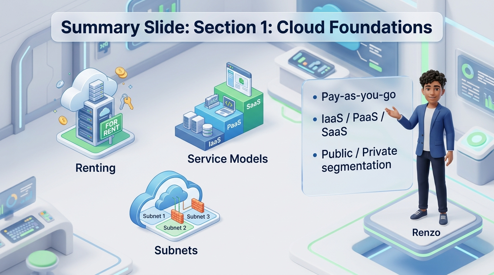

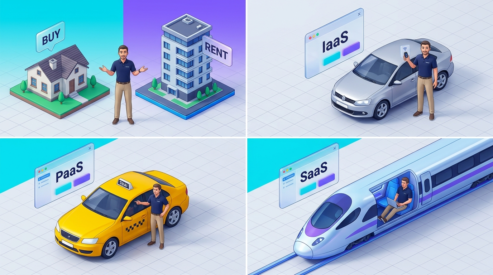

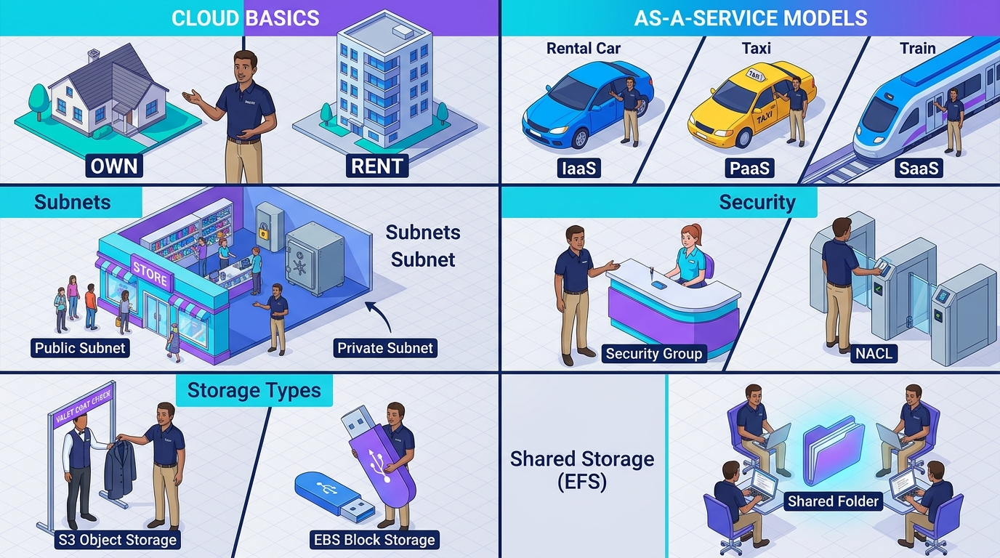

### I. Cloud Computing & Resource Typologies

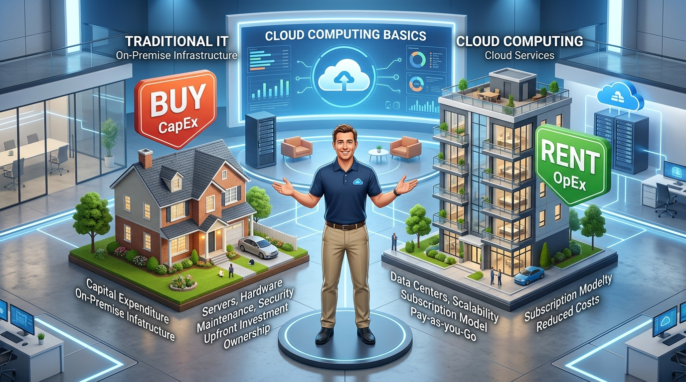
*   **What:** Cloud computing is the renting of computing resources (compute, storage, databases, and networking) from public cloud providers (such as AWS) via pay-as-you-go billing, eliminating the need to procure, cool, and maintain physical server hardware [1].
*   **Why:** It replaces capital expenditure (CapEx) with flexible operational expenditure (OpEx) [28], enabling companies to run lightweight architectures, launch products globally in minutes [29], and scale capacity dynamically to match fluctuating user demand [2, 21].
*   **Where:** Resources are deployed in highly resilient geographic boundaries [4]. Global infrastructure is divided into **Regions** (independent geographic locations such as N. Virginia or London) [4] and **Availability Zones (AZs)** (physically separated datacenters within a Region with redundant power, cooling, and fiber links) [5, 33].
*   **How:** By using the AWS Management Console, CLI, or Software Development Kits (SDKs) to trigger APIs that provision virtual resources on top of AWS's hypervisors and physical server grids [1, 107].
*   **Advantages:**
    *   **Zero Upfront CapEx:** Avoids massive upfront investments ($10,000+ per physical host) [2, 28].
    *   **Infinite Elasticity:** Scale down during idle periods (e.g., Netflix spinning down servers overnight) to optimize costs [2].
    *   **Global Footprint:** Deploy close to users to lower latency and meet compliance guidelines (such as GDPR) [4, 29].
*   **Disadvantages:**
    *   **Variable Cost Risks:** Dynamic scaling can cause unpredictable billing if not governed by budget limits [28, 51].
    *   **Shared Responsibility Model:** AWS manages physical datacenter security, but misconfigurations of your applications or network remain your responsibility [10, 161].
*   **Mental Model (Renting vs. Owning):** Owning on-premises servers is like buying a house—you pay for the mortgage, roof repairs, and security systems yourself [31]. Cloud computing is like renting an apartment—the landlord handles property maintenance, cooling, and physical security, while you only pay the rent and furnish your living space [31].

---

### II. The Core As-A-Service Models

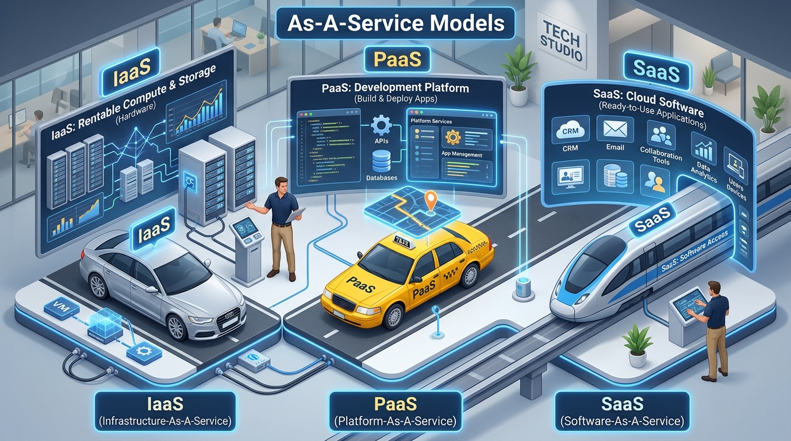
*   **What:** Infrastructure as a Service (IaaS), Platform as a Service (PaaS), and Software as a Service (SaaS) represent the three primary levels of cloud services, differentiated by the boundary of responsibility between the tenant and AWS [3].
*   **Why:** Different applications require different balances of control vs. management overhead [3].
*   **Where:** Operating across all compute boundaries in AWS.
*   **How:** 
    *   **IaaS:** AWS provides virtualized compute, storage, and networking (e.g., EC2), while you maintain the operating system, runtimes, middleware, and application [3].
    *   **PaaS:** AWS fully manages the operating system, patching, scaling, and middleware (e.g., Elastic Beanstalk), and you simply deploy your code [3].
    *   **SaaS:** AWS and partners host, manage, and deliver the complete software application over the web (e.g., Microsoft 365, Salesforce, or Gmail) [4].
*   **Advantages:**
    *   **IaaS:** Offers maximum architectural flexibility and direct OS control [3].
    *   **PaaS:** Speeds up deployment times, allowing developers to focus strictly on code features [3].
    *   **SaaS:** Zero installation or infrastructure management overhead [4].
*   **Disadvantages:**
    *   **IaaS:** High operational burden of managing OS patches, system updates, and backups [3, 118].
    *   **PaaS:** Limited control over system parameters and underlying networking constraints [3].
    *   **SaaS:** No customization options; entirely locked into vendor configurations [4].
*   **Mental Model (Car Rental Analogy):**
    *   **IaaS:** Renting a car. You drive it and pay for gas, but you control where it goes and how it is driven [3].
    *   **PaaS:** Taking a taxi. You do not drive or maintain the car; you just tell the driver where to go [3].
    *   **SaaS:** Riding a train. You just buy a ticket, sit down, and ride along a fixed track with zero control over the route [4].

---

### III. Public vs. Private Subnets

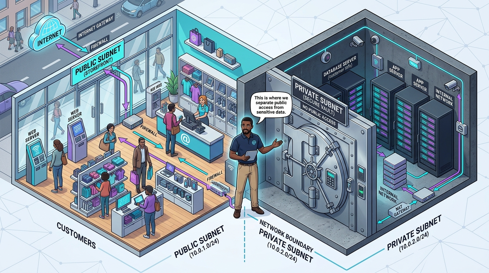
*   **What:** A subnet is a subdivided IP range within a Virtual Private Cloud (VPC) [6, 25]. A public subnet has a direct routing pathway to the internet via an Internet Gateway [7, 40]. A private subnet cannot be reached from the internet directly [8, 40].
*   **Why:** Enforces network segmentation to isolate sensitive backends and databases from public-facing interfaces [7, 8].
*   **Where:** Carved out of your VPC's CIDR block (e.g., subnetting 10.0.1.0/24 inside VPC CIDR 10.0.0.0/16) [6, 25].
*   **How:**
    *   **Public Subnet:** The route table associated with this subnet includes a default route (`0.0.0.0/0`) pointing directly to an attached **Internet Gateway (IGW)** [7, 130]. Resources inside are assigned public IP addresses [7].
    *   **Private Subnet:** The route table contains only local routes or a default route pointing to a **NAT Gateway** located in a public subnet [8, 130]. Resources inside maintain only private IP addresses [8, 112].
*   **Advantages:**
    *   **Layered Security:** Dramatically reduces the attack surface of databases and business-logic servers by blocking direct inbound pathways [8, 41].
    *   **Granular Ingress Controls:** Inbound traffic is forced to terminate at public proxies or load balancers before being audited and routed [39, 127].
*   **Disadvantages:**
    *   **Complex Troubleshooting:** Resolving packet loss or connection drops requires auditing multi-layer routing, security groups, and NAT logs [10, 187].
    *   **NAT Cost Overhead:** Private subnets require active public NAT Gateways, which incur hourly and data-processing charges [113, 114].
*   **Mental Model (The Retail Store):** The public subnet is the storefront and display windows—customers walk in, browse, and speak with staff [8]. The private subnet is the locked back office and vault—it has no public doors, and only authorized staff can bring items (updates/data) from the back room using a secure intermediate route [8].

---

### IV. Stateful Security Groups vs. Stateless Network ACLs (NACLs)

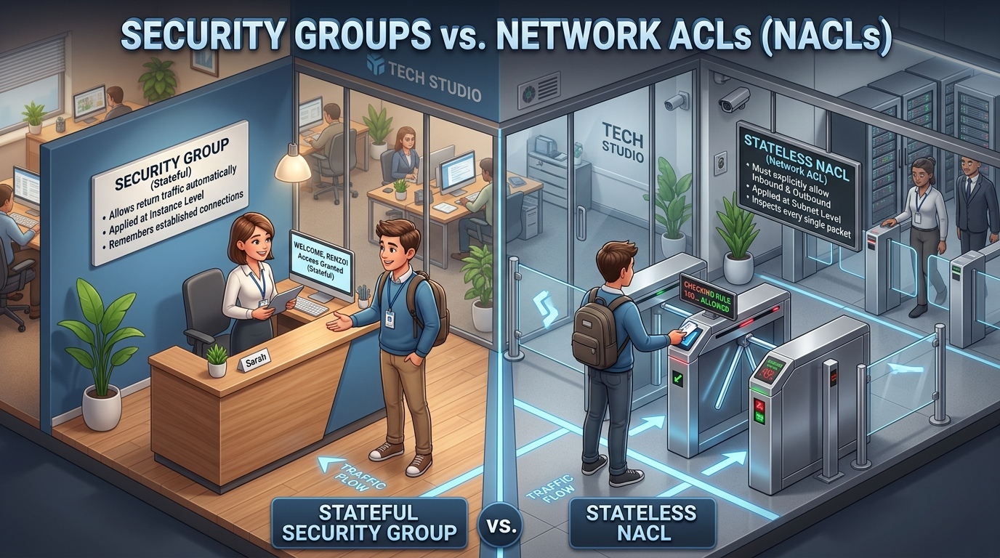
*   **What:** Security Groups and Network ACLs (NACLs) are the two primary firewall layers that filter traffic inside a VPC [18, 75].
*   **Why:** Multi-layered security (defense-in-depth) ensures that even if an instance firewall is misconfigured, the network-level subnet boundary remains secure [91, 161].
*   **Where:** Security Groups operate at the individual network interface/instance level [18, 75]. NACLs operate globally at the subnet boundary [75].
*   **How:**
    *   **Security Groups:** Allow-only rules [19, 76]. They are **stateful**: if traffic is allowed inbound, the return connection is tracked and automatically allowed outbound, regardless of outbound rules [19, 48].
    *   **NACLs:** Ordered, numbered allow and deny rules (e.g., Rule 100, Rule 200) [76]. They are **stateless**: every packet must be evaluated against separate inbound and outbound rules; return traffic is *not* automatically tracked [76].
*   **Advantages:**
    *   **Security Groups:** Easy to manage due to connection tracking and the ability to reference other Security Groups directly instead of IP addresses [47, 50].
    *   **NACLs:** Enable broad subnet-level security blocklists (e.g., explicitly blocking a malicious IP subnet from reaching any resource) [91, 131].
*   **Disadvantages:**
    *   **Security Groups:** Cannot explicitly deny traffic; they are strictly deny-by-default with allow rules [48, 76].
    *   **NACLs:** High administrative complexity. Forgetting to open outbound ephemeral ports (1024-65535) for return traffic will block communication completely [76, 92].
*   **Mental Model (Building Security):** A Security Group is like an office receptionist—once you are checked in and allowed entry, you can leave freely because they recognize you [48]. A stateless NACL is like an automated security turnstile at the main building entrance—it requires you to swipe your ID card to enter *and* swipe your ID card to exit every single time; it has no memory of your prior swipe [76].

---

### V. S3, EBS, and EFS Storage Paradigms


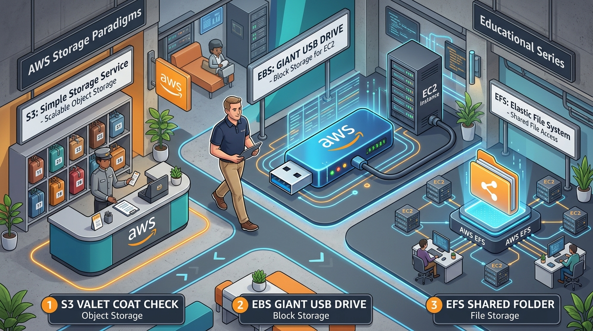
*   **What:** S3 (object storage), EBS (block storage), and EFS (network file storage) are the three primary storage types in AWS, designed for entirely different application access patterns [14, 15, 16].
*   **Why:** Different systems require varying combinations of scale, shareability, and access speeds [147].
*   **Where:**
    *   **S3:** Globally accessible over HTTP via API calls, independent of servers [15, 53].
    *   **EBS:** Tied to a single Availability Zone, mounted as a direct physical disk on a single EC2 instance [15, 147].
    *   **EFS:** Highly available across multiple Availability Zones, mounted concurrently by dozens of EC2 instances [16, 147].
*   **How:**
    *   **S3:** Data is stored as individual objects with customizable metadata and unique key-value identifiers [12, 152].
    *   **EBS:** Data is stored in raw, fixed-size blocks, formatted with a native filesystem (like ext4 or NTFS) [15, 151].
    *   **EFS:** Mounted over standard Network File System (NFSv4) protocols, automatically scaling storage up and down on write [16, 147].
*   **Advantages:**
    *   **S3:** Infinitely scalable, 99.999999999% durable, and highly cost-effective through lifecycle transition rules [12, 13, 153].
    *   **EBS:** Extremely low latency, high IOPS, making it ideal for performance-critical databases and boot volumes [15, 151].
    *   **EFS:** Simplifies multi-host application clustering (such as WordPress or shared CMS setups) [16].
*   **Disadvantages:**
    *   **S3:** High access latency compared to local disks; not suitable as a database boot volume or filesystem runtime [54, 152].
    *   **EBS:** Hard boundary within a single AZ; cannot be shared concurrently across multiple hosts [15, 147].
    *   **EFS:** Higher cost per gigabyte compared to standard EBS volumes and S3 storage classes [54].
*   **Mental Model:**
    *   **S3:** Valet parking coat check—you drop off a coat, get a ticket (metadata/key), and retrieve it later over standard channels; you cannot edit the coat while it is checked in [152].
    *   **EBS:** A dedicated USB flash drive—you plug it directly into your laptop; it is extremely fast, but only your laptop can read and write to it [16, 151].
    *   **EFS:** A shared Google Drive folder—multiple teammates mount it simultaneously, and changes are instantly synchronized [16].

---

## SECTION 2: Level 2 - Internal Workings & Deep-Dive Mechanics (L2)

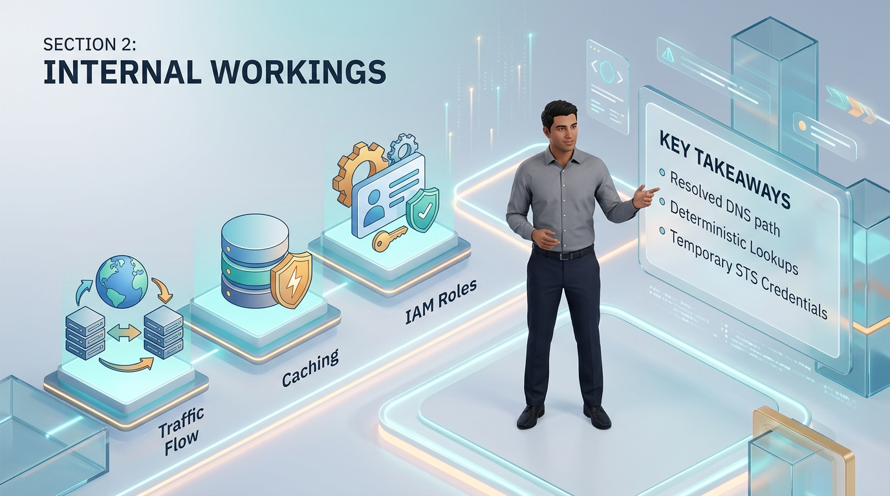

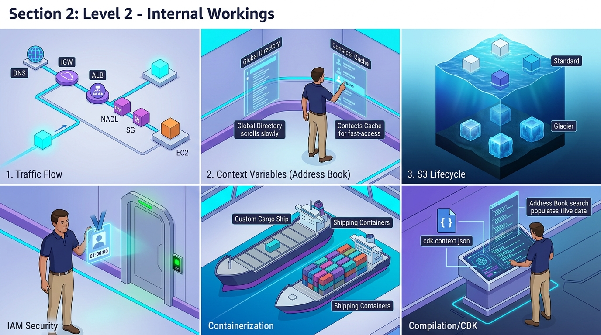

### I. Browser-to-EC2 Traffic Resolution Flow

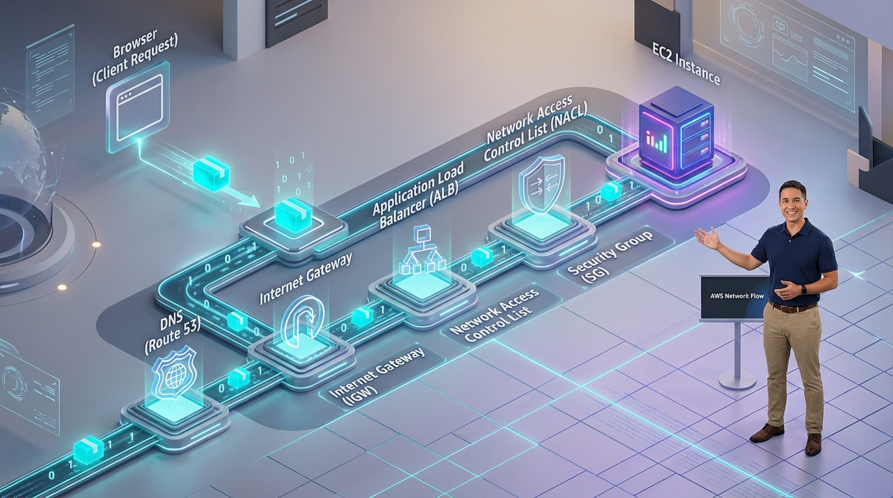
*   **What:** The detailed, multi-layered network flow that occurs from the moment a user types an address in a browser to the moment an EC2 instance returns an HTTP response [84].
*   **Why:** Crucial for tracking network latencies, troubleshooting load balancer routing failures, and isolating performance drops across protocol layers [172, 188].
*   **Where:** Across internet root nameservers, CloudFront CDN edge caches, Route 53 resolvers, and VPC network interfaces [81, 84, 109].
*   **How:** (The End-to-End Walkthrough) [84-87, 126-128]

```
[Browser] ---> 1. Resolve DNS (Route 53) ---> Returns Public IP
    |
    v
[Internet Gateway] ---> 2. Enters VPC ---> Translates Public to Private IP
    |
    v
[Application Load Balancer] ---> 3. Decodes HTTP ---> Picks Target Subnet Route
    |
    v
[Subnet NACL Check] (Stateless Firewall) ---> 4. Validates Inbound Ports
    |
    v
[EC2 Security Group Check] (Stateful Firewall) ---> 5. Validates Instance Access
    |
    v
[EC2 Instance] ---> 6. Process Application Code ---> Emits Stateful Return Packet
```

1.  **DNS Resolution:** The browser queries Route 53 (via root and TLD nameservers) to resolve `www.example.com` to a public IP (typically pointing to an Application Load Balancer) [84, 110].
2.  **Internet Gateway Ingress:** The HTTP request arrives at the VPC’s **Internet Gateway (IGW)**, which maps the public IP to a private IP within the VPC using Network Address Translation (NAT) [85, 112].
3.  **ALB Routing Check:** The request enters the public subnet route table and hits the ALB, which terminates the SSL certificate and executes load-balancing algorithms (such as Round-Robin or Least Outstanding Requests) [85, 96, 97, 127].
4.  **Subnet NACL Verification:** The ALB routes the traffic to the private subnet containing the target EC2 instance. The traffic is validated against the subnet's stateless NACL rules [86].
5.  **Instance SG Verification:** The traffic arrives at the EC2 instance's Network Interface (ENI), where the stateful Security Group processes the inbound allow rules [86, 117].
6.  **Application Processing & Stateful Return:** The web application processes the packet. On return, the Security Group tracks the active session and automatically allows the response packet outbound [86]. The stateless NACL verifies the packet against outbound rules, and the packet is returned via the IGW [86, 87].

---

### II. Dynamic Context Variables & Lookup Determinism
*   **What:** Context variables are metadata parameters used in AWS CDK (or standard IaC) to query dynamic AWS network settings at compilation time [122].
*   **Why:** Ensures infrastructure definitions adapt automatically to dynamic environments (e.g., locating an active VPC ID without hardcoding string variables) [36, 122].
*   **Where:** Compiled locally by the developer or within CI/CD build pipelines [79].
*   **How:** When a lookup method (such as `Vpc.fromLookup()`) is compiled, the compiler checks the local cache file (`cdk.context.json`). If the context key is missing, the compile run is suspended; the compiler executes live AWS API calls to fetch the VPC ID, caches the result in `cdk.context.json`, and resumes compilation [122].
*   **Advantages:**
    *   **No Hardcoded Strings:** Prevents brittle codebases by dynamically discovering VPC structures, subnets, and active Route 53 hosted zones [36, 122].
    *   **Deterministic Runs:** Because lookup values are cached locally in `cdk.context.json`, subsequent builds are identical, preventing drift and pipeline failures in offline environments [79, 122].
*   **Disadvantages:**
    *   **Context Staleness:** If a VPC subnet configuration is changed in AWS, your local cache still references the old subnet configuration until you manually clear `cdk.context.json` [122].
    *   **Initial Build Overhead:** First-run syntheses require live AWS API credentials and take longer to resolve lookup calls [122].
*   **Mental Model (Address Book Caching):** Dynamic lookup is like searching for a friend's phone number. Instead of hardcoding the number into your phone, you look it up once from a directory (live AWS API) and save it to your contacts list (`cdk.context.json`). Every call thereafter uses your contacts list immediately, ensuring consistency, until you explicitly delete or update the card.

---

### III. S3 Storage Class Management & Optimization Math

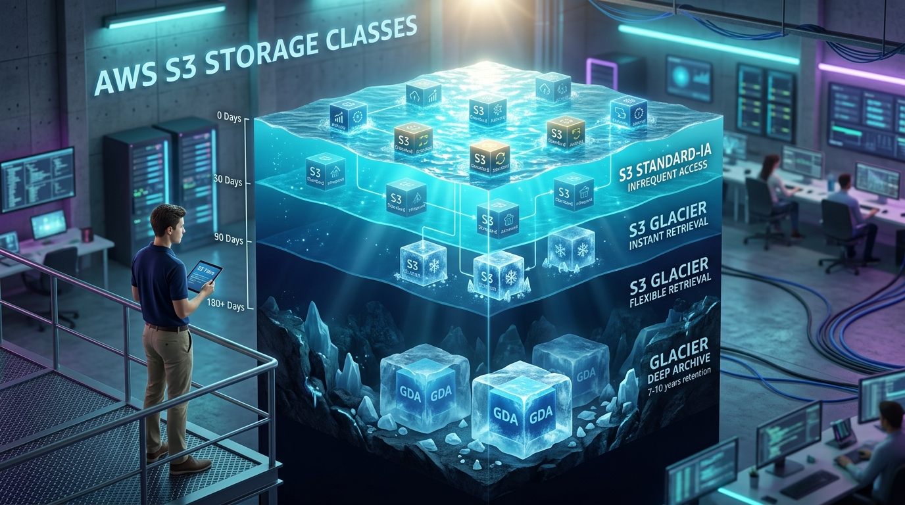
*   **What:** S3 storage classes (Standard, Intelligent-Tiering, Standard-IA, One Zone-IA, Glacier Instant/Flexible Retrieval, Glacier Deep Archive) are physical and billing optimizations designed around data access frequency [13, 114].
*   **Why:** Organizations store petabytes of data; using the standard tier for infrequently accessed archives leads to massive cost overruns [54, 153].
*   **Where:** Executed globally within S3 bucket lifecycles [14, 116].
*   **How:** By implementing automated **S3 Lifecycle Policies** that evaluate object ages (e.g., transitioning files from Standard to Glacier after 90 days) [13, 116].
*   **Math and Retrieval Comparisons:** [13, 115, 116]

| Storage Class | Minimum Billing Duration | Minimum Object Billing Size | Retrieval Time Frame | Ideal Use Case |
| :--- | :--- | :--- | :--- | :--- |
| **S3 Standard** | None [13] | None [13] | Instantaneous [115] | Active website assets, raw logs being ingested [115] |
| **Intelligent-Tiering** | None [115] | None [115] | Instantaneous [115] | Unpredictable or fluctuating access patterns [115] |
| **Standard-IA** | 30 Days [116] | 128 KB [116] | Instantaneous [116] | Active backups, disaster recovery assets [116] |
| **One Zone-IA** | 30 Days [116] | 128 KB [116] | Instantaneous [116] | Easily reproducible thumbnail caches [116] |
| **Glacier Instant** | 90 Days [116] | 128 KB [116] | Milliseconds [116] | Compliance records needing rapid retrieval [116] |
| **Glacier Flexible** | 90 Days [116] | None [116] | 1-5 Min (Expedited) to 3-5 Hours [116] | Standard corporate archival backups [116] |
| **Glacier Deep Archive**| 180 Days [116]| None [116] | 12 to 48 Hours [116] | Strict 7-10 year financial audits [116] |

*   **Advantages:**
    *   **Drastic Cost Cuts:** Moving data to Glacier Deep Archive drops storage costs to ~$1 per TB per month, securing a ~95% savings over S3 Standard [116].
    *   **Automation:** Set-and-forget lifecycle rules handle transitions silently under the hood [116].
*   **Disadvantages:**
    *   **Retrieval Charges:** Accessing files inside Infrequent Access or Glacier tiers incurs retrieval-per-GB fees, which can quickly exceed storage savings if accessed frequently [116].
    *   **Minimum Storage Traps:** Deleting or replacing a Standard-IA file 5 days after creation still results in a full 30-day billing charge [116].

---

### IV. IAM Role Security & STS AssumeRole Cryptography

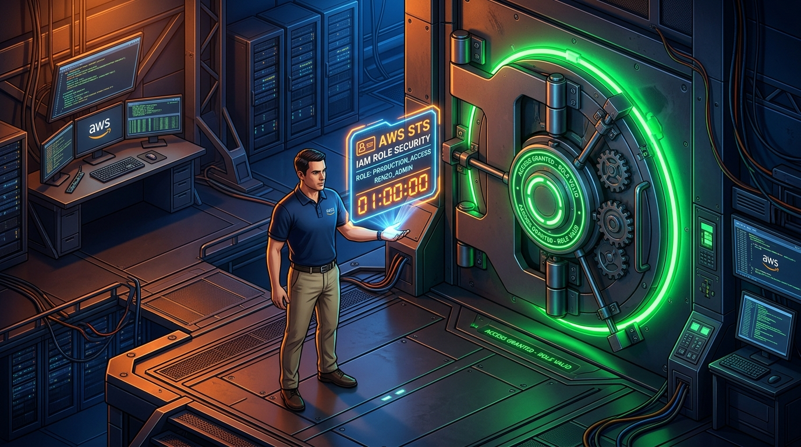
*   **What:** IAM Roles represent temporary security identities that do not contain permanent passwords or static access keys [105, 106].
*   **Why:** Static IAM User access keys are easily leaked on public source repositories (like GitHub) and are the primary source of catastrophic security breaches [51, 69, 106].
*   **Where:** Attached to AWS resources (EC2, ECS, Lambda) and trusted identity providers globally [18, 108].
*   **How:** Using the **AWS Security Token Service (STS)** [158]. When an EC2 instance wants to read from S3:
    1. The instance queries the internal **Instance Metadata Service (IMDS)** [51, 107].
    2. IMDS generates an STS `AssumeRole` API request to AWS [158].
    3. STS generates temporary credentials (an access key, secret key, and session token) with a fixed expiration window (typically 1-12 hours) [51, 106, 158].
    4. These temporary keys are loaded into memory and automatically rotated by AWS before they expire, requiring no manual configuration [51, 107].
*   **Advantages:**
    *   **Zero Hardcoded Keys:** Application code has no embedded credentials, making credential leaks impossible [18, 107].
    *   **Scoped Attack Surface:** If an instance is compromised, its keys expire within hours, preventing long-term exposure [51, 106].
*   **Disadvantages:**
    *   **IMDS Exploitation Risks:** Vulnerable web application proxies (SSRF attacks) can allow attackers to query local IMDS endpoints and extract session keys [107]. (Mitigated by enforcing **IMDSv2**, which requires session-token headers).
    *   **Debugging Overhead:** Identifying why a policy block fails requires analyzing STS call trails and CloudTrail logs [119, 120].

---

### V. Containerization vs. Virtual Machines (VMs)

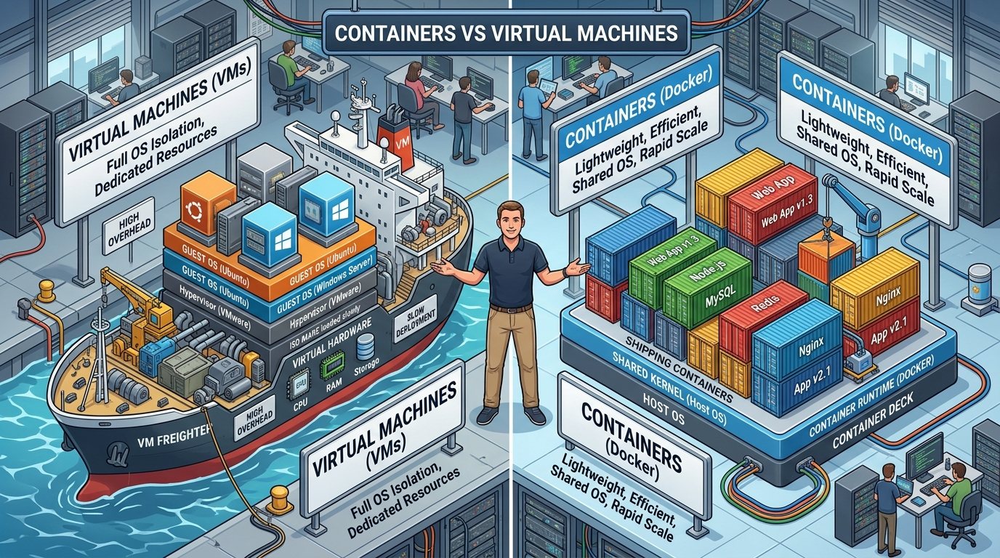
*   **What:** Virtual Machines (like EC2 instances) are full operating system installations running on top of physical hardware hypervisors [10, 124]. Containers (like Docker) are isolated user-space environments that share the host operating system's kernel [124].
*   **Why:** Modern systems require ultra-fast boot times, high packaging density, and a consistent environment from a developer’s laptop to production [123, 124, 164].
*   **Where:** Managed using orchestrators like Amazon ECS or EKS [125, 126].
*   **How:**
    *   **VMs:** Launching an EC2 requires allocating virtual CPU, memory, and spinning up a full guest OS kernel, which takes minutes to boot [11, 124].
    *   **Containers:** Docker packaging bundles the app code, runtimes, and dependencies into an immutable image. It launches as a isolated process on top of the host's Linux kernel in seconds, utilizing a fraction of the memory footprint [124].
*   **Advantages:**
    *   **Portability:** Solves the "works on my machine" problem—the exact same container image runs on any environment without adjustment [123, 164].
    *   **Resource Density:** Run dozens of isolated microservices on a single underlying EC2 host, optimizing hardware utilization [124].
*   **Disadvantages:**
    *   **Shared Kernel Risks:** Because containers share the host kernel, a kernel-level privilege escalation exploit on one container can potentially compromise the entire host [124].
    *   **Storage Volatility:** Containers are designed to be stateless; writing persistent files requires mounting external network systems (such as EFS) [140, 166].
*   **Mental Model (Shipping Containers):** A Virtual Machine is like building a custom cargo ship for every single delivery—it is heavy, takes months to construct, and has its own crew [124]. A container is a standard shipping container box—it fits on any standard ship, truck, or train, packages its cargo cleanly, and is easily loaded and moved in seconds [124].

---

## SECTION 3: Level 3 - System Design Scenarios & Triage (L3)

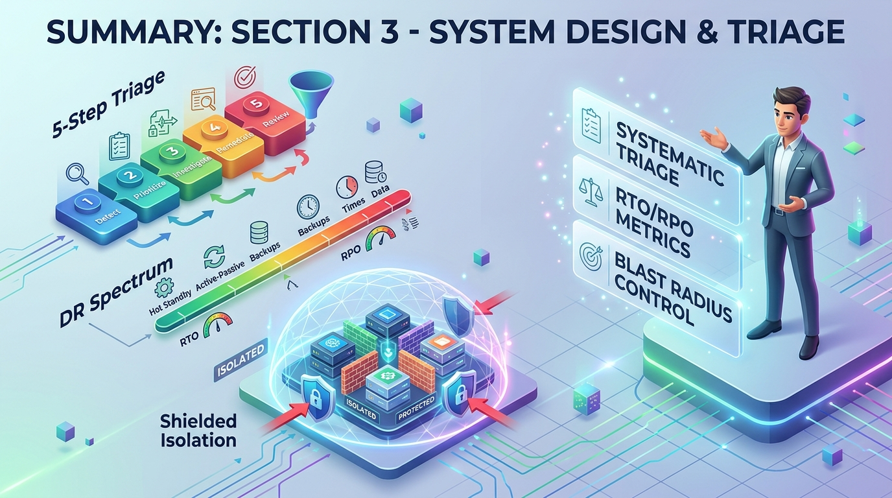

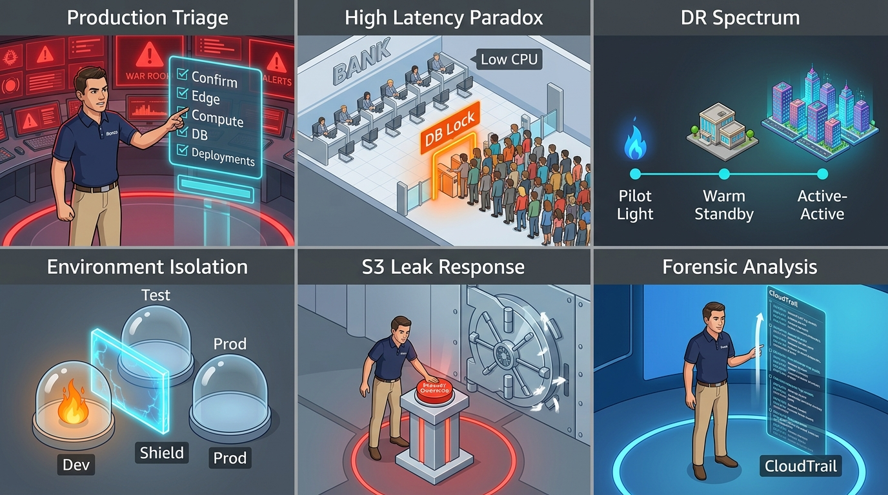

### I. Real-Time Production Down "5-Step Triage" Playbook

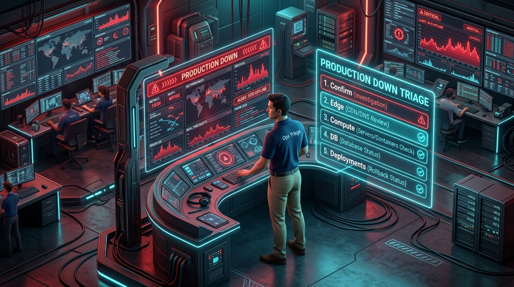
*   **What:** A rigorous, high-pressure execution playbook for senior engineers when a primary production system goes dark [172].
*   **Why:** Resolves outages systematically without losing time to chaotic guessing, minimizing financial losses and downtime [60, 62].
*   **Where:** Executed across all infrastructure layers under peak stress [172].
*   **How:** (The 5-Step Execution Playbook) [172]

```
[Outage Trigger] 
       |
       v
Step 1: Confirm Scope & Alerts (Global vs. Local? DNS vs. App?)
       |
       v
Step 2: Check Edge & Load Balancer (ALB reachable? Healthy targets count?)
       |
       v
Step 3: Analyze Compute & Hosts (EC2 running? Container CrashLoopBackOff?)
       |
       v
Step 4: Audit Connectivity & DB (RDS CPU 100%? Connection pool exhausted?)
       |
       v
Step 5: Review Recent Deployments (CI/CD rollback? CloudTrail audit logs?)
```

1.  **Verify & Scope:** Confirm the outage from multiple external locations and check global dashboards (Route 53, CloudFront) to isolate whether the issue is a DNS failure, a global CDN drop, or localized to a single region [172].
2.  **Audit Load Balancer Health:** Access the ALB dashboard. Verify the count of healthy target instances. Are web servers failing health checks? If healthy targets are 0, check why backend servers are failing the ALB's health check endpoints [172, 189].
3.  **Inspect Compute Status:** Query the status of your compute hosts (EC2 instances, container groups). Check if servers are offline or repeatedly restarting (e.g., K8s `CrashLoopBackOff` loops) [172, 180].
4.  **Audit DB & Storage Connections:** Check the database performance metrics (CPU usage, database connection pools, memory utilization). If connection pools are exhausted, backend web servers will hang, and the site will throw 504 Gateway Timeouts [172, 178].
5.  **Audit Recent Changes:** Review the recent git commits, CI/CD deployment pipelines, network ACL revisions, or security group changes within the last 30 minutes. If a deployment introduced the bug, execute an immediate rollback to the last known stable build [172, 185].

---

### II. High Response Latency with Low CPU Utilization


*   **What:** A performance paradox where users experience high response latencies (>5 seconds), but the backend EC2 hosts show CPU and memory utilization under 15% [194].
*   **Why:** Adding more servers will not solve this problem. Engineers must diagnose non-compute resource locks [194].
*   **Where:** Typically isolated within database connection pools, third-party API handshakes, or downstream network configurations [194].
*   **How:** (The Diagnostics Procedure) [178, 194]
    1.  **Trace Application Call Chains:** Implement distributed tracing (such as OpenTelemetry or AWS X-Ray) to measure the exact execution duration of each call segment [170, 194].
    2.  **Audit DB Connection Pools:** Check the application’s maximum database connection pool size. If the pool is limited to 10 connections but traffic surges, threads will block waiting in line for a database connection to free up [194].
    3.  **Isolate Slow Database Queries:** Check the database's slow query logs. Missing indexes on high-throughput tables will cause queries to lock tables and force application wait states [178, 194].
    4.  **Identify Thread Locking:** Profile the application JVM or runtime. Look for long-running synchronization blocks or thread deadlocks where threads are waiting on thread-unsafe I/O operations [194].
    5.  **Isolate Downstream Third-Party Timeouts:** Check outbound HTTP call durations. If your web app makes synchronous API calls to external payment or shipping gateways, a latency drop on their side will block your threads [194].
*   **Mental Model (The Bank Lobby):** Your low CPU is like having 10 fast, idle bank tellers ready to work. The high latency is like having a queue of 100 people wrapping around the block because the lobby's security turnstile (the database connection limit or slow query index lock) only lets 1 person through at a time. The tellers are not busy (low CPU), but the customers are waiting forever (high response latency).

---

### III. Disaster Recovery (DR) Strategies: RTO vs. RPO Architectures


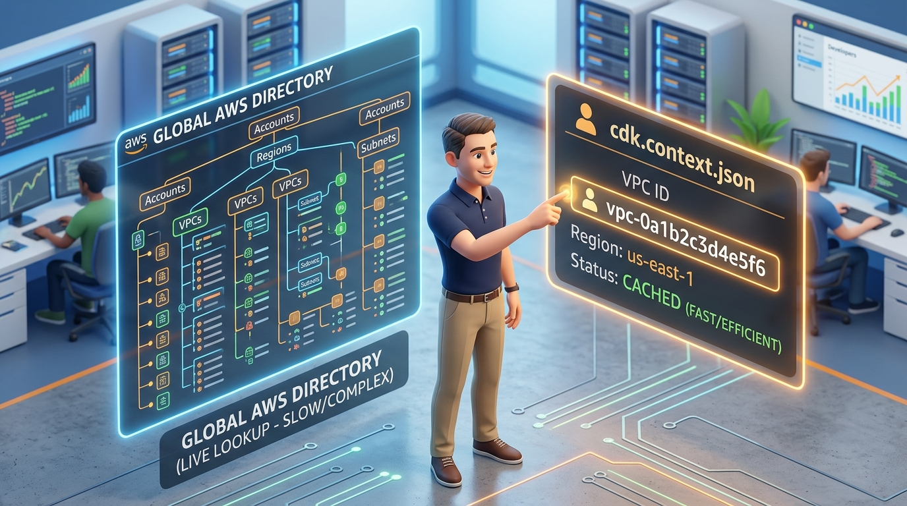
*   **What:** Disaster Recovery (DR) defines how a system recovers and resumes operations following a catastrophic datacenter or regional outage [184].
*   **Why:** Ensures business continuity, limits data loss, and meets regulatory compliance targets [61, 184].
*   **Where:** Across multi-AZ and multi-region AWS environments [5, 137, 184].
*   **How:** DR strategies are defined by two key metrics:
    *   **Recovery Time Objective (RTO):** The maximum acceptable duration of downtime before the application must be restored [184].
    *   **Recovery Point Objective (RPO):** The maximum acceptable age of data that can be lost from backup pools during recovery [184].
*   **Architectural DR Spectrum:** [184]

```
Cost: Low <---------------------------------------------------> High
Resiliency: Days/Hours <--------------------------------------> Real-Time

[Backup & Restore] ---> [Pilot Light] ---> [Warm Standby] ---> [Active-Active Multi-Region]
 (RTO: 24h, RPO: 24h)   (RTO: 4h, RPO: 1h)  (RTO: 30m, RPO: 15m)    (RTO: 0s, RPO: 0s)
```

1.  **Backup and Restore (Highest RTO/RPO):** Low-cost, cold DR. Backups are scheduled regularly (e.g., daily S3 snapshots) [184]. If the region goes down, infrastructure is rebuilt from scratch using IaC templates and data is restored from S3 [184].
2.  **Pilot Light:** Core data stores (databases) are continuously running and replicating data in a secondary region [184]. Application compute layers (EC2, ECS) are kept shut down or unprovisioned, ready to be scaled up via Auto Scaling during a disaster event [184].
3.  **Warm Standby:** A scaled-down, functional replica of the entire environment is constantly running in the secondary region [184]. Traffic is not actively routed here, but if the primary region fails, DNS switches to the secondary region, which quickly scales up to handle production traffic [184].
4.  **Active-Active Multi-Region (Zero RTO/RPO):** The ultimate, high-cost configuration. Both regions are actively receiving live production traffic [5, 184]. Databases replicate bidirectionally in real-time, providing seamless sub-second failover if a region fails [5, 184].
*   **Advantages:**
    *   **Active-Active:** Absolute resilience; users experience zero disruption [176, 195].
    *   **Backup & Restore:** Extremely inexpensive; you only pay for storage, not idle compute [184].
*   **Disadvantages:**
    *   **Active-Active:** Massive infrastructure billing costs and extreme software engineering complexity (resolving distributed database write conflicts and latency lags) [5].
    *   **Backup & Restore:** High risk of losing hours of business data and hours of downtime during recovery [184].

---

### IV. Environment Isolation (Dev, Test, Prod)

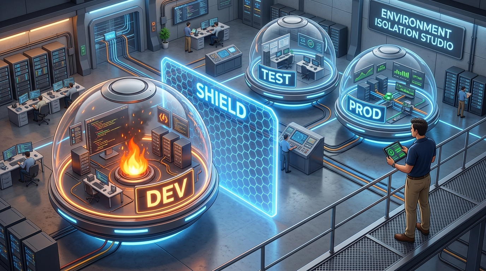
*   **What:** Securing and isolating development, testing, and production workloads to prevent testing mistakes or developer errors from impacting live customer systems [162].
*   **Why:** Developers occasionally test destructive code blocks, execute load testing, or misconfigure security parameters; these must never impact production environments [162, 163, 185].
*   **Where:** Across the entire corporate AWS organization [162].
*   **How:** (The Industry Standard Isolation Architecture) [162-164]
    *   **Account-Level Boundaries:** Do not run Dev, Test, and Prod in the same AWS account using prefix names [162]. Isolate them inside dedicated, separate AWS accounts managed under **AWS Organizations** [81, 162].
    *   **Network Segregation:** Dev and Prod must never be connected via VPC Peering or Transit Gateways [163]. Each account operates its own isolated VPC with non-overlapping IP ranges [163].
    *   **Strict IAM Policies & MFA:** Developers are granted elevated, read-write access to the Dev account, but production access is strictly locked down [163, 164]. Only automated CI/CD pipelines can push changes to production, requiring multi-factor authentication (MFA) and authorization gates [163, 164].
    *   **Database Isolation:** Production customer databases are never replicated or shared into the Dev account [163]. Instead, Dev databases are seeded with anonymized, mocked data pools [163].
*   **Advantages:**
    *   **Perfect Blast Radius Control:** Even if a developer accidentally deletes a database or compromises a server in the Dev account, the production environment is completely unaffected [120, 162].
    *   **Compliance:** Meets strict security compliance standards (such as SOC2 or PCI-DSS) that mandate complete isolation of production user data [162, 186].
*   **Disadvantages:**
    *   **Management Complexity:** Requires managing multiple sets of IAM roles, DNS records, and build pipelines across multiple account consoles [162].
    *   **Cost Multipliers:** Some base network components (such as Transit Gateways or base database licenses) must be duplicated per account [113, 162].

---

### V. Public S3 Bucket Data Leak Incident Response Playbook


*   **What:** A high-speed security incident response playbook for when a developer accidentally exposes an S3 bucket containing sensitive customer data to the public internet [203].
*   **Why:** Prevents malicious actors from scraping data, avoids regulatory fines, and limits security damage [203].
*   **Where:** Across the compromised S3 resource and AWS Identity boundaries [203].
*   **How:** (The Incident Response Protocol) [155, 203]

```
[Public Leak Alert]
       |
       v
Step 1: Immediate Containment ---> Enable Block Public Access (Account-Level)
       |
       v
Step 2: Resource Isolation ---> Apply Strict Deny-All S3 Bucket Policy
       |
       v
Step 3: Forensic Log Extraction ---> Pull S3 Server Access Logs & CloudTrail Data Events
       |
       v
Step 4: Audit & Identify Scope ---> Parse Logs to Map IPs & Downloaded Objects
       |
       v
Step 5: Credential Rotation ---> Invalidate Exposed Keys & Cache Assets
```

1.  **Immediate Containment:** Do not waste time analyzing *why* the bucket was made public. Instantly trigger the account-level **S3 Block Public Access** feature in the console or CLI [203]. This acts as a master override switch, instantly severing all public access to all S3 buckets in the account [203].
2.  **Apply Local Deny Policies:** Update the specific S3 bucket policy, adding an explicit `Deny` statement for all anonymous public principal elements (`Principal: "*"`) [203].
3.  **Forensic Log Extraction:** Enable and extract **S3 Server Access Logs** and **CloudTrail Data Events** [155, 203]. These provide detailed audits of every single API request, IP address, and down-to-the-millisecond download event [203].
4.  **Map Leak Scope:** Parse the extracted JSON log files. Identify every IP address that queried the bucket, which specific file keys were accessed, and the exact volume of data downloaded [203]. This isolates whether the files were accessed only by internal developers or scraped by malicious automated internet bots [203].
5.  **Re-Secure and Prevent:** Rotate any KMS keys associated with the bucket encryption [203]. Set up automated AWS Config rules or Service Control Policies (SCPs) that permanently block developers from modifying public access blocks in the future [203].