# The Ultimate AWS Architectural Masterclass & System Design Study Guide
### Mapped to Course-Presentation-AWS-INTERVIEW-GUIDE (1).pdf

This master study guide is a highly technical, end-to-end synthesis of the core cloud services, architectural patterns, and system design playbooks covered in the AWS Presentation Interview Guide [1]. It provides senior engineers, staff architects, and tech leads with the exhaustive "under-the-hood" knowledge, mental models, trade-offs, and concrete system design blueprints required to pass senior-level and principal-level AWS architectural interviews.

---

## Phase 1: Foundations, Global Infrastructure & Resiliency

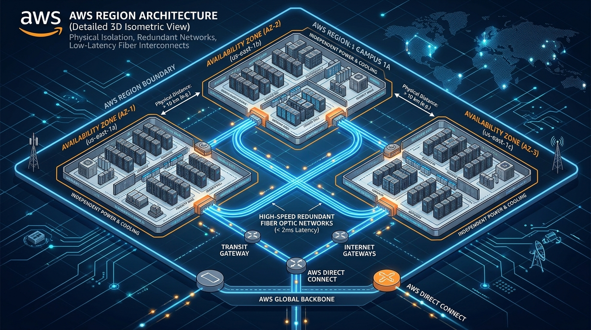

### 1. Regions & Availability Zones
*   **WHAT**: An **AWS Region** is a physical geographical location containing multiple, physically isolated, and redundant **Availability Zones (AZs)** [4]. Each AZ consists of one or more discrete data centers, each equipped with independent power, cooling, physical security, and ultra-low-latency, redundant fiber-optic networking [5]. Services can be strictly regional (e.g., S3, RDS) or globally scoped (e.g., Route 53, IAM) [5].
*   **WHY**: To guarantee high availability, fault tolerance, compliance, and disaster recovery [4]. By structuring applications to distribute traffic across separate AZs within a region, architects can build systems that tolerate data center-level physical disasters (floods, power grid collapses) with zero disruption to the user.
*   **WHERE**: Placed at the very foundation of the AWS landing zone layout. All network topologies (VPCs), computing pools (Auto Scaling Groups), and database replication groups (RDS Multi-AZ) must span across a minimum of 2-3 Availability Zones [4, 5, 18, 28, 60].
*   **HOW**:
    1. Assess placement constraints: **User Location** (latency), **Data Location** (sovereignty and compliance like GDPR), and **Service Availability** (not all regions support all services) [4].
    2. Deploy multi-AZ infrastructure via AWS CloudFormation or CDK [66, 73].
    3. Configure Route 53 latency-based or geolocation routing to direct users to the nearest regional endpoint [85, 86].
*   **MENTAL MODEL**: Think of an AWS Region as a **Sovereign Nation**. Think of Availability Zones as **Isolated Municipal Power Plants** within that nation. If one power plant experiences a generator failure or flood, the remaining plants are completely unaffected and dynamically absorb the load over a private high-speed grid.
*   **ADVANTAGES**:
    *   **Near-Zero RTO/RPO** for regional failover using automated Multi-AZ synchronization [28, 60].
    *   **Strict Regulatory Adherence**: Ensures data resides strictly within national boundaries (e.g., AWS Frankfurt for GDPR) [4].
    *   **Sub-Millisecond Inter-AZ Latency**: Encrypted private transit lines enable synchronous database replication across zones without degrading client response times [5, 28].
*   **DISADVANTAGES**:
    *   **Data Transfer Costs**: Data sent across AZ boundaries within the same region incurs a billing charge of $0.01 per GB in each direction [88]. High-throughput streaming between nodes in different AZs can quickly inflate your bill.
    *   **Eventually Consistent Inter-Region Replication**: Bypassing region boundaries (e.g., DynamoDB Global Tables) introduces speed-of-light replication lag, resulting in eventual consistency across hemispheres [37, 38].
*   **SYSTEM DESIGN SCENARIO**:
    *   **Problem**: A financial trading platform must guarantee 99.999% uptime for transaction processing. A physical event (such as a major electrical storm) destroys a complete data center cluster. How do you design the compute and relational database tier to survive this with zero manual intervention and zero data loss?
    *   **Solution**: Deploy an **Amazon Aurora PostgreSQL cluster** across three AZs (Replicating data 6 ways across 3 AZs) [28, 29]. In front of Aurora, deploy an **Application Load Balancer (ALB)** and an **Auto Scaling Group (ASG)** spanning all three subnets [9, 18]. Configure the ALB to execute active health checks [18]. In the event of an AZ outage, the ALB instantly stops sending traffic to the unhealthy zone, the ASG provisions new instances in the remaining healthy AZs using **Launch Templates** [18], and Aurora performs an automated, sub-30-second storage-level failover to a read replica in a healthy zone with **zero data loss** (RPO=0) [28].

---

### 2. The Cloud Mindset: CapEx vs. OpEx & Heavy Lifting Elimination

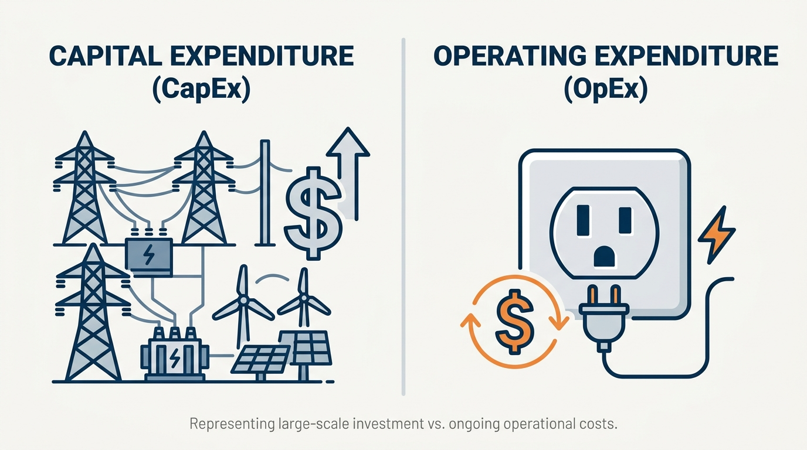
*   **WHAT**: The structural shift from **Capital Expense (CapEx)** (upfront investment in physical servers, data center real estate, cooling systems, and networking switches) to **Variable/Operational Expense (OpEx)** (paying only for the exact amount of cloud resources consumed per second/hour) [2]. This shift represents the elimination of **undifferentiated heavy lifting**—such as patching hypervisors, racking servers, and managing physical storage [2, 114].
*   **WHY**: To dramatically accelerate the speed of innovation [94, 95]. Organizations can experiment instantly, pivot immediately without write-off penalties, and scale up or down based on real-time consumer demand rather than static, multi-year capacity forecasts [2, 17, 114].
*   **WHERE**: Impacts every architectural layer—from choosing managed serverless platforms (PaaS/FaaS) over raw virtual machines (IaaS) to restructuring financial modeling and FinOps practices [6, 8, 91, 114].
*   **HOW**:
    1. Perform **Total Cost of Ownership (TCO)** assessments comparing cloud resource billing models against on-premise hardware maintenance, networking, software licensing, and engineering personnel costs [90, 91].
    2. Establish organizational policies to enforce tagged ownership (`Cost Allocation Tags`) on every deployed AWS resource [89].
    3. Implement automated budget thresholds via **AWS Budgets** to trigger SNS notifications when projected spend exceeds OpEx boundaries [89].
*   **MENTAL MODEL**: Think of CapEx as **Buying and Maintaining a Power Grid Infrastructure** (building a dam, laying cables, hiring technicians). Think of OpEx as **Plugging an Appliance into a Wall Outlet** and paying a utility bill only for the exact kilowatt-hours consumed.
*   **ADVANTAGES**:
    *   **Instant Scaling & Infinite Capacity**: Eliminates the risk of "guessing capacity" and failing to handle a 10x traffic spike [2].
    *   **Focus on Business Logic**: Offloads hypervisor security, OS patching, hardware replacement, and cooling infrastructure directly to AWS [2, 114].
    *   **Global Footprint in Minutes**: Spin up exact replicas of your architecture in Europe, Tokyo, or Virginia with a single API call [2, 4].
*   **DISADVANTAGES**:
    *   **Runaway Variable Costs**: In the absence of strict cost governance, a developer's infinite loop in a serverless Lambda function or an unmonitored EMR cluster can generate thousands of dollars in a single weekend [88, 89].
    *   **Vendor Lock-In**: Deep integration with cloud-native PaaS/FaaS APIs (e.g., DynamoDB Streams, Lambda) makes migrating workloads back on-premise or to a competitor exceptionally expensive and complex [7, 36, 104].
*   **SYSTEM DESIGN SCENARIO**:
    *   **Problem**: A startup needs to launch a seasonal video processing application. Peak demand occurs during sports tournaments (generating millions of transcodes), but during the offseason, usage drops to absolute zero. If they build this on-premise, they must spend $250k on GPU hardware that will sit idle for 9 months of the year.
    *   **Solution**: Architect a fully serverless, pay-for-use pipeline. Store raw video uploads in **Amazon S3** [44]. S3 triggers **S3 Event Notifications** that push tasks into an **Amazon SQS Queue** [49, 81]. Use **AWS Lambda** (configured with GPU-accelerated container runtimes) or **AWS Batch** running on **AWS Fargate** to scale instantly from zero to 10,000 concurrent processing nodes [9, 10, 24]. In the offseason, the startup pays $0.00 for compute. During peak tournaments, they pay only for the exact milliseconds their code executes, aligning costs directly with their revenue [24, 88].

---
\n\n## Phase 2: Compute Paradigms & Virtualization

### 3. Elastic Compute Cloud (EC2): Scaling, Virtualization & Key Pairs

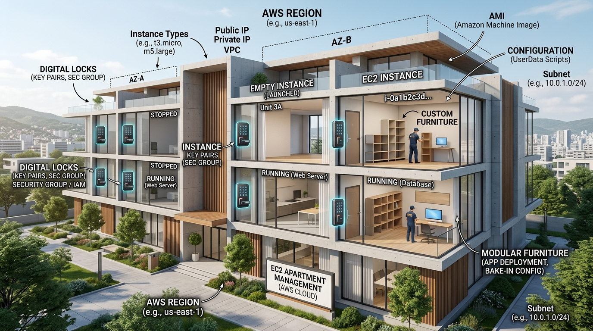
*   **WHAT**: **Amazon EC2** provides scalable, secure virtual machines (instances) running on top of AWS-managed physical hypervisors [10]. It is the foundational **IaaS (Infrastructure as a Service)** offering [5]. EC2 instances are constructed via **Amazon Machine Images (AMIs)**—pre-packaged templates containing the operating system, applications, boot configurations, and block device mappings [12].
*   **WHY**: To provide raw, unrestricted access to compute resources with absolute operating system-level control. This allows organizations to run legacy software, deploy custom kernel modules, or optimize low-level compute configurations [19, 31].
*   **WHERE**: Placed inside the private or public subnets of a custom VPC, typically orchestrated by an **Auto Scaling Group (ASG)** behind an **Application Load Balancer (ALB)** [10, 18, 19, 60].
*   **HOW**:
    1. Select the optimal **Instance Family** tailored to your workload: `m` (General Purpose), `t` (Burstable), `c` (Compute Optimized), `r` (Memory Optimized), `i` (Storage/IOPS Optimized), or `g` (GPU/Machine Learning) [11].
    2. Configure **Security Groups** (acting as stateful virtual firewalls) to enforce a strict "default-deny" rule on all inbound and outbound traffic [13, 19].
    3. Inject bootstrap scripts into the EC2 instance metadata using **User Data**, or compile custom applications directly into a custom **Golden AMI** to eliminate startup boot delays [19].
    4. Secure access via asymmetric **Key Pairs** (using SSH Port 22 for Linux or RDP Port 3389 for Windows) [14].
*   **MENTAL MODEL**: Think of an EC2 instance as a **Rented Empty Apartment**. You are given the keys (Key Pairs). You can paint the walls, bring in any furniture (applications), and install locks (Security Groups) [10, 13, 14]. However, you are entirely responsible for cleaning, maintaining, and locking the doors.
*   **ADVANTAGES**:
    *   **Complete Control**: Full root/administrator access to the underlying kernel, operating system, and storage volumes [12, 19, 31].
    *   **Highly Flexible Hardware Selection**: Choose from thousands of hardware combinations—from tiny burstable instances (t2.micro) with a fraction of a CPU to massive multi-GPU nodes with terabytes of RAM [11, 12].
    *   **Dynamic Scaling**: Scale horizontally (adding more instances) or vertically (resizing to a larger instance class) in response to resource metrics [17].
*   **DISADVANTAGES**:
    *   **Significant Operational Burden**: You must manage security patches, OS updates, hypervisor network configurations, backup strategies, and runtime performance [19, 109].
    *   **Slow Provisioning Times**: Spinning up a raw EC2 instance can take 1-3 minutes. Under sudden, explosive traffic spikes, this delay can lead to dropped requests or degraded performance before the auto-scaling group can scale out.
*   **SYSTEM DESIGN SCENARIO**:
    *   **Problem**: An enterprise runs a legacy monolithic accounting system that requires kernel-level customization and runs on Windows Server. It cannot be containerized or rewritten. During quarterly closing cycles, CPU usage spikes to 100%, freezing the application.
    *   **Solution**: Deploy the legacy monolith across a Multi-AZ network topology in a custom VPC [60]. Launch the monolith on an **m6i.large** general-purpose instance [11]. Configure an **Auto Scaling Group** with a minimum size of 2 and a maximum of 10, using **Target Tracking Scaling Policies** set to maintain average CPU utilization at 70% [18]. To eliminate boot-time installation latency, use **AWS Systems Manager** to pre-install the legacy application, patches, and configurations, and bake this state into a custom **Golden AMI** [12, 19]. When the quarterly close triggers a CPU spike, the ASG spins up identical, pre-configured instances from the AMI in under 90 seconds, distributing the incoming transaction load smoothly [18].

---

### 4. EC2 Purchase Models: On-Demand, Spot, Reserved & Savings Plans

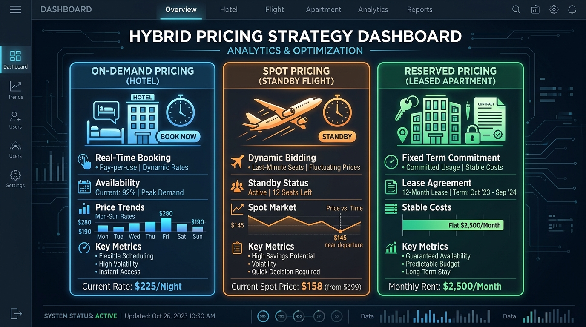
*   **WHAT**: AWS provides four main pricing models for compute to optimize capital efficiency [14, 15]:
    1.  **On-Demand**: Pay-as-you-go per second with no upfront commitments [14].
    2.  **Spot Instances**: Bid on spare AWS compute capacity for up to a 90% discount [14, 15]. However, AWS can reclaim the instance with a strict **2-minute notice** [14, 15].
    3.  **Reserved Instances (RI)**: Commit to a specific instance family and region for a 1 or 3-year term for up to a 75% discount [15, 16].
    4.  **Savings Plans**: Commit to a dollar-per-hour spend across EC2, Fargate, and Lambda for up to a 72% discount [15, 17].
*   **WHY**: To align computing costs with performance and predictability requirements [20, 116]. Steady-state workloads should never be run on On-Demand pricing, while flexible, batch-oriented workloads should leverage Spot pricing [14, 15].
*   **WHERE**: Evaluated and applied globally across all AWS compute pools in an organization to optimize FinOps performance [20, 116].
*   **HOW**:
    1. Run **AWS Compute Optimizer** to evaluate historical CPU, memory, and network usage to identify over-provisioned resources (Right-Sizing) [90, 116].
    2. Map workloads to purchase styles: Run baseline servers on Savings Plans [15, 17]; scale dynamic web traffic on On-Demand [14]; execute batch processing on a **Spot Fleet** spanning multiple instance families to maximize fulfillment rates [15, 16].
    3. Implement automated backup policies to save progress for Spot-based tasks to handle sudden preemptions gracefully [15].
*   **MENTAL MODEL**: 
    *   *On-Demand*: Renting a **Hotel Room** at standard walk-in rates (most expensive, completely flexible) [14].
    *   *Spot*: **Standby Flight Tickets** (extremely cheap, but you can be bumped from the flight if a full-paying customer shows up) [14, 15].
    *   *Reserved/Savings*: **Leasing an Apartment** for a 12 or 36-month contract (substantial discount, but you pay regardless of whether you are in the room) [15].
*   **ADVANTAGES**:
    *   **Substantial Cost Reduction**: Blending Spot, Reserved, and Savings Plans can slash monthly compute costs by 50% to 70% compared to pure On-Demand architectures [14, 15].
    *   **Agility with Savings Plans**: Unlike standard RIs, Savings Plans apply automatically across operating systems, regions, and compute families (e.g., EC2 to Fargate or Lambda) [15, 17].
*   **DISADVANTAGES**:
    *   **Involuntary Termination (Spot)**: Spot instances are highly volatile; they are not suitable for stateful or latency-sensitive user sessions [15].
    *   **Underutilization Waste (RIs)**: Committing to a 3-year term for a compute class that your software architecture outgrows in 6 months creates dead capital waste [15, 16].
*   **SYSTEM DESIGN SCENARIO**:
    *   **Problem**: An image hosting platform processes 50 million thumbnails daily. The processing pipeline is a batch application that pulls images from S3, resizes them, and writes them back. Compute costs on On-Demand instances have become unsustainable, representing 60% of total operational spend.
    *   **Solution**: Architect a hybrid, cost-optimized compute tier. Analyze historical logs to identify the platform's absolute minimum daily baseline load. Purchase a **Compute Savings Plan** to cover this baseline load at a 72% discount [17]. For the elastic, spiky image-processing workload, configure an **Auto Scaling Group** to request a **Spot Fleet** spanning multiple instance families (e.g., c5.large, c6g.large, m5.large) to maximize resource availability [16, 18]. Implement the image-resizing code to pull tasks from an **SQS Queue** [22, 81]. If AWS issues a 2-minute termination notice on a Spot instance [15], the running container immediately stops polling the queue, allowing the in-flight SQS message visibility timeout to expire so another instance can process the message seamlessly [81]. This architecture achieves a flat 80% reduction in image processing costs [15].

---

### 5. Elastic Beanstalk: PaaS vs. Container Deployment

*   **WHAT**: **AWS Elastic Beanstalk** is an easy-to-use **Platform as a Service (PaaS)** that automates the deployment, provisioning, load balancing, auto-scaling, and health monitoring of web applications and batch workers [6, 9, 20]. Beanstalk supports pre-configured runtimes (Java, Go, Python, Node.js, Ruby, PHP) and custom Docker containers [20, 21].
*   **WHY**: To minimize time-to-market for developer teams [109]. It removes the complexity of manually writing CloudFormation templates, configuring Auto Scaling Groups, or managing load balancers, while still allowing developers to retain full underlying control of the infrastructure [20, 22].
*   **WHERE**: Placed at the edge of the architecture to host standard 3-tier web applications, APIs, or background asynchronous worker tasks [21, 22].
*   **HOW**:
    1. Organize your project into Beanstalk concepts: **Application** (the logical project container), **Application Version** (a specific, immutable zip or Docker image stored in S3), and **Environment** (the actual provisioned AWS resources running a version) [21].
    2. Choose the correct **Environment Tier**: **Web Server Tier** (for HTTP/HTTPS traffic using ALB and EC2) or **Worker Tier** (for batch processing, which automatically deploys an ASG, EC2 instances, and an SQS queue daemon to poll messages) [21, 22].
    3. Configure **Rolling** or **Immutable** platform updates to apply OS and security patches automatically during low-traffic hours [21, 22].
*   **MENTAL MODEL**: Think of Elastic Beanstalk as an **Automatic Transmission Car**. You step on the gas (upload your code) and the car automatically shifts gears, accelerates, and balances fuel consumption (autoscales and provisions resources) [20]. If you want, you can still switch to manual override (SSH into the instances and modify the raw configuration) [22].
*   **ADVANTAGES**:
    *   **Rapid Deployment**: Developers upload a zip file or a Git commit, and a secure, production-grade application is live in under 5 minutes [20].
    *   **Zero Platform Fees**: You pay only for the raw AWS resources (EC2, S3, ALB) created by Beanstalk—the orchestrator itself is free [21].
    *   **Underlying Infrastructure Access**: Unlike other PaaS models, you can still modify the underlying EC2 configurations, attach security groups, and run customized configuration files (`.ebextensions`) [22].
*   **DISADVANTAGES**:
    *   **Monolithic Constraints**: Beanstalk is not designed for complex, distributed microservices architectures; orchestrating hundreds of independent microservices in Beanstalk leads to configuration drift and high management overhead [22, 23].
    *   **Tight Coupling (State Risk)**: Configuring an RDS database directly inside the Beanstalk environment is a major anti-pattern; if the Beanstalk environment is deleted, the database is permanently destroyed with it [22].
*   **SYSTEM DESIGN SCENARIO**:
    *   **Problem**: A business wants to launch a simple seasonal e-commerce API. The development team has no dedicated DevOps engineers and must focus strictly on coding. The API must scale automatically during holiday sales but cost next to nothing during low-traffic periods.
    *   **Solution**: Provision an **AWS Elastic Beanstalk** environment using the **Web Server Tier** with a Node.js runtime [21]. Configure the Auto Scaling Group with a minimum size of 1 and a maximum of 10, triggered by network request count [18, 20]. Ensure the database (Amazon RDS PostgreSQL) is launched **externally** (outside of Beanstalk) to decouple state from compute [22]. Pass the database connection credentials securely via **SSM Parameter Store** [79] and reference them in Beanstalk's environment properties [78]. Developers can run a single command (`eb deploy`) to push updates safely using **Blue-Green Deployments** (using Route 53 CNAME swaps to minimize downtime) [76, 86].

---

### 6. Container Orchestration: ECS vs. EKS & Serverless Compute (Fargate, Lambda)

*   **WHAT**: Container orchestration manages the lifecycle, placement, networking, and scaling of thousands of microservice containers [8, 23]. AWS provides two orchestrators [8, 9]:
    1.  **Elastic Container Service (ECS)**: An AWS-native, highly integrated orchestrator [9, 23].
    2.  **Elastic Kubernetes Service (EKS)**: A managed Kubernetes service providing 100% compatibility with open-source Kubernetes APIs [8, 9].
    Both can run on two compute backends: **EC2 Clusters** (you manage the VMs) [9, 23] or **AWS Fargate** (serverless container compute where you pay strictly for vCPU and Memory per second—no servers to manage) [8, 9].
    For event-driven execution, **AWS Lambda** provides a fully serverless, highly scalable, pay-per-invocation function-as-a-service (FaaS) model [9, 24].
*   **WHY**: Containers provide lightweight process isolation, rapid boot times, and cloud neutrality [7]. Orchestrators are required to handle deployment strategies, network routing, self-healing, and service discovery across dynamic container pools [8].
*   **WHERE**: Placed at the core of modern microservices, event-driven architectures, real-time data pipelines, and API backends [6, 23, 24].
*   **HOW**:
    1. Build a self-contained **Docker Image** and store it securely in **Amazon ECR (Elastic Container Registry)** [7, 65].
    2. Define your application blueprint: For ECS, write a **Task Definition** specifying vCPU, Memory, networking, and IAM roles [9, 24].
    3. Configure **Service Autoscaling** to scale task counts based on real-time CloudWatch metrics [22, 73].
    4. For serverless functions, deploy your business logic inside **AWS Lambda** [24]. Configure execution memory (up to 10GB) and maximum execution timeout (900 seconds) [24].
*   **MENTAL MODEL**: 
    *   *Containers*: Standardized, cargo-sized **Shipping Containers** [7].
    *   *ECS/EKS*: The **Cargo Ship Cranes** that load, stack, and organize those containers onto the deck based on space and weight limits [8, 23].
    *   *Fargate*: **Chartering a Third-Party Cargo Service**—you pay for the exact volume of cargo shipped, and they handle the ship, the engine, and the crew [8, 9].
    *   *Lambda*: A **Vending Machine**—you put a coin in (request trigger), the machine performs a single function, and it shuts off until the next coin is inserted [24, 88].
*   **ADVANTAGES**:
    *   **Extreme Density & Resource Efficiency**: Containers do not pack a guest OS, making them 10x lighter and faster to boot than standard VMs [7].
    *   **Absolute Serverless Compute (Fargate/Lambda)**: Removes all operational overhead of patching, scaling, or managing underlying VM hosts [8, 9].
    *   **Rapid Event-Driven Scaling (Lambda)**: Scales from zero to thousands of concurrent executions in milliseconds in response to S3 uploads, API calls, or database changes [24, 49, 104].
*   **DISADVANTAGES**:
    *   **Cold Start Latency (Lambda)**: Idle Lambda functions experience a 200ms to 5-second "cold start" latency spike during the initial container initialization, making them less suitable for low-latency, real-time gaming or high-frequency trading backends [24].
    *   **Strict Resource Constraints**: Lambda is capped at a 15-minute (900s) maximum execution duration [24]. Long-running ETL jobs or complex database migrations will fail and must be run on ECS/EKS [9].
*   **SYSTEM DESIGN SCENARIO**:
    *   **Problem**: A media portal needs to handle unpredictable surges in user traffic. During viral news events, API request volume spikes from 100 requests/sec to 100,000 requests/sec in under 30 seconds. Standard EC2 auto-scaling is too slow to absorb this surge, leading to 504 Gateway Timeouts.
    *   **Solution**: Deconstruct the media portal's monolithic API into highly optimized, stateless microservices. Package the APIs into Docker containers and deploy them onto **Amazon ECS** using **AWS Fargate** compute [9, 23]. By utilizing Fargate, the portal avoids the bottleneck of waiting for underlying EC2 instances to boot; instead, Fargate directly provisions and runs raw containers in seconds. In front of ECS, deploy an **Application Load Balancer (ALB)** and set up a **Target Tracking Scaling Policy** based on ALB active request count [9, 18]. For highly bursty, lightweight background tasks (like generating social share cards or sending push notifications), offload the execution entirely to **AWS Lambda**, which scales instantly to handle thousands of concurrent invocations [9, 24].

---
\n\n## Phase 3: Database Architectures

### 7. Relational Databases (RDS & Aurora)

*   **WHAT**: **Amazon RDS** is a managed database service supporting popular engines (MySQL, PostgreSQL, MariaDB, Oracle, SQL Server) [27]. It automates provisioning, patching, backup retention, and recovery [28]. **Amazon Aurora** is AWS's cloud-native, high-performance relational engine [28]. It decouples compute from storage, utilizing a shared **cluster volume** that automatically replicates data 2 copies each across 3 Availability Zones (6 total copies) [28, 29].
*   **WHY**: To offload the tedious operational burden of managing high-availability databases (sharding, backup scripts, Multi-AZ failovers) while ensuring strict ACID compliance, relational schemas, and complex join query capabilities [28, 30].
*   **WHERE**: Used as the primary transactional state store (OLTP) for e-commerce checkouts, financial ledgers, inventory systems, and traditional enterprise backends [27, 30].
*   **HOW**:
    1. For high-availability, enable **Multi-AZ Deployments** in RDS [28]. This maintains a synchronous standby replica in a separate AZ; RDS automatically handles DNS failover to the standby in under 60 seconds if the primary fails [28].
    2. To optimize read-heavy workloads, provision up to 15 **Read Replicas** in Aurora [28].
    3. To protect against region-wide outages and provide local low-latency reads for global users, deploy an **Aurora Global Database** [28]. This asynchronously replicates data directly at the storage level to up to five secondary AWS Regions in under 1 second [28, 29].
*   **MENTAL MODEL**: Think of Amazon RDS as **Leasing a Managed Bank Vault**. You are responsible for organizing the cash and papers inside the safety deposit boxes (tables, indexes, optimization) [28], but AWS manages the physical vault security, redundant power supplies, backup generators, and building maintenance [28].
*   **ADVANTAGES**:
    *   **Self-Healing Storage Fabric (Aurora)**: Decoupled storage automatically scales up to 128TB [30]. It continuously scans for bad sectors, automatically repairing them in the background without affecting DB performance [29].
    *   ** synchronous Multi-AZ Replication**: Guarantees zero data loss (RPO=0) during zone outages [28].
    *   **Storage Auto-Scaling**: RDS automatically increases allocated storage when free space drops below 10%, preventing application freezes due to full disks [30].
*   **DISADVANTAGES**:
    *   **Scale Limits**: Traditional relational engines are bound by vertical scaling constraints; even with write sharding, they cannot easily scale to handle millions of concurrent writes per second [30, 31].
    *   **No OS-level Access**: You cannot log into the host operating system of an RDS instance, limiting your ability to install third-party plugins or customize low-level DB parameters [31].
*   **SYSTEM DESIGN SCENARIO**:
    *   **Problem**: An e-commerce application experiences database lag during flash sales. The system crashes when concurrent users attempt to check out, and analytics queries run by business analysts on the database lock transactional tables.
    *   **Solution**: Migrate the transactional database to **Amazon Aurora PostgreSQL** with a **Single-Master** deployment [28, 29]. Separate read and write traffic at the application layer: send all checkout write transactions to the primary writer endpoint, and route all product-catalog read queries to the Aurora **Reader Endpoint**, which automatically distributes the load across up to 15 auto-scaled **Read Replicas** [28, 29, 30]. To isolate analytics queries completely, establish an asynchronous pipeline that replicates data into **Amazon Redshift** for OLAP workloads, ensuring heavy reporting queries never run against transactional tables [31, 32].

---

### 8. NoSQL Architectures (DynamoDB): Key-Value & Document Store

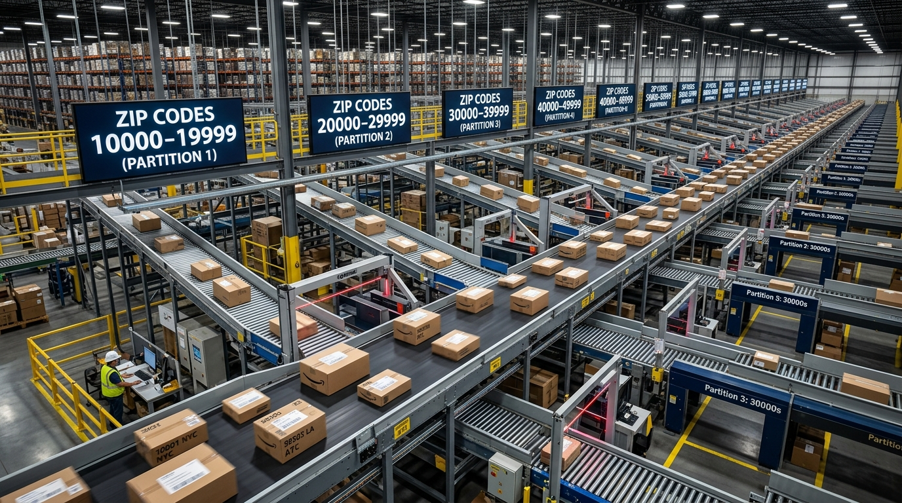
*   **WHAT**: **Amazon DynamoDB** is a fully managed, serverless NoSQL database designed for single-digit millisecond performance at any scale [36]. It supports both key-value and document data formats [36]. Data is stored in region-specific tables consisting of Items and Attributes, with a mandatory Primary Key (Partition Key + optional Sort Key) [37].
*   **WHY**: Traditional relational databases fail when write/read throughput scales to hundreds of thousands of transactions per second [30, 31]. DynamoDB guarantees consistent, low-latency performance at scale by automatically partitioning data across physical storage nodes as your table grows [36].
*   **WHERE**: Ideal for high-throughput, latency-sensitive workloads like user session storage, shopping carts, gaming leaderboards, and real-time IoT telemetry pipelines [34, 35, 36, 37].
*   **HOW**:
    1. Choose the correct Read/Write Capacity Mode: **Provisioned Mode** (with Auto-Scaling to control cost and avoid throttling) or **On-Demand Mode** (for unpredictable, spiky traffic where you pay strictly per request) [36, 39].
    2. Optimize query patterns using **Global Secondary Indexes (GSIs)** (to query on non-primary attributes with custom projection) and **Local Secondary Indexes (LSIs)** [37, 38].
    3. For global distributed applications, enable **DynamoDB Global Tables** to replicate data with multi-active, multi-region write capability [37].
    4. By default, DynamoDB provides **Eventually Consistent Reads**; for strict read accuracy, explicitly request **Strongly Consistent Reads** [38].
*   **MENTAL MODEL**: Think of DynamoDB as a **Massive Logistics Sorting Facility**. The **Partition Key** is the postal zip code [37]. No matter how many packages enter the facility (millions of TPS), workers can route packages in parallel because they look only at the zip code to place them on separate sorting belts (nodes) [36].
*   **ADVANTAGES**:
    *   **Infinite Horizontal Scaling**: No practical limits on database size or total throughput; DynamoDB scales seamlessly to handle millions of TPS [36].
    *   **Fully Serverless Operational Model**: Zero server management, patching, or storage provisioning required [36].
    *   **DynamoDB Streams**: Capture real-time item modifications (inserts, updates, deletes) as an ordered stream, allowing you to trigger serverless Lambdas to execute event-driven workflows [104].
*   **DISADVANTAGES**:
    *   **No Complex Joins**: DynamoDB does not support native SQL joins, multi-table queries, or ad-hoc aggregations; you must design your table structure strictly around your application's access patterns (Single-Table Design) [37].
    *   **Hot Partition Throttling**: If your query pattern directs 95% of traffic to a single partition key (e.g., a viral celebrity's user ID), that physical partition will exhaust its allocated RCU/WCU, resulting in database throttling regardless of total table capacity.
*   **SYSTEM DESIGN SCENARIO**:
    *   **Problem**: A multiplayer mobile game must track real-time player states and high scores. The database must handle massive surges in reads and writes when a new season launches, scaling up to 500,000 writes/sec without dropping connections or exceeding a 10ms latency budget.
    *   **Solution**: Create a DynamoDB table with a primary key structure where `player_id` is the Partition Key (enabling high partition cardinality to avoid hot keys) and `data_type` is the Sort Key [37]. Configure the table to run in **On-Demand Capacity Mode** during launch day to absorb unpredictable traffic spikes, then transition to **Provisioned Mode** with Auto-Scaling once traffic stabilizes to optimize costs [39]. To display real-time global leaderboards, create a **Global Secondary Index (GSI)** with a partition key of `region` and a sort key of `score` [37, 38]. Configure **DynamoDB Streams** [104] to detect score updates; when a player sets a new record, the stream triggers an **AWS Lambda function** [104] to push real-time congratulations notifications to the player's device using **Amazon SNS** [49, 82].

---

### 9. Analytical Databases: Amazon Redshift (OLAP vs. OLTP)

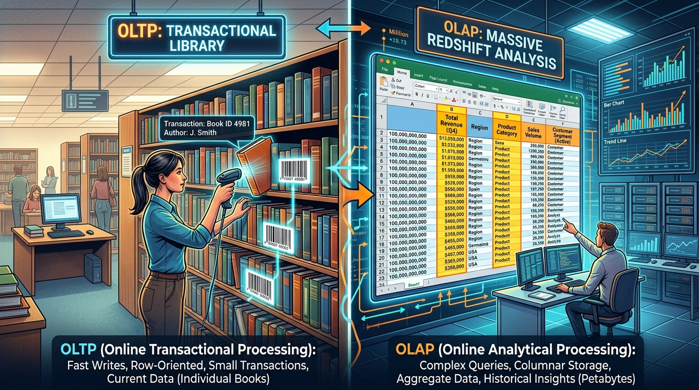
*   **WHAT**: **Amazon Redshift** is a fast, fully managed, petabyte-scale data warehouse service [31, 32]. Unlike transactional databases (OLTP) that store data in a row-oriented fashion, Redshift is designed for **On-Line Analytical Processing (OLAP)** [31]. It stores data column-by-column (columnar storage) and utilizes a **Massively Parallel Processing (MPP)** architecture [31, 32].
*   **WHY**: Complex reporting queries (e.g., "Calculate the average monthly sales growth over 5 years across 400 stores") require reading entire tables. Running these queries on a row-oriented database (like RDS MySQL) requires reading every column from disk, which exhausts I/O performance and locks transactional tables [30, 31]. Columnar storage allows Redshift to read only the specific columns needed for the calculation, compressing data up to 10x and returning analytical queries in seconds [31, 32].
*   **WHERE**: Placed at the core of enterprise Business Intelligence (BI), ETL pipelines, and centralized data warehousing [31, 32, 101].
*   **HOW**:
    1. Provision a Redshift cluster consisting of a **Leader Node** (which parses SQL queries, compiles execution plans, and coordinates tasks) and multiple **Compute Nodes** (which execute the compiled queries in parallel) [32, 33].
    2. Define efficient **Distribution Styles** (KEY, EVEN, or ALL) to determine how rows are distributed across compute nodes, minimizing network traffic during joins.
    3. Configure **Redshift Spectrum** to query petabytes of cold, structured, or semi-structured data directly inside **Amazon S3** without loading it into the Redshift cluster, enabling independent scaling of compute and storage [103].
*   **MENTAL MODEL**: Think of a row-oriented database as a **Library of Complete Novels**. To find the age of every character, you must pull and open every single book and scan every page. Think of Redshift as a **Giant Spreadsheet**. Every column is stored as a separate file. To calculate the average age of all characters, you pull only the "Age" column file, bypass all other columns, and calculate the average instantly.
*   **ADVANTAGES**:
    *   **Massively Scalable Analytics**: Scales up to petabytes of data by dynamically adding more compute nodes to the cluster [32].
    *   **Highly Compressed Data**: Columnar storage compresses similar data types efficiently, slashing physical disk space and reducing I/O operations [32].
    *   **Enterprise Tool Integration**: Integrates natively with standard reporting and BI tools (QuickSight, Tableau) using standard SQL queries [31, 32].
*   **DISADVANTAGES**:
    *   **Not Suitable for Transactional (OLTP) Workloads**: Redshift is highly inefficient for frequent single-row writes or updates; every write requires rewriting complete columns, leading to disk fragmentation and performance degradation [31].
    *   **High Compute Cost**: Running a 24/7 Redshift cluster can be expensive. If you have low-volume, highly ad-hoc queries, serverless analytical services like **Amazon Athena** are much more cost-effective [103].
*   **SYSTEM DESIGN SCENARIO**:
    *   **Problem**: A global streaming company wants to run daily retention analysis on billions of user play-event records stored in S3. Loading all this data into a transactional database is impossible, and running the analysis on an EMR cluster takes over 6 hours.
    *   **Solution**: Establish a centralized data warehouse. Use **AWS DataSync** or **Kinesis Firehose** to continuously aggregate user play events into **Amazon S3** [99, 101, 105]. Define schemas using the **AWS Glue Data Catalog**. Provision an **Amazon Redshift** cluster [31, 32]. Use **Redshift Spectrum** to execute complex SQL reporting queries directly against S3 [103]. Redshift Spectrum distributes the execution of queries across thousands of temporary Amazon-managed nodes, bypassing the local cluster size and scanning billions of rows in S3 in parallel [103]. The query completes in under 4 minutes, and results are written directly to a BI dashboard.

---
\n\n## Phase 4: Enterprise Storage Fabrics

### 10. Instance Store vs. Elastic Block Store (EBS)

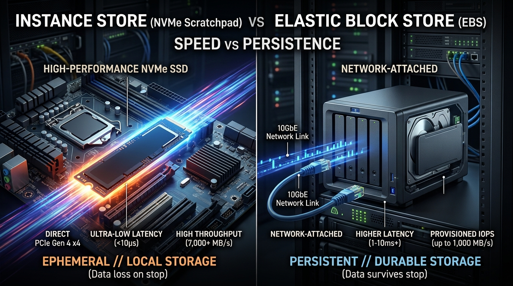
*   **WHAT**: AWS provides two primary block storage options for EC2 instances [39, 41]:
    1.  **Instance Store**: Physically attached directly to the host computer [40]. It provides **ephemeral (temporary) storage**—if the instance is stopped, terminated, or experiences a hardware failure, all data is permanently lost [40].
    2.  **Elastic Block Store (EBS)**: Network-attached virtual hard drives [41]. It provides **persistent, highly durable block storage** that operates independently from the life of the EC2 instance, allowing you to stop the instance and detach or attach the volume at will [41].
*   **WHY**: Under high-performance transaction environments (e.g., in-memory caches, distributed database replicas), network latency to EBS can bottleneck performance [42]. Instance Store provides direct, raw NVMe-based speed, while EBS is required for long-term database storage, system boot volumes, and point-in-time snapshot recovery [41, 42].
*   **WHERE**: Instance Store is mounted locally on specialized instance types (e.g., i3en, d3) [11]; EBS volumes are provisioned in specific Availability Zones and attached to EC2 instances across the network [41].
*   **HOW**:
    1. For mission-critical databases, deploy **EBS-Optimized EC2 instances** with **Provisioned IOPS SSD (io1/io2)** volumes to guarantee consistent IOPS performance [11, 42, 115].
    2. Schedule automated point-in-time backups using **EBS Snapshots** (stored as incremental backups inside S3) [22, 41, 42].
    3. For cost-sensitive workloads with predictable I/O, utilize **General Purpose SSD (gp3)** volumes, which allow independent scaling of throughput and IOPS [42].
*   **MENTAL MODEL**: 
    *   *Instance Store*: The **RAM/Scratchpad of your Laptop**—incredibly fast, but if you shut down the machine, everything is erased [40, 42].
    *   *EBS*: An **External Network Hard Drive** plugged into your laptop via a high-speed cable—you can unplug it, plug it into a different laptop, and your files are perfectly preserved [41, 42].
*   **ADVANTAGES**:
    *   **Incredible I/O Speed (Instance Store)**: Low-latency physical attachment delivers up to 100x the throughput and lower latency than network-attached EBS [41, 42].
    *   ** AZ-Level Durability (EBS)**: EBS volumes are automatically replicated within their Availability Zone to protect against single-hardware component failure, boasting a 99.999% availability rate [41].
*   **DISADVANTAGES**:
    *   **No Snapshots for Instance Store**: You cannot snapshot or back up an Instance Store volume using native AWS snapshot APIs [41, 42].
    *   **Network-Level Bottlenecks (EBS)**: High-throughput operations can saturate the hypervisor network link, leading to latency spikes and application timeouts if not using EBS-Optimized instances [115].
*   **SYSTEM DESIGN SCENARIO**:
    *   **Problem**: A financial institution runs a high-frequency trading application that utilizes a NoSQL database cluster (such as Cassandra). The database replicates data across multiple nodes at the application layer. The database requires extreme read/write IOPS, but network-attached storage latency is causing nodes to drop out of the cluster.
    *   **Solution**: Launch the Cassandra database nodes on storage-optimized **i4i** EC2 instances equipped with physically attached **Instance Store SSDs** [11]. This delivers NVMe-level, sub-millisecond read/write speeds, keeping latency well under the budget [41, 42]. To handle the ephemeral nature of the storage [40, 42], rely on Cassandra's native application-level replication across 3 Availability Zones [5]. Additionally, configure a nightly cron task that runs a database snapshot, compresses the files, and transfers them to **Amazon S3** [45]. If an instance fails, spin up a new i4i instance, and the Cassandra cluster will automatically stream replicate and sync the missing data from surviving nodes.

---

### 11. Shared File Systems: Amazon EFS vs. Amazon FSx

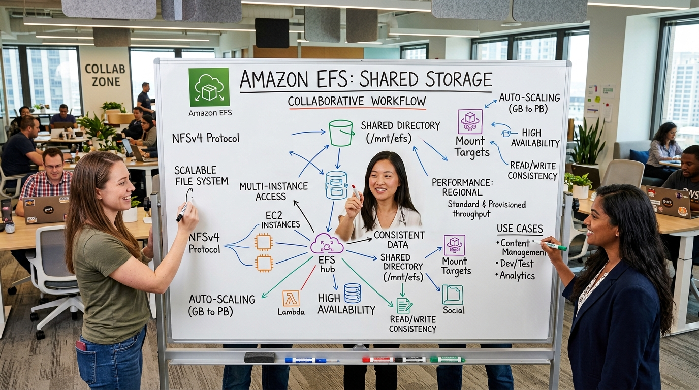
*   **WHAT**: AWS provides two primary shared file storage systems compatible with standard file system protocols (NFS, SMB) [43]:
    1.  **Amazon EFS (Elastic File System)**: A serverless, auto-scaling, pay-for-use file storage system compatible with Linux-based workloads (NFSv4) [43]. It spans across multiple Availability Zones automatically [43].
    2.  **Amazon FSx**: Managed, highly specialized third-party file systems [43, 119]. This includes **FSx for Windows File Server** (integrating natively with Active Directory) [43] and **FSx for Lustre** (designed for sub-millisecond, high-performance computing workloads) [43].
*   **WHY**: Standard block storage (EBS) can only be attached to a single EC2 instance at a time (with few exceptions) [41]. EFS and FSx enable thousands of EC2 instances, containers, or lambda functions to mount, read, and write to a shared directory simultaneously [43, 119].
*   **WHERE**: Positioned as the centralized shared storage tier for content management systems (Wordpress, Drupal), shared user home directories, enterprise Windows file shares, and machine learning training datasets [43, 119].
*   **HOW**:
    1. Deploy EFS inside your VPC, creating **Mount Targets** in each private subnet [43, 60].
    2. Configure **EFS Lifecycle Management** to automatically transition infrequently accessed files to the lower-cost EFS IA (Infrequent Access) storage tier after 30 days [47, 48].
    3. To access high-performance cluster compute, spin up an **FSx for Lustre** filesystem, linking it directly to an Amazon S3 bucket to process raw dataset files [43].
*   **MENTAL MODEL**: Think of EFS as a **Centralized Shared Office Whiteboard**. Every employee (EC2 instance) in the building can write on and read from the whiteboard at the exact same time, immediately seeing updates made by others.
*   **ADVANTAGES**:
    *   **True Serverless Auto-Scaling**: EFS starts empty and automatically grows or shrinks up to petabytes as files are added or deleted; you never provision storage capacity upfront [43].
    *   **Simultaneous Multi-Host Mounting**: Mount EFS to thousands of Linux servers, on-premises systems over Direct Connect, or serverless ECS tasks simultaneously [43, 119].
    *   **Native Windows AD Integration (FSx)**: Supports standard NTFS permissions, DFS namespaces, and Active Directory security bindings natively [43].
*   **DISADVANTAGES**:
    *   **High Latency compared to EBS**: Network-attached shared file protocols introduce higher latency overhead compared to direct block storage; EFS is not suitable for running low-latency relational databases (like MySQL/PostgreSQL) [30, 42].
    *   **Cost Factor**: EFS standard storage is significantly more expensive per GB ($0.30/GB/month) than standard EBS gp3 or Amazon S3 storage classes [42, 43, 44].
*   **SYSTEM DESIGN SCENARIO**:
    *   **Problem**: A media company runs a massive Wordpress portal. The portal is deployed across an Auto Scaling Group of 20 EC2 Linux instances to handle high traffic spikes. The instances need access to a shared directory containing 2TB of user-uploaded images and PDF assets. Using EBS means servers have out-of-sync media directories, leading to broken images for users.
    *   **Solution**: Provision an **Amazon Elastic File System (EFS)** inside the VPC, establishing Mount Targets in all private subnets [43, 60]. Mount the EFS directory to `/var/www/html/wp-content/uploads` on all 20 EC2 instances via NFSv4 [43]. Configure EFS with **EFS Lifecycle Management** to automatically transition files untouched for 14 days to EFS Infrequent Access (EFS IA) to slash storage costs by 80% [47]. This setup guarantees that when an editor uploads an image on Server 1, it is immediately readable by Servers 2 through 20 with zero replication delay, resolving the split-brain media issue [43].

---

### 12. Object Storage: S3 Storage Classes, Lifecycles & Static Hosting

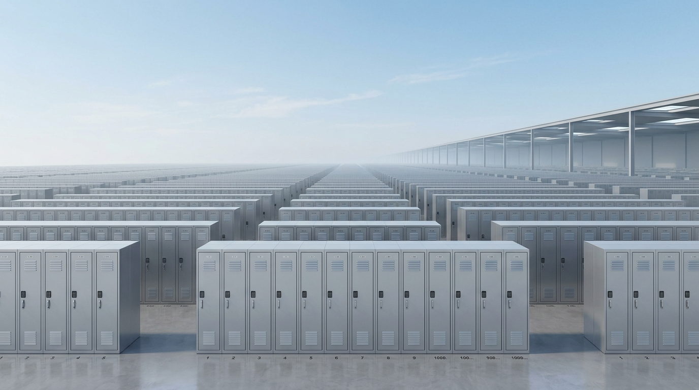
*   **WHAT**: **Amazon S3 (Simple Storage Service)** is an infinitely scalable, secure, REST API-accessible object storage service [44]. It stores data as "objects" inside "buckets" using a flat key-value namespace [44]. S3 provides 99.999999999% (11 9's) of durability by automatically replicating objects across a minimum of three geographically separated Availability Zones within a region [45, 46].
*   **WHY**: To store unstructured and semi-structured data securely, durably, and cheaply [25, 45]. It removes the scale limitations and administrative burden of managing traditional SAN or NAS storage architectures.
*   **WHERE**: Positioned as the centralized storage backbone of modern cloud architectures—serving as a staging area for ETL data, backups, data lakes, static assets, and log retention [45, 102].
*   **HOW**:
    1. Leverage different **S3 Storage Classes** to optimize costs: `S3 Standard` (frequent access), `S3 Standard-IA` (long-lived, infrequently accessed, backups), `S3 One Zone-IA` (non-critical, easily recreated data), `S3 Intelligent-Tiering` (monitors patterns and shifts objects automatically), `S3 Glacier` (archival data, retrieval times in minutes to hours), and `S3 Glacier Deep Archive` (lowest cost, retrieval in hours) [46, 47].
    2. Define **S3 Lifecycle Policies** to automate transitions from high-cost Standard storage to cold Glacier classes, and ultimately trigger expiration/deletion actions [47, 48].
    3. Configure **S3 Static Website Hosting** by uploading HTML/CSS/JS, enabling the static hosting endpoint, disabling "Block Public Access", and applying a **Bucket Policy** allowing public read access [48].
    4. Guard against accidental deletion or ransomware by enabling **S3 Versioning** and **S3 Object Lock** [45].
*   **MENTAL MODEL**: Think of S3 as an **Infinite Luggage Storage Locker Facility** [44]. You do not reserve a locker size; you simply check in individual bags (objects) and are handed a claim ticket (the object key/URL) [44]. The locker facility automatically duplicates your bags and stores them in separate buildings across town (Availability Zones) so that if one building burns down, your luggage is completely safe [45].
*   **ADVANTAGES**:
    *   **Unparalleled Durability**: 11 9's of durability means you can store 10,000,000 objects and expect to lose at most one object every 10,000 years [45, 46].
    *   **Extremely Low Cost**: S3 Standard is cheap, and Glacier Deep Archive costs as little as $0.00099 per GB per month [44, 47].
    *   **Event-Driven Integration**: Trigger real-time, serverless workflows natively via S3 Event Notifications (e.g., pushing events to SNS, SQS, or triggering Lambda functions) [49, 104].
*   **DISADVANTAGES**:
    *   **Retrieval Penalties on IA/Glacier**: Accessing Standard-IA or One Zone-IA objects incurs retrieval fees per GB; S3 Glacier Deep Archive requires up to 12 hours before data can be read, making it useless for real-time applications [46, 47].
    *   **Not a File System**: S3 is object storage; you cannot execute random-access, partial-file writes or mount S3 natively onto an operating system like a standard hard drive without utilizing translation layers (which degrade performance) [40, 41].
*   **SYSTEM DESIGN SCENARIO**:
    *   **Problem**: An insurance firm generates 100 million claim documents monthly (averaging 50KB each). Documents are accessed frequently in the first 30 days of submission, but are rarely accessed after that. By law, they must preserve these records for 7 years. Storing all 7 years of data in S3 Standard is generating massive monthly storage bills.
    *   **Solution**: Implement a cost-optimized **S3 Lifecycle Configuration** [47, 48]. Store all new document uploads in **S3 Standard** [46]. Create a Lifecycle Rule that:
        1. Automatically **transitions** objects to **S3 Standard-IA** after 30 days of creation (cutting storage costs by 40% while preserving sub-millisecond access for unexpected requests) [46, 47].
        2. Automatically **transitions** objects to **S3 Glacier Deep Archive** after 90 days (slashing costs by an additional 90% for the remaining 6.7 years of the compliance period) [46, 47].
        3. Configures **S3 Object Lock** in compliance mode to block any deletion requests (including from the root account) until the 7-year regulatory period has expired.

---

### 13. Hybrid Storage Integration: AWS Storage Gateway

*   **WHAT**: **AWS Storage Gateway** is a hybrid storage service that enables on-premises software applications and physical appliances to seamlessly write and read data directly from Amazon S3, S3 Glacier, and EBS snapshots over the network [50]. It operates in three main configurations [50, 52]:
    1.  **File Gateway (S3/Glacier)**: Exposes a standard network file share (NFS or SMB) on-premises; local files written to the share are uploaded directly to S3 buckets [51, 52].
    2.  **Tape Gateway (Virtual Tape Library)**: Replaces physical magnetic tape backup systems with a virtual tape library stored on S3 and Glacier, requiring zero changes to legacy on-premises tape backup software [51, 52].
    3.  **Volume Gateway (Block Storage)**: Exposes standard iSCSI block volumes to local servers, backed by cloud storage [51, 52]. It runs in two modes: **Cached Volumes** (primary data is stored in S3, and frequently accessed data is cached locally on-premises) or **Stored Volumes** (primary data is stored locally, with asynchronous backups uploaded to AWS as EBS snapshots) [51, 52].
*   **WHY**: To bridge the gap between legacy on-premises data centers and AWS [50]. It allows enterprises to leverage S3's infinite scalability, high durability, and low cost without rewriting legacy application code or investing in additional local SAN/NAS physical storage arrays [50, 51].
*   **WHERE**: Deployed as a virtual appliance (VMware ESXi, Hyper-V) or physical hardware gateway inside the on-premises corporate data center [50].
*   **HOW**:
    1. Deploy the Storage Gateway virtual appliance in the local network [50].
    2. Bind the gateway to your AWS Account.
    3. Configure local mount target volumes (e.g., exposing an SMB share for File Gateway or an iSCSI target for Volume Gateway) [51].
    4. Connect the local gateway to Amazon S3 over an encrypted **AWS Managed VPN** tunnel or **AWS Direct Connect** [50, 63].
*   **MENTAL MODEL**: Think of Storage Gateway as a **Wormhole Portal** placed in the corner of your local office basement. You throw file folders (File Gateway) or physical cassette tapes (Tape Gateway) into the portal. The objects instantly vanish from the office and land safely inside AWS's infinite global warehouse (Amazon S3) [50, 51].
*   **ADVANTAGES**:
    *   **Zero App Modification**: Legacy physical applications write to standard NFS/SMB or iSCSI interfaces; they are completely unaware that their backend storage is the public cloud [43, 50, 51].
    *   **Bandwidth Conservation**: Local cache storage keeps frequently accessed files on-premises, reducing latency and conserving external internet line bandwidth [51].
    *   **Eliminates Tape Maintenance**: Replaces error-prone, fragile physical magnetic tape storage with durable, virtual tapes backed by 11 9's of S3 Glacier durability [45, 51].
*   **DISADVANTAGES**:
    *   **Network Dependability**: If the internet or Direct Connect connection to AWS fails, the local gateway cannot upload new data, and if a cache-miss occurs, local apps cannot read files [52, 63].
    *   **Cache Management Overhead**: If the local cache size is provisioned too small, the gateway will experience frequent cache-misses, forcing local servers to wait for network retrievals from S3, which severely degrades application performance [51].
*   **SYSTEM DESIGN SCENARIO**:
    *   **Problem**: A hospital has an on-premises PACS (Picture Archiving and Communication System) that stores heavy patient MRI and X-ray files. The local SAN storage is completely full, and the hospital cannot afford to buy more physical SAN arrays. By law, they cannot modify the legacy PACS software, which must write to standard SMB file shares.
    *   **Solution**: Deploy an **AWS Storage File Gateway** as a VMware virtual machine in the hospital's local data center [50, 51]. Bind the gateway's SMB share interface to the legacy PACS software [51]. Configure the File Gateway's backend S3 bucket with an **S3 Lifecycle Policy** [48] that immediately transitions MRI files to **S3 Standard-IA** and then to **S3 Glacier** after 12 months [46, 47]. The legacy PACS software continues to write to the local SMB share interface natively [43, 51]. File Gateway caches the newest files locally on-premises for immediate doctor review while automatically uploading older files to S3 in the background [51]. This resolves the local SAN storage limit immediately with zero modifications to legacy hospital systems [50, 51].

---
\n\n## Phase 5: Secure Networking & Identity Governance

### 14. Virtual Private Cloud (VPC) & Flow Logs

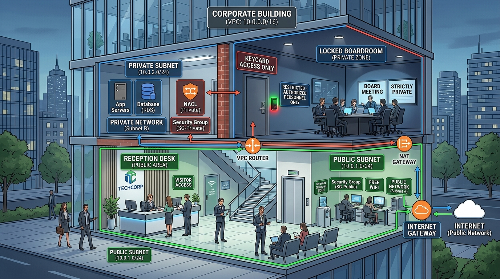
*   **WHAT**: **Amazon VPC** is a logically isolated virtual network within your AWS account in a specific region [59, 60]. It gives you absolute control over your network topology, including the selection of IP address ranges (CIDR blocks), creation of **Subnets** (public and private boundaries), configuration of route tables, and network gateways [60]. To secure traffic, VPC utilizes **Security Groups** (stateful firewalls at the instance level) [13, 19] and **Network Access Control Lists (NACLs)** (stateless firewalls at the subnet boundary) [61]. To monitor, **VPC Flow Logs** capture and record all IP traffic going in and out of your network interfaces [61].
*   **WHY**: Network isolation is the cornerstone of the Security Pillar [109, 111]. Standard compute and database instances must be isolated from the public internet to protect them from unauthorized access, malware injection, and malicious port scans [60].
*   **WHERE**: The fundamental wrapper around all regional workloads (EC2, ECS, RDS, Redshift, ElastiCache) [10, 23, 27, 32].
*   **HOW**:
    1. Segment your VPC: Place public-facing web servers in **Public Subnets** (which route traffic through an **Internet Gateway (IGW)**) [60, 67].
    2. Place databases and application backends in **Private Subnets** (which have no route to the IGW) [60].
    3. To allow private instances to safely fetch software updates from the internet without exposing themselves, route their outbound traffic through a **NAT Gateway** deployed in the public subnet [63].
    4. Enable **VPC Flow Logs** on the VPC, subnet, or specific network interface level, publishing log streams to **Amazon CloudWatch Logs** or **Amazon S3** [61].
*   **MENTAL MODEL**: Think of a VPC as a **Secured Corporate Office Building** [59]. 
    *   *Public Subnet*: The **Reception Desk** in the lobby—anyone can walk in off the street [60].
    *   *Private Subnet*: The **Locked Executive Boardroom** in the back—only authorized personnel can enter [60].
    *   *Security Groups*: **Personal Security Guards** who protect individual executives—they remember who they let out and let them back in automatically (stateful) [13, 19].
    *   *NACLs*: The **Subnet Security Turnstiles** at the hallway entrance—they check everyone's ID card on both the way in and the way out, forgetting them immediately (stateless) [61].
*   **ADVANTAGES**:
    *   **Absolute Traffic Isolation**: Completely blocks unauthorized public internet routing to private database and application tiers [60].
    *   **Granular Forensic Visibility**: VPC Flow Logs capture every accept/reject decision on network interfaces, enabling rapid troubleshooting of connectivity or misconfigured security policies [61].
    *   **Zero-Internet Private Transit**: Connect directly to AWS public APIs (such as S3 or DynamoDB) over **VPC Endpoints (PrivateLink)**, keeping traffic strictly inside the private AWS fiber-optic backbone and completely off the public internet [61].
*   **DISADVANTAGES**:
    *   **Complex Route Table Administration**: Misconfigured route tables or NAT gateways can lead to silent connection drops, routing loops, or failure of auto-scaling groups to boot [18, 61, 67].
    *   **NAT Gateway Cost traps**: AWS charges a baseline hourly rate for running a NAT Gateway combined with a per-GB data processing charge. High-volume data transfers through a NAT Gateway can easily dominate your monthly networking bill.
*   **SYSTEM DESIGN SCENARIO**:
    *   **Problem**: A healthcare database containing sensitive patient medical history is deployed on EC2 instances. Auditors find that database instances are occasionally communicating with unknown external IP addresses, and developers have misconfigured security groups to allow public SSH access (0.0.0.0/0).
    *   **Solution**: Restructure the network topology. Create a custom VPC with strict IP boundaries [59, 60]. Place the database EC2 instances in a **Private Subnet** with zero route to the internet gateway [60]. Block all public SSH access by setting the inbound Security Group rules to allow Port 22 connections **only** from a trusted Bastion Host or Systems Manager Session Manager VPC endpoints [13]. Configure **NACL rules** at the subnet boundary to strictly restrict outbound communication to specific, known application subnets [61]. Enable **VPC Flow Logs** on the database subnet, sending records to **Amazon CloudWatch Logs** [61]. Establish a CloudWatch Metric Filter to trigger an **AWS Lambda function** [24, 75] and alert the security operations center via **Amazon SNS** if any outbound "REJECT" traffic occurs or if an internal instance attempts to communicate with an unauthorized external CIDR block [61, 82].

---

### 15. Identity & Access Management (IAM) & Cross-Account AssumeRole

*   **WHAT**: **AWS IAM** manages authentication (verifying who you are) and authorization (verifying what permissions you have) across all AWS resources [53]. It operates using Users, Groups, and **Roles** (which provide temporary security credentials) [54, 58]. IAM evaluates access using policy structures, including **Identity-Based Policies** (attached to IAM users/roles) [54], **Resource-Based Policies** (attached directly to resources like S3 bucket policies) [57], and AWS STS **AssumeRole** handshakes for cross-account federation [55, 56].
*   **WHY**: To enforce the absolute cornerstone of security: the **Principle of Least Privilege** [57, 110]. Credentials should never be hardcoded into configuration files or baked into application code; instead, temporary, rotating security tokens should be injected dynamically [54, 110].
*   **WHERE**: The security gatekeeper wrapping every single API call made inside AWS globally [3, 53].
*   **HOW**:
    1. **Never use the ROOT account** for daily operations; configure a strong password policy and enforce hardware Multi-Factor Authentication (MFA) immediately [54, 57, 58].
    2. Attach an **IAM Role** to an EC2 instance via an **Instance Profile** [54, 55]. The AWS SDK on the instance automatically fetches temporary access keys from the metadata service, rotating them every 6 hours [54].
    3. To grant developers in a Development Account (Account 2222) access to a Production S3 Bucket in a Production Account (Account 1111):
       * Create an IAM Role (`ProdS3AccessRole`) in Account 1111 [55, 56].
       * Configure the **Trust Relationship** of the role to allow STS AssumeRole calls from Account 2222 [55, 56].
       * In Account 2222, grant developers the permission to call `sts:AssumeRole` targeting the ARN of `ProdS3AccessRole` [56].
*   **MENTAL MODEL**: Think of IAM as the **Central Security Desk of a High-Sec Facility**.
    *   *IAM User*: Your **Permanent Employee ID Badge**.
    *   *IAM Role*: A **Temporary Visitor Pass** [54, 58]. You must hand over your ID card, prove you are authorized to visit (Trust Relationship) [55, 56], and the security desk clips a temporary pass onto your chest that self-destructs after 1 hour [56].
    *   *Instance Profile*: The **Pass Holder Clip** attached to an EC2 server so it can wear a temporary visitor pass [55].
*   **ADVANTAGES**:
    *   **Eliminates Hardcoded Credentials**: Using IAM Roles for EC2, Lambda, and ECS completely removes long-lived secret keys from S3 or Git repositories, blocking key-leak exploits [54, 58].
    *   **Fine-Grained Policy Conditions**: Write policies that restrict actions based on time, geographic IP ranges, MFA verification, or resource tags [57].
*   **DISADVANTAGES**:
    *   **Complex Policy Evaluation Logic**: When multiple policies overlap (Identity policies, Resource policies, Service Control Policies, Permissions Boundaries), a single explicit "Deny" statement anywhere instantly overrides all "Allow" statements, leading to silent, difficult-to-debug "AccessDenied" API failures.
    *   **Administrative Overhead**: Managing individual users and static keys at scale becomes impossible; organizations must implement IAM Identity Center to federate with Active Directory [54].
*   **SYSTEM DESIGN SCENARIO**:
    *   **Problem**: A multi-national retail group operates a decentralized development model with 50 separate AWS accounts. The central compliance team discovered that developers in a test account have been generating static AWS Access Keys, storing them on their local laptops, and accidentally committing them to public GitHub repositories, leading to account hijackings.
    *   **Solution**: Implement a secure, federated identity governance framework. **Delete all static IAM user access keys** across all 50 accounts immediately [54, 58]. Set up **AWS Control Tower** and utilize **AWS Organizations** to centrally govern accounts [97, 124]. Establish an enterprise-wide single-sign-on mapping using **IAM Identity Center** linked to the corporate Active Directory. To allow secure cross-account operations, create standardized **IAM Roles** with strict trust relationships mapped to the centralized Identity Provider [55, 56]. For application compute instances, enforce the deployment of **Instance Profiles** on all EC2 servers, forcing the software SDKs to fetch short-lived, self-rotating credentials natively from the instance metadata, blocking key leaks permanently [54, 55].

---

### 16. Key Management Service (KMS) & CloudHSM

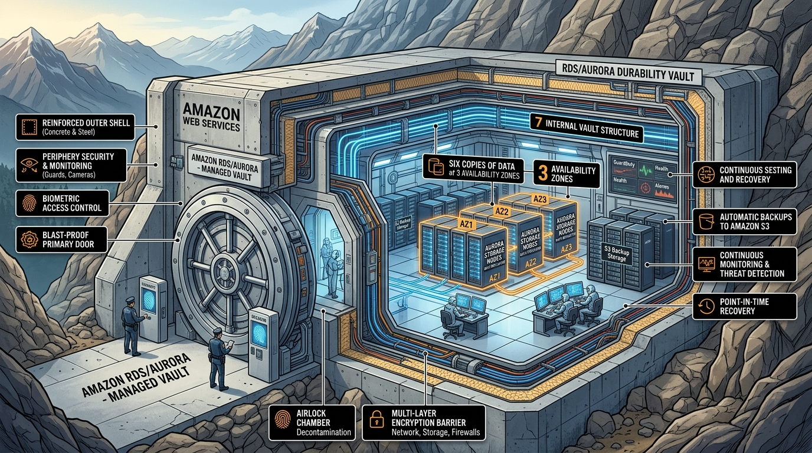
*   **WHAT**: AWS provides two primary options for managing cryptographic keys and performing data encryption [58]:
    1.  **Key Management Service (KMS)**: A secure, multi-tenant, managed key management service [58]. It is backed by FIPS 140-2 Level 3 physical Hardware Security Modules (HSMs) managed by AWS [58]. It integrates natively with virtually all storage and database services in AWS (S3, EBS, RDS, DynamoDB, Redshift) [58].
    2.  **CloudHSM**: Dedicated, single-tenant physical Hardware Security Modules hosted inside AWS [123]. You have exclusive administrative control over the physical HSM appliance [111, 123].
*   **WHY**: To protect sensitive data at rest and meet strict corporate compliance standards [58, 111]. KMS enables secure encryption key generation, rotation, auditing, and access control [58].
*   **WHERE**: Integrated at the storage and database layer across all AWS resources [58].
*   **HOW**:
    1. Generate a Customer Managed Key (CMK) in KMS [58].
    2. Attach a **Key Policy** defining who can administer the key and who can use the key for cryptographic operations (`kms:Encrypt`, `kms:Decrypt`) [58].
    3. For S3 uploads, choose your encryption level: **SSE-S3** (S3 manages the keys) [59], **SSE-KMS** (you manage access to AWS KMS Customer Master Keys, which provides strict access control and auditing) [59], or **SSE-C** (the customer manages their own key and passes it in the REST header on every API call) [59].
*   **MENTAL MODEL**: 
    *   *KMS*: A **Bank's Shared Safety Deposit Box Room**. The bank manages the facility, the security guards, and the vault doors, but you own the specific key to your box [58].
    *   *CloudHSM*: You **Rent the Entire Physical Safety Vault Building**. You have the only key to the building, you hire your own guards, and the bank technicians have no physical way to enter the building or see what is inside [111, 123].
*   **ADVANTAGES**:
    *   **Seamless Service Integration**: Enabling encryption at rest on an S3 bucket or an RDS database is a single-click checkbox—KMS automatically handles behind-the-scenes envelope encryption operations transparently [58, 59].
    *   **Audit-Ready Trails**: Every single cryptographic operation (key generation, decrypt request) is permanently recorded in **AWS CloudTrail**, providing compliance auditors with complete "who, when, what" visibility [58, 114].
    *   **Automated Key Rotation**: KMS can automatically rotate CMKs every year, preventing stale keys from becoming vulnerability vectors [58, 111].
*   **DISADVANTAGES**:
    *   **KMS API Rate Limits**: Under extreme transactional volumes (e.g., millions of decryptions per second on S3 files), applications can exhaust the regional KMS API rate limits, resulting in standard "KMSLimitExceeded" throttles. You must implement envelope encryption and cache data keys to bypass this.
    *   **High Cost of CloudHSM**: CloudHSM requires renting a dedicated physical appliance inside your AZ, which incurs a baseline billing charge of ~$1.45 per hour per HSM instance (~$12,000/year per instance), regardless of usage [111, 123].
*   **SYSTEM DESIGN SCENARIO**:
    *   **Problem**: A healthcare billing API must comply with strict HIPAA requirements. Patient records stored in S3 and RDS must be encrypted using keys that are rotated annually, and the database credentials must be encrypted using keys that are strictly managed by a dedicated compliance officer with no AWS administrator access.
    *   **Solution**: Generate a custom **Customer Managed Key (CMK)** inside **AWS KMS** [58]. Define a highly restrictive **Key Policy** that explicitly grants the compliance officer administrative permissions, while denying these permissions to the standard AWS Administrator group [58]. Enable **Automated Annual Key Rotation** on the CMK [58, 111]. When storing patient records in S3, configure the bucket to enforce **SSE-KMS** using this custom CMK [59]. To protect the database credentials, store them inside **AWS Secrets Manager** [123], and configure Secrets Manager to encrypt the payload using the custom CMK [58]. Ensure that every database access request is audited by enabling **AWS CloudTrail**, creating a CloudWatch alarm to trigger if any unauthorized user attempts to perform a `kms:Decrypt` operation on the CMK [58, 114].

---
\n\n## Phase 6: Advanced Content Delivery & High-Availability Routing

### 17. Content Delivery Networks: Amazon CloudFront & Lambda@Edge

*   **WHAT**: **Amazon CloudFront** is a global **Content Delivery Network (CDN)** that accelerates the distribution of your static and dynamic web content (HTML, CSS, JS, images, video) to users around the world [83]. CloudFront operates through a global network of **Edge Locations** [82]. When a user requests content, CloudFront routes the request to the nearest edge location, serving cached assets with low latency [83]. If the asset is not cached, CloudFront retrieves it from your designated **Origin** (such as an S3 bucket, ALB, or external server) and caches it for future requests [83]. **Lambda@Edge** allows you to execute lightweight serverless Node.js or Python code directly at the edge locations [84].
*   **WHY**: To minimize latency for a global audience, eliminate duplicate compute workload on your origin servers, and protect against distributed denial-of-service (DDoS) attacks [82, 83].
*   **WHERE**: Positioned at the very front of your architecture, acting as the public entry point for all global user requests [83, 84].
*   **HOW**:
    1. Create a CloudFront **Distribution**, defining your **Origin** (e.g., an S3 bucket hosting static website assets) [83, 84].
    2. Configure **Cache Behaviors** and TTL (Time-to-Live) values to control how long assets are cached at the edge before refreshing from the origin [84].
    3. To secure S3 assets, restrict access so users can only access files through CloudFront by using an **Origin Access Control (OAC)** policy.
    4. Enable **AWS Shield Standard** (automatically active) and configure **AWS WAF** rules on your CloudFront distribution to block common L7 exploits (SQL injection, XSS) [83, 111].
    5. Register **Lambda@Edge** triggers at four lifecycle stages: Viewer Request, Origin Request, Origin Response, and Viewer Response [84].
*   **MENTAL MODEL**: Think of your S3 origin server as a **Central Bakery in Paris**. If a customer in Tokyo wants a fresh croissant, shipping it directly from Paris on every order takes 12 hours (high latency). Think of CloudFront as a **Global Chain of Local Cafes**. The Paris bakery freezes and ships croissants to local cafes in Tokyo, New York, and London (Edge Locations) [82, 83]. When a local customer orders, they receive the croissant instantly from the display case [83].
*   **ADVANTAGES**:
    *   **Extremely Low Latency**: Dramatically reduces Page Load Time (TTFB) for global users by serving content directly from edge caches [82, 83].
    *   **Dramatically Reduces Origin Load**: Caching static assets at the edge reduces compute workloads and database connections on origin servers by up to 90%, preventing server crashes [83, 84].
    *   **Zero Egress Cost to S3**: Data transfer out of S3 to Amazon CloudFront is $0.00 per GB, allowing you to optimize networking costs [83].
*   **DISADVANTAGES**:
    *   **Cache Invalidation Lag**: If you update an image or a javascript file on your origin, users will continue to see the old version cached at the edge until the TTL expires (which can be days) [84]. You must execute a manual, paid **Cache Invalidation** or use unique file version hashes (cache busting).
    *   **Lambda@Edge execution limits**: Lambda@Edge operates under strict execution limits (e.g., maximum 50MB package size, 5-second timeout for viewer triggers) [24, 84].
*   **SYSTEM DESIGN SCENARIO**:
    *   **Problem**: A media company hosts a static portfolio site on Amazon S3 [48]. During a viral marketing campaign, scrapers and bad bots flood the S3 bucket with GET requests, scraping high-resolution images, draining S3 bandwidth, and generating massive data transfer egress bills [88].
    *   **Solution**: Restructure the static asset delivery architecture. Deploy an **Amazon CloudFront Distribution** in front of the S3 bucket [83, 84]. Configure **Origin Access Control (OAC)** to ensure that the S3 bucket accepts GET requests **only** from the CloudFront distribution [48, 83]. Disable public access on the S3 bucket [48]. Set the default TTL to 24 hours to ensure 99% of requests are cached at the edge [84]. Attach **AWS WAF** to the CloudFront distribution [83, 111], configuring a rate-limiting rule to block any IP address making more than 100 requests in a 5-minute window, and implement geography-blocking to block bad bots and scrapers [93]. This eliminates S3 scraper traffic, drops origin load to near-zero, and leverages the $0.00 data transfer rate from S3 to CloudFront [83].

---

### 18. Intelligent Global Routing: Route 53 vs. Global Accelerator

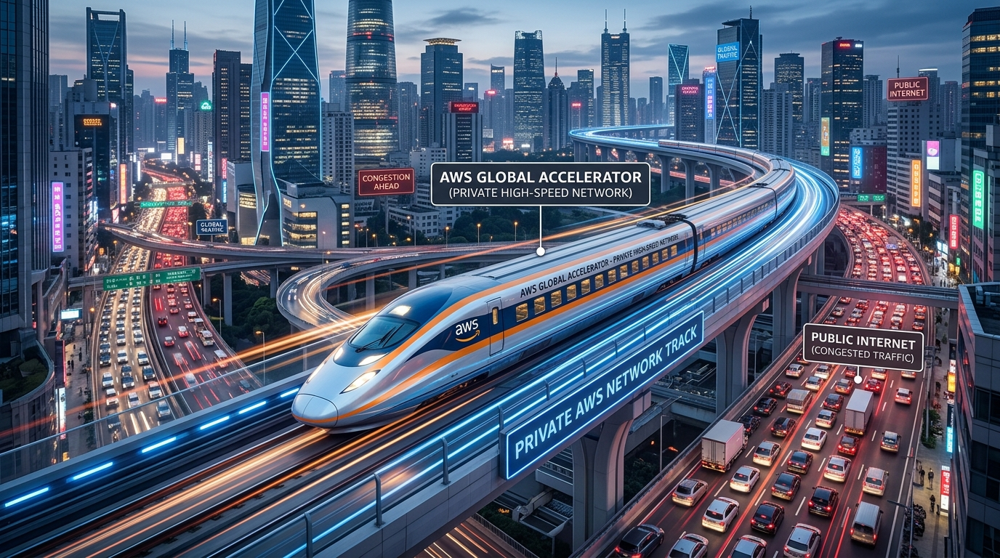
*   **WHAT**: AWS provides two primary global network routing services [86]:
    1.  **Amazon Route 53**: A highly available, scalable **Domain Name System (DNS)** web service [85, 86]. It maps human-readable domain names (e.g., `in28minutes.com`) to numeric IP addresses [85]. It offers advanced routing policies, including Latency-Based Routing, Geolocation, Geoproximity, Weighted Round Robin, and Active-Passive Failover [4, 86].
    2.  **AWS Global Accelerator**: A network layer service that improves the availability and performance of your applications by directing client traffic over AWS's high-speed, private global fiber-optic network instead of the public internet [86]. It provides you with **two static Anycast IP addresses** hosted at AWS edge locations globally [86].
*   **WHY**: DNS caching behaviors are unpredictable; public routers and client operating systems cache DNS responses (ignoring TTL values), resulting in slow failover times (minutes to hours) during outages [86]. Global Accelerator bypasses DNS caching issues entirely by keeping IP addresses static and routing traffic at the IP protocol layer, enabling sub-10-second failovers [86].
*   **WHERE**: Positioned at the entry point of your global multi-region architectures [86].
*   **HOW**:
    1. Register your domain name inside **Route 53** [85, 86].
    2. For a multi-region API backend, configure a **Route 53 Latency-Based Routing Policy** with active **Route 53 Health Checks** to automatically route users to the region with the lowest ping [4, 86].
    3. To build a globally accelerated TCP/UDP application (like a real-time gaming or VoIP server), deploy an **AWS Global Accelerator** [86].
    4. Bind your static Anycast IPs to your Application Load Balancers or EC2 instances in different regional subnets [86].
*   **MENTAL MODEL**: 
    *   *Route 53*: An **Address Book/Directory Service** [85, 86]. You lookup the address of a business, write it down, and walk there yourself over public city streets (the public internet) [86].
    *   *Global Accelerator*: A **Private High-Speed Bullet Train network** [86]. Instead of navigating public city traffic, you walk to the nearest bullet train station in your neighborhood (AWS Edge Location Anycast IP) [86]. The train flies over a dedicated, private, high-speed line directly to the business back office [86].
*   **ADVANTAGES**:
    *   **Near-Instant Failover (Global Accelerator)**: Bypasses DNS propagation delays, rerouting traffic away from unhealthy regions in under 10 seconds [86].
    *   **Consistent Network Performance**: Bypasses the congested public internet, reducing jitter and network latency by up to 60% [86].
    *   **Flexible DNS Traffic Engineering (Route 53)**: Effortlessly run A/B testing (using weighted routing) or route users to region-specific content (using geolocation routing) [4, 85, 86].
*   **DISADVANTAGES**:
    *   **DNS Propagation Delay (Route 53)**: If a region goes down, client browsers that have cached the old IP address will continue trying to connect to the dead region until their local cache expires, regardless of Route 53 health check updates [86].
    *   **High Fixed Cost (Global Accelerator)**: AWS Global Accelerator charges a fixed hourly fee of $0.025 per hour (~$18/month) per accelerator plus a variable Data Transfer Premium fee based on volume, making it more expensive than basic Route 53 DNS records.
*   **SYSTEM DESIGN SCENARIO**:
    *   **Problem**: A financial API backend is deployed in both the US-East (N. Virginia) and EU-West (London) regions to provide low-latency endpoints globally [4, 86]. During a region-wide fiber cut in Virginia, the US-East region becomes completely unreachable. Client applications must fail over to London immediately. Using standard Route 53 DNS failover is too slow, causing client transactions to fail for over 15 minutes due to ISP DNS caching [86].
    *   **Solution**: Deploy **AWS Global Accelerator** in front of the US-East and EU-West Application Load Balancers [86]. Configure Global Accelerator to provide two static **Anycast IP addresses** [86]. Point the corporate API domain name directly to these Anycast IPs. Configure the active health check parameters in Global Accelerator to monitor the ALBs in both regions [86]. During normal operations, a user in Chicago connects to the nearest Anycast edge location; traffic is routed over AWS's private backbone to the N. Virginia ALB [86]. When N. Virginia goes offline, Global Accelerator detects the failure within 8 seconds and instantly reroutes all subsequent Anycast IP traffic to the healthy London ALB [86]. Because the client applications never change their destination IP address, the failover occurs seamlessly with zero connection loss, completely bypassing ISP DNS caching delays [86].

---
\n\n## Phase 7: Cloud Financial Engineering & Operational Excellence

### 19. DevOps CD: CodePipeline & CodeDeploy

*   **WHAT**: **AWS CodePipeline** is a fully managed continuous delivery (CD) service that automates release pipelines for fast and reliable application updates [64, 65]. **AWS CodeDeploy** is a managed deployment service that automates software deployments to compute services like EC2, ECS, AWS Fargate, Lambda, and on-premises instances [65, 77].
*   **WHY**: Manual deployments are a primary source of outages [109]. Automating the build, test, and deployment phases using a structured pipeline ensures that code modifications are delivered in a predictable, auditable, and rollback-safe manner [64, 109].
*   **WHERE**: Positioned between software source control (e.g., CodeCommit, GitHub) and live cloud compute targets [65].
*   **HOW**:
    1. Define a pipeline in **CodePipeline** triggered by code pushes to a **CodeCommit** repository [65].
    2. Execute tests and package code inside **CodeBuild** containers [65].
    3. Configure **CodeDeploy** to manage deployments [65, 77].
    4. Select a safe **Deployment Strategy**: **In-Place/Rolling** (instances are updated one by one, reducing capacity during deployment) or **Blue-Green** (provisioning a complete parallel environment with the new version, testing with shadow traffic, and swapping traffic instantly to eliminate downtime) [76, 77].
*   **MENTAL MODEL**: Think of CodePipeline as a **Automated Automobile Assembly Line**. The raw metal (source code) is fed in at the start [65]. Robotic arms paint the metal (CodeBuild compiles and runs tests) [65]. If a test fails, the assembly line instantly stops (automatic rollback) [68]. The finished car is then parked in the display showroom (CodeDeploy) using a safe parking strategy (Blue-Green) [65, 76, 77].
*   **ADVANTAGES**:
    *   **Downtime Elimination**: Blue-Green deployments allow you to test new application versions on live production networks before officially cutting traffic over [76].
    *   **Automated Self-Healing Rollbacks**: If a newly deployed version triggers errors or spikes latency, CodeDeploy integrates with CloudWatch Alarms to instantly roll back to the previous stable version automatically [68, 80].
    *   **Unified Pipeline Visibility**: Track the status of active builds, test results, approvals, and deployments in a single centralized dashboard [97].
*   **DISADVANTAGES**:
    *   **High Infrastructure Cost during Blue-Green**: Maintaining a complete duplicate environment of 50 EC2 instances during a Blue-Green deployment window doubles compute costs during the transition phase [76].
    *   **Pipeline Bottlenecks**: Complex, synchronous pipelines with slow-running integration test stages can stall development velocity, blocking urgent bug fixes from reaching production quickly.
*   **SYSTEM DESIGN SCENARIO**:
    *   **Problem**: A company deploys critical API updates to an ASG of 30 EC2 instances [18]. Developers use manual bash scripts to SSH into instances and pull the latest code. During a recent deployment, a bad configuration file was pushed, crashing 15 instances simultaneously and causing a 3-hour outage before operations could identify and manually roll back the changes.
    *   **Solution**: Implement a secure continuous delivery framework. Orchestrate a deployment pipeline in **AWS CodePipeline** [65]. When developers push code to SCM, CodeBuild compiles the code and executes static security analysis [65]. Configure **AWS CodeDeploy** to deploy the packaged application using a **Blue-Green Deployment** strategy [76, 77]. CodeDeploy provisions a parallel Auto Scaling Group running the new application version [18, 76]. Configure a **CloudWatch Alarm** to monitor the percentage of HTTP 5xx errors in the new target group [73, 80]. If the new version triggers a single 5xx error or fails a basic HTTP health check, CodeDeploy instantly swaps the Route 53 CNAME back to the original stable environment, terminating the broken environment automatically with **zero impact to users** [20, 68, 76, 80].

---

### 20. Infrastructure as Code (IaC): CloudFormation, CDK & SAM

*   **WHAT**: **Infrastructure as Code (IaC)** is the practice of provisioning and managing AWS resources using declarative template files or programmatic code, bypassing manual console modifications [66, 67]. AWS provides three primary IaC solutions [66]:
    1.  **AWS CloudFormation**: The foundational service that provisions resources using declarative JSON/YAML templates [66, 68].
    2.  **AWS CDK (Cloud Development Kit)**: An open-source software development framework that allows you to define cloud infrastructure using familiar programming languages (TypeScript, Python, Java, Go, C#) [66, 73]. CDK code is compiled (synthesized) directly into standard CloudFormation templates under the hood [73].
    3.  **AWS SAM (Serverless Application Model)**: A specialized, open-source framework designed specifically for building serverless applications [70]. SAM extends CloudFormation, utilizing simplified YAML definitions to deploy Lambda, API Gateway, and DynamoDB resources with built-in best practices [70, 71, 72].
*   **WHY**: To eliminate manual human error, configuration drift, and unrepeatable deployments [67]. IaC acts as "version control" for your physical hardware environments, allowing you to deploy identical, secure Development, QA, and Production stacks predictably in minutes [67].
*   **WHERE**: The absolute starting point for all cloud deployments, system provisioning, and resource lifecycle management [66, 67].
*   **HOW**:
    1. Write a YAML template defining your mandatory **Resources** (e.g., an S3 Bucket or an EC2 instance), passing dynamic values via **Parameters** and regional mappings via **Mappings** [68, 69, 70].
    2. Organize resources into logical **Stacks** [69].
    3. Execute deployments through CloudFormation. In the event of a creation error, CloudFormation initiates **Automatic Rollbacks**, deleting all partially created resources to return your environment to a clean, known stable state [68].
    4. To make modifications, generate a **Change Set** to audit exactly what resources will be added, modified, or destroyed before execution [69].
*   **MENTAL MODEL**: Think of your AWS infrastructure as a **Complex Custom House**.
    *   *Manual Console*: Building the house by hand, brick by brick, without a blueprint.
    *   *CloudFormation*: A detailed **Architectural Blueprint**—it specifies the exact dimensions, pipes, and wiring [68]. You hand the blueprint to a master builder (CloudFormation engine), and they construct the house identically every single time [67, 68].
    *   *AWS CDK*: A **High-Level Prefabricated Design Tool**—it allows you to write "code" to generate blueprints dynamically, using pre-designed room modules (Constructs) with standard furniture pre-installed [73].
*   **ADVANTAGES**:
    *   **Absolute Repeatability**: Deploy identical, multi-tier global architectures across 10 regions predictably in minutes with zero manual configuration drift [67, 71].
    *   **Automatic Rollbacks on Failure**: If a database fails to provision, CloudFormation immediately rolls back the deployment, deleting any orphaned VPCs, subnets, or security groups to prevent half-configured, unresolvable stack states [68].
    *   **Change-Set Audit Trails**: Change-sets show exactly what will be deleted or replaced before running a deployment, protecting critical databases from accidental deletion [69].
*   **DISADVANTAGES**:
    *   **Configuration Drift**: If an engineer manually modifies an EC2 security group or RDS parameter via the AWS Console, CloudFormation is unaware of the change (Configuration Drift), leading to deployment failures during subsequent stack updates.
    *   **Circular Dependencies**: Poorly structured templates can create circular dependency locks (Stack A waiting for Stack B, while Stack B waits for Stack A), halting deployments and requiring manual stack intervention.
*   **SYSTEM DESIGN SCENARIO**:
    *   **Problem**: A startup needs to deploy isolated customer environments ("tenant stacks") consisting of an S3 bucket, an API Gateway, and a DynamoDB table on-demand. Manually building these via the console takes 4 hours per customer and frequently leads to mismatched configurations and exposed, public S3 buckets.
    *   **Solution**: Create a standardized **AWS SAM Template** defining a secure serverless tenant stack [70]. Define a standard DynamoDB table (`AWS::Serverless::SimpleTable`) [72], an API Gateway (`AWS::Serverless::Api`) [72], and a Lambda function (`AWS::Serverless::Function`) with strict security policies [72]. Incorporate parameters to pass unique tenant IDs during stack execution [69]. Integrate the SAM template into an automated administrative portal. When a new customer registers, the portal invokes an administrative Lambda to run `aws cloudformation create-stack` targeting the SAM template [68, 69]. CloudFormation provisions the complete, secure serverless environment in under 2 minutes, ensuring 100% configuration consistency and automatic rollback if any resource fails to instantiate [68].

---

### 21. Monitoring & Observability: CloudWatch, X-Ray & CloudTrail

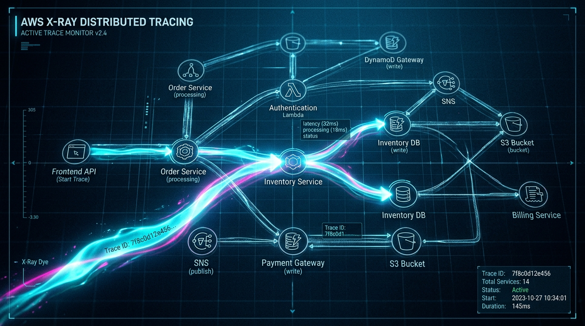
*   **WHAT**: AWS provides a comprehensive, three-dimensional observability suite [110, 114]:
    1.  **Amazon CloudWatch**: Collects real-time operational data in the form of **Metrics** (numerical performance data from over 70 AWS services) [73], **Logs** (detailed text streams from EC2 OS agents, Lambda stdout, and VPC Flow Logs) [113, 114], and **Events (EventBridge)** (system state changes that trigger automated target actions) [74, 75].
    2.  **AWS X-Ray**: A distributed tracing service that maps request flows through complex, microservice architectures, visualizing latency bottlenecks and transaction error paths [3, 24, 121].
    3.  **AWS CloudTrail**: A governance and compliance auditing service that records a permanent history of every API call made inside your AWS account (e.g., "Who terminated that EC2 instance, from what IP, and when") [3, 114, 123].
*   **WHY**: You cannot manage what you do not measure. Observability is critical to the Operational Excellence and Reliability pillars [109, 112]. It ensures you can proactively detect application errors, automatically scale compute to meet demand, and execute forensic audits during security breaches [61, 110, 114].
*   **WHERE**: Deployed globally across all AWS services, database engines, serverless APIs, and computing instances [73, 114].
*   **HOW**:
    1. Install the **CloudWatch Unified Agent** on EC2 instances to stream system-level RAM, disk utilization, and application log files directly to **CloudWatch Logs** [110, 113].
    2. Set up a **CloudWatch Alarm** to monitor a specific metric (e.g., average CPU utilization exceeding 80% for 5 minutes) [74, 113, 116]. Connect the alarm to an **Auto Scaling Group** to trigger a scale-out action [18], or send a notification to an **Amazon SNS Topic** to alert developers [89, 112].
    3. Instrument your microservice code with the **AWS X-Ray SDK** to propagate a tracing header across HTTP requests [24, 71].
    4. Enable **AWS CloudTrail** globally across all regions, streaming audit logs to an encrypted S3 bucket for permanent storage and compliance auditing [110, 114, 123].
*   **MENTAL MODEL**: 
    *   *CloudWatch*: The **Dashboard Indicators of a Modern Jet Fighter**—it displays fuel levels (Disk space), speed (CPU), engine RPMs (Memory), and alerts the pilot when things overheat (Alarms) [73, 113].
    *   *X-Ray*: An **X-Ray Dye Injection**—you inject dye into a patient's bloodstream (the user's API request) and watch it travel through the veins (databases, lambdas, third-party APIs), visually isolating exactly where a blockage occurs [24, 121].
    *   *CloudTrail*: The **Black Box Flight Recorder**—it permanently records every single action the pilot and copilot make, preserving the audit trail even if the plane crashes [114, 123].
*   **ADVANTAGES**:
    *   **Proactive Self-Healing Infrastructure**: Connect CloudWatch Alarms directly to EC2 scaling policies or Lambda functions to remediate failures automatically before users experience downtime [18, 115].
    *   **Eliminates Finger-Pointing (X-Ray)**: Visually maps distributed systems, proving exactly whether a latency spike was caused by database lockups or a slow third-party API gateway call [121].
    *   **Incontrovertible Audit Trail**: CloudTrail provides an immutable history of account API activity, meeting strict compliance requirements (HIPAA, PCI-DSS) [58, 114].
*   **DISADVANTAGES**:
    *   **Log Storage Cost Traps**: Storing raw debug application logs in CloudWatch Logs indefinitely is exceptionally expensive ($0.50 per GB ingested plus storage fees). You must configure aggressive log expiration policies (e.g., expire logs after 14 days) or transition raw logs to cheap S3 standard storage [74].
    *   **Performance Overhead**: Heavy X-Ray tracing instrumentation can introduce minor latency and CPU overhead on compute-bound instances. You must configure sampling rates (e.g., trace only 5% of successful requests) to protect performance.
*   **SYSTEM DESIGN SCENARIO**:
    *   **Problem**: A microservices-based banking application experiences intermittent performance degradation during peak hours. Some transactions take over 10 seconds to complete. Developers cannot locate the issue because logs are scattered across 50 independent ECS containers [23], and there is no trace mapping request flows across microservices.
    *   **Solution**: Establish a centralized observability platform. Install the **AWS Distro for OpenTelemetry** or the **CloudWatch Agent** on all container tasks, streaming container logs directly to a centralized **CloudWatch Logs** group [74, 113]. Instrument all Java and Node.js microservices with the **AWS X-Ray SDK** [24]. When a client submits a transaction, the X-Ray SDK injects a `Trace ID` into the HTTP header [24]. As the request travels from API Gateway to Lambda, then to ECS, and finally to Aurora, X-Ray records the exact execution duration of each segment [3, 24, 28]. Use the **X-Ray Service Map** to visually isolate the bottleneck [121]. This reveals that a specific database query in the ECS inventory container is executing a full-table scan on Aurora, taking 9.8 seconds due to a missing index [29]. Developers add the index, resolving the latency instantly [26].

---

### 22. Cloud Financial Management: TCO, Cost Explorer & Budgets

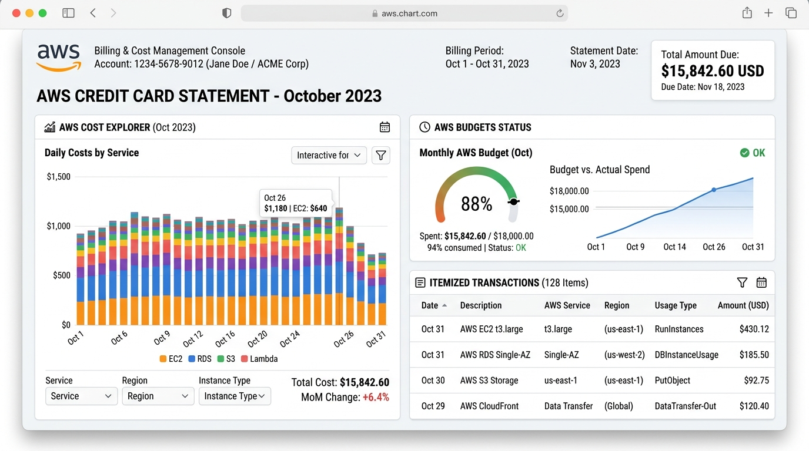
*   **WHAT**: **AWS Billing and Cost Management** services enable organizations to monitor, analyze, project, and actively control their cloud operational expenses [89]. The framework includes:
    1.  **Total Cost of Ownership (TCO) Calculator**: Evaluates the comprehensive cost of running workloads on-premises (incorporating physical servers, software licensing, electricity, real estate, networking, and support personnel) against identical AWS cloud configurations [90, 91].
    2.  **AWS Cost Explorer**: A visual reporting tool that displays historical and projected cost data as graphs, allowing you to filter spend by region, instance type, tag, or specific AWS service [89].
    3.  **AWS Budgets**: Allows you to set custom monthly, quarterly, or yearly budgets, triggering real-time alerts via Amazon SNS or email when actual or projected costs exceed your budgeted threshold [89, 92].
*   **WHY**: In the cloud's OpEx model, anyone with IAM permissions can provision resources, meaning costs can spiral out of control instantly [2, 91, 116]. Cloud Financial Management (FinOps) is critical to the Cost Optimization Pillar [109, 116].
*   **WHERE**: Positioned as the administrative and financial governance wrapper around your entire AWS Organization [89, 124].
*   **HOW**:
    1. Enforce a strict tagging policy across the organization, enabling **Cost Allocation Tags** to categorize resource expenditures by project, department, or owner [89, 91].
    2. Create an **AWS Budget** set to trigger an SNS alarm when projected monthly spending exceeds 85% of your target budget [89].
    3. Establish an automated FinOps Lambda function that subscribes to the SNS alarm; if the budget is breached, the Lambda automatically terminates idle development EC2 instances or scales down dev database clusters [18, 75, 92].
*   **MENTAL MODEL**: Think of Cost Explorer as a **Detailed Itemized Credit Card Statement** with interactive graphs—it shows you exactly whether your money was spent on dining (Compute) or travel (Networking) [89]. Think of AWS Budgets as a **Pre-Paid Debit Card** with a cellular alert—the instant your child (a developer) spends or is projected to spend close to their limit, you receive a text message (SNS alarm) allowing you to lock the card (scale down resources) [89, 92].
*   **ADVANTAGES**:
    *   **Proactive Cost Governance**: Budgets catch cost anomalies before they generate massive monthly bills, turning retrospectively audited expenses into actively managed OpEx [89, 91].
    *   **Eliminates Waste**: Cost Explorer and AWS Compute Optimizer identify idle or over-provisioned resources (e.g., a massive r5.2xlarge instance running at 2% CPU utilization), recommending immediate down-sizing [90, 116].
*   **DISADVANTAGES**:
    *   **Reactive Alarm Lag**: Standard billing and Cost Explorer metrics can experience an 8 to 24-hour update lag, meaning a massive, runaway cost anomaly can execute for hours before a budget alarm triggers.
    *   **Complex Shared Billing Allocation**: Allocating shared networking (NAT Gateways, Direct Connect) or database costs across multi-tenant enterprise platforms requires complex tagging strategies and calculation models [88, 89, 91].
*   **SYSTEM DESIGN SCENARIO**:
    *   **Problem**: A software company operates 10 separate development teams in a shared AWS account. Compute costs have unexpectedly increased by 40% month-over-month. The finance department cannot identify which team or developer is responsible for the spend, and developers are leaving massive GPU-optimized instances running continuously over weekends [11].
    *   **Solution**: Implement strict financial governance. Enable **AWS Organizations** to segment development teams into separate, isolated AWS accounts [124]. Enforce a strict **Resource Tagging Policy** using **AWS Config Rules** [114, 124]. Any resource launched without a valid `Owner` and `CostCenter` tag is automatically terminated by a compliance Lambda function within 15 minutes [24, 114]. Configure **AWS Cost Explorer** with **Cost Allocation Tags** to break down monthly spend by team [89]. Set up an **AWS Budget** for each team account [89]. If a team's actual or projected spend exceeds 100% of their monthly allocation, trigger an **AWS Budgets Action** that automatically applies a restrictive IAM policy to their account, blocking the creation of any new EC2 instances or RDS databases until the budget is reset or manually extended by the finance department [15, 89].

---
\n\n## Phase 8: Data Lakes, Streaming & Machine Learning Pipeline

### 23. Large-Scale Analytics: Athena, EMR & Lake Formation
*   **WHAT**: AWS provides a suite of managed analytics services to process and extract intelligence from petabytes of data [101]:
    1.  **Amazon Athena**: An interactive, serverless query service that allows you to analyze data directly inside **Amazon S3** using standard SQL queries [103, 121]. You pay strictly per GB of data scanned [103].
    2.  **Amazon EMR (Elastic MapReduce)**: A managed cluster platform that simplifies running big data frameworks, such as Apache Hadoop, Spark, Hive, Presto, and Pig, on AWS [102, 121].
    3.  **AWS Lake Formation**: Simplifies the process of setting up a secure, compliant **Data Lake** in S3 [102, 121]. It centrally defines and enforces database, table, column, and row-level access permissions across your analytics suite.
*   **WHY**: Traditional database clusters are too expensive and complex to scale to petabytes of unstructured or semi-structured data [25, 101]. Creating a **Data Lake** on S3 decouples compute from storage, allowing organizations to store raw data cheaply and spin up computing engines (Athena, EMR) on-demand to process it [101, 102].
*   **WHERE**: Positioned as the centralized analytical layer for processing unstructured logs, IoT telemetry datasets, and business intelligence reporting [25, 101, 102].
*   **HOW**:
    1. Establish an **Amazon S3 bucket as your Data Lake** [102]. Store files in optimized columnar formats (Parquet or ORC) and compress them (using Snappy) to minimize S3 storage costs and Athena query costs [32].
    2. Run an **AWS Glue Crawler** to automatically scan the S3 files, determine the schema, and write table metadata to the **AWS Glue Data Catalog** [102].
    3. Query the S3 data instantly using **Amazon Athena**, passing SQL commands natively via the console [103].
    4. For complex machine learning, graph calculations, or heavy data transformations (ETL), spin up an **Amazon EMR cluster** [102].
*   **MENTAL MODEL**: Think of your data lake (S3) as a **Massive Unsorted Recycling Bin** [101, 102].
    *   *Athena*: A **Metal Detector**—you stand over the bin, query a specific search (SQL command), scan the bin, and instantly pull out only the specific items you asked for without organizing the bin first [103].
    *   *EMR*: A **Team of Heavy Excavator Trucks and Sorters**—you spin up a massive fleet of machines (Hadoop/Spark cluster) to systematically crush, process, and transform the entire pile of recycling in parallel [102].
*   **ADVANTAGES**:
    *   **Absolute Serverless Querying (Athena)**: Zero clusters to manage or maintain; query petabytes of S3 logs on-demand using standard SQL commands [103].
    *   **Highly Cost-Optimized (Athena)**: Pay only $5.00 per TB of data scanned [103]. If you partition your S3 bucket and use columnar formats, you can reduce scan volumes by 99%, running queries for pennies.
    *   **Hadoop Ecosystem Integration (EMR)**: Spinnings up Spark or Hive clusters takes minutes, and EMR natively integrates with Spot instances to slash compute costs by up to 90% [15, 102].
*   **DISADVANTAGES**:
    *   **Athena Query Performance Limitations**: Athena is designed for ad-hoc queries, not for real-time, low-latency application queries; it cannot guarantee sub-second response times under concurrent production API traffic [103].
    *   **EMR Cluster Management Complexity**: Managing EMR Hadoop cluster sizes, node bootstrap actions, and tuning Spark memory settings requires highly specialized big data engineering skills.
*   **SYSTEM DESIGN SCENARIO**:
    *   **Problem**: An IoT logistics company collects 500GB of raw JSON sensor data daily from 100,000 trucks. The data is stored in S3 [44]. Business analysts must run weekly ad-hoc SQL queries on the data. Running an EMR cluster 24/7 is generating massive compute bills, and loading all this unstructured JSON into a traditional database is slow and error-prone [30, 31, 102].
    *   **Solution**: Establish a serverless analytics pipeline. Store the raw sensor files in **Amazon S3** [102]. Run an **AWS Glue Crawler** weekly to automatically catalogue the JSON schema [102]. Create a serverless transformation pipeline using a Lambda function or an Athena CTAS (Create Table As Select) query to automatically convert the raw JSON files into highly compressed **Apache Parquet (columnar) files**, partitioned by `truck_region` and `date` in S3 [32, 103]. Analysts can now use **Amazon Athena** to query the Parquet files using standard SQL [103]. Because Athena reads only the specific Parquet columns and partitions requested in the query [32, 103], the total data scanned drops from 500GB to 2GB per query, reducing query latency from minutes to 4 seconds, and slashing billing costs to fractions of a cent [103].

---

### 24. Real-Time Streaming: Amazon Kinesis (Streams vs. Firehose vs. Analytics)
*   **WHAT**: **Amazon Kinesis** makes it easy to collect, process, and analyze real-time, continuous streaming data at any scale [105]. The Kinesis suite consists of:
    1.  **Kinesis Data Streams (KDS)**: A highly customizable, real-time streaming service [105]. It ingests data sequentially into "Shards", guaranteeing order preservation and allowing multiple custom consumer applications to read from the stream simultaneously [105, 112]. Data can be retained for up to 365 days.
    2.  **Kinesis Data Firehose**: A fully managed, serverless delivery stream [105]. It captures, transforms (using inline Lambda functions), and automatically loads streaming data directly into S3, Redshift, OpenSearch, or Splunk [105]. It operates on buffer intervals (size or time), requiring zero consumer administration.
    3.  **Kinesis Data Analytics**: Allows you to run continuous SQL queries or build Java/Scala applications directly against streaming data to compute real-time metrics (e.g., rolling averages) [105].
*   **WHY**: Traditional database and batch solutions are designed to process static files periodically [31]. Modern businesses (e.g., clickstream analytics, fraud detection, stock trading) must ingest and analyze data as it is generated in real-time, down to the millisecond [103].
*   **WHERE**: Placed at the very front of real-time telemetry, clickstream, logging, and transactional data ingestion pipelines [25, 103, 105].
*   **HOW**:
    1. Install the **Kinesis Producer Library (KPL)** or Kinesis Agent on your web servers to continuously push clickstream events into a **Kinesis Data Stream** [105].
    2. Configure the number of **Shards** in your stream based on throughput requirements (each shard supports 1MB/sec write and 2MB/sec read).
    3. To automatically load raw stream events into your data lake, configure a **Kinesis Data Firehose** subscribing to the stream, setting a buffer time of 60 seconds before batching files into **Amazon S3** [105].
    4. For real-time threat or anomaly detection, connect the stream to **Kinesis Data Analytics** to run continuous SQL queries [105].
*   **MENTAL MODEL**: 
    *   *Kinesis Data Streams*: A **Multi-Lane Conveyor Belt** [112]. Items (data records) are placed on the belt in strict order. Multiple workers (consumers) stand along the belt, each tracking their own position and processing items in real-time as they pass by [105, 112].
    *   *Kinesis Data Firehose*: A **Giant Funnel** [105]. You dump a continuous stream of water (data) into the funnel. The funnel automatically filters the water (Lambda transformations) and pours it directly into a storage bucket (S3) once the funnel is full [105].
*   **ADVANTAGES**:
    *   **Millisecond Real-Time Processing**: Data is available to consumers within 70 milliseconds of ingestion, enabling real-time dashboards and instant fraud detection [105].
    *   **Decoupled Multi-Consumer Architecture**: A single Kinesis Data Stream can support up to 5 separate consumer applications (e.g., one Lambda calculating metrics, one Firehose archiving to S3, and one ECS task detecting security threats) simultaneously without interference [105, 112].
*   **DISADVANTAGES**:
    *   **Manual Shard Management**: If traffic spikes, you must actively split shards to scale throughput; under-provisioned streams will return "ProvisionedThroughputExceededException" errors, dropping producer records if not using the On-Demand scaling mode.
    *   **Strict Order Constraints**: Retaining strict order requires routing records to the same shard using a consistent partition key; if the partition key is poorly distributed, it leads to hot shards and performance bottlenecks.
*   **SYSTEM DESIGN SCENARIO**:
    *   **Problem**: A financial application processes millions of stock transaction events per second. The application must detect potential credit card fraud in real-time (notifying security within 2 seconds of a transaction), while simultaneously archiving every transaction record to a secure data lake in S3 for compliance auditing [45, 114].
    *   **Solution**: Architect a real-time streaming pipeline. Route all transaction events into **Amazon Kinesis Data Streams** [105]. Use a transaction's `credit_card_number` as the Partition Key to guarantee that all transactions for a specific card are routed to the same shard in strict sequence [105]. Attach two independent consumers:
        1.  **Consumer A (AWS Lambda)**: Triggered in real-time by the Kinesis Stream [104, 105]. The Lambda executes anomaly-detection algorithms, comparing the transaction location against historical patterns [107]. If fraud is suspected, it instantly publishes an alert to an **Amazon SNS Topic** to freeze the card [82].
        2.  **Consumer B (Kinesis Data Firehose)**: Subscribes to the same Kinesis Stream [105]. Firehose buffers the incoming transactions for 60 seconds or 100MB, automatically converts the payloads to Parquet, and writes the batch files directly into a secure **Amazon S3 compliance bucket** [45, 46, 105].
        This achieves sub-second fraud detection while guaranteeing 100% compliant data archiving with zero infrastructure management [105].

---

### 25. Enterprise Machine Learning: Amazon SageMaker

*   **WHAT**: **Amazon SageMaker** is a fully managed service that simplifies and accelerates every stage of the machine learning lifecycle: from preparing and cleaning data, to building, training, tuning, deploying, and monitoring machine learning models at scale [108]. It supports popular deep-learning frameworks (TensorFlow, PyTorch, MXNet) within built-in, optimized container environments [108].
*   **WHY**: Traditional machine learning workflows require manual data science setups on individual local machines, manual provisioning of GPU-enabled clusters for training, complex manual hyperparameter tuning, and manual hosting of Docker containers to expose model endpoints, leading to slow deployment cycles (MLOps) [106, 108]. SageMaker automates and unifies all of this under a single managed platform [108].
*   **WHERE**: Positioned as the centralized machine learning platform for building recommendation engines, fraud models, image classifications, and predictive analytics pipelines [107, 108].
*   **HOW**:
    1. Organize your ML pipeline into SageMaker's standard steps [107, 108]:
       * **Data Preparation (SageMaker Data Wrangler)**: Clean and engineer features.
       * **Model Building**: Utilize pre-configured algorithms (e.g., XGBoost, Linear Learner) or write custom code [106].
       * **Model Training (SageMaker Training Jobs)**: Spin up an ephemeral, high-performance GPU compute cluster on-demand. SageMaker loads dataset files from S3, executes training, outputs the compiled model artifact back to S3, and immediately terminates the GPU cluster [108].
       * **Model Deployment (SageMaker Endpoints)**: Host the compiled model inside a managed container behind a secure, auto-scaling HTTPS endpoint [108].
    2. For limited-code requirements, run **SageMaker Auto ML (Autopilot)** to automatically train, tune, and rank models based on raw tabular data [106, 108].
*   **MENTAL MODEL**: Think of SageMaker as a **State-of-the-Art Automotive R&D Facility**.
    *   *Notebooks*: The **Designer's Drafting Table**—where you draw initial blueprints and write code.
    *   *Training Jobs*: A **High-Tech Assembly Factory**—you order a fleet of robot assembly lines (ephemeral GPU clusters) to build and refine the car [108]. The instant the cars are completed, the factory completely dismantles itself so you don't pay rent on empty space [108].
    *   *Endpoints*: A **Managed Dealership Showroom**—where the finished cars are placed. The showroom automatically expands (autoscales) to handle more customers (inference requests) [108].
*   **ADVANTAGES**:
    *   **Cost-Optimized GPU Training**: Because training clusters are strictly ephemeral and billed per second, data scientists can utilize massive clusters of P3 GPU instances for complex training runs, shutting them down immediately upon completion [108].
    *   **Managed Endpoint Auto-Scaling**: SageMaker manages the container scaling, multi-AZ deployment, and endpoint health of model APIs, guaranteeing low-latency inferences under peak user traffic [108].
    *   **Built-in MLOps Pipelines**: Automatically track data lineage, detect model performance drift in production, and run hyperparameter tuning jobs automatically [108].
*   **DISADVANTAGES**:
    *   **High Compute Cost for Endpoints**: Running multi-AZ, real-time SageMaker inference endpoints 24/7 can be highly expensive. If your application has highly ad-hoc or low-volume inference needs, serverless inference models are much more cost-effective.
    *   **Complex Custom Runtimes**: Deploying highly custom, non-standard ML frameworks requires building custom Docker containers that comply with SageMaker's internal container specifications, which can be complex and time-consuming.
*   **SYSTEM DESIGN SCENARIO**:
    *   **Problem**: A major e-commerce platform wants to deploy a personalized product recommendation engine [107]. The data science team has built a PyTorch-based model [108]. However, during previous attempts, deploying the model to standard EC2 instances led to CPU saturation, and developers have struggled to build a secure, automated retraining pipeline as new user transaction data is generated daily [107].
    *   **Solution**: Build an automated MLOps pipeline on SageMaker [108]. Store raw customer transaction logs continuously in **Amazon S3** [102]. Schedule a weekly **SageMaker Pipelines** workflow. The workflow triggers a **SageMaker Training Job**, which spins up an ephemeral cluster of GPU-accelerated **p3.2xlarge** instances, pulls the latest PyTorch model code from ECR, loads the training data from S3, and compiles the updated model artifact [108]. SageMaker writes the finished model artifact back to S3 and terminates the GPU cluster [108]. The pipeline then triggers a **SageMaker Endpoint Update**, deploying the updated model using a Blue-Green strategy behind an auto-scaling HTTPS endpoint [108]. The e-commerce frontend calls this secure endpoint via an **Application Load Balancer** to deliver real-time personalized recommendations to users, with compute scaling automatically in response to active shopping traffic [9, 107, 108].

---
\n\n## Phase 9: Well-Architected Framework & Enterprise Migration

### 26. The Six Pillars of the Well-Architected Framework

*   **WHAT**: An AWS-curated collection of design principles, questions, and architectural best practices to help cloud architects build secure, high-performing, resilient, cost-effective, and sustainable infrastructure [109]. The framework consists of **Six Pillars** [109]:
    1.  **Operational Excellence**: Focuses on running and monitoring systems, and continuously improving processes [109, 110]. Key principle: "Perform frequent, small, reversible changes" [110].
    2.  **Security**: Focuses on protecting data, systems, and assets through defense-in-depth [109, 111]. Key principle: "Principle of least privilege" [110].
    3.  **Reliability**: Focuses on preventing and quickly recovering from failures to meet business demand [109, 112]. Key principle: "Prepare for failure; prefer loosely coupled architectures" [110, 112].
    4.  **Performance Efficiency**: Focuses on using compute resources efficiently and maintaining that efficiency as demand scales [109, 115]. Key principle: "Go serverless; use managed services" [114, 115].
    5.  **Cost Optimization**: Focuses on running systems at the lowest possible price point [109, 117]. Key principle: "Measure and track expenditures; right-size compute" [116].
    6.  **Sustainability**: Focuses on minimizing the environmental impact of running cloud workloads [109, 117]. Key principle: "Shared Responsibility: AWS is responsible for sustainability *of* the cloud (efficient cooling, power, data center utilization); the Customer is responsible for sustainability *in* the cloud (efficient programming languages, algorithms, data storage, and right-sizing)" [117, 118].
*   **WHY**: Building cloud systems without a formal structural review leads to fragile, insecure architectures with high operational costs and high risk of catastrophic outages [109]. Mapped questions help teams identify and remediate high-risk vulnerabilities before they impact users.
*   **WHERE**: Applied continuously during the design, build, and operational phases of all workloads across an enterprise AWS landscape [109, 124].
*   **HOW**:
    1. Run the **AWS Well-Architected Tool** in the AWS console to evaluate your active workloads against the framework's structured questions [124].
    2. Implement **Infrastructure as Code (IaC)** and **CI/CD pipelines** to enforce standardized, secure, and repeatable resource deployments [109].
    3. Configure centralized, multi-region monitoring via **Amazon CloudWatch** and **AWS CloudTrail** to maintain complete system observability [110, 114].
    4. Automatically scan for security threats using **Amazon GuardDuty** and data privacy issues using **Amazon Macie** [123].
*   **MENTAL MODEL**: Think of the Well-Architected Framework as a **Comprehensive Structural Building Code Review** for a skyscraper. It ensures that the building is structurally sound to survive earthquakes (Reliability) [112], has secure, coded badge entry doors (Security) [111], uses energy-efficient heating and solar panels (Sustainability/Cost) [117], has real-time smoke alarms (Operational Excellence) [110], and has escalators that scale automatically with pedestrian volume (Performance) [115].
*   **ADVANTAGES**:
    *   **Proactive Risk Mitigation**: Catch high-risk architectural flaws (such as a database with no backups or an S3 bucket with public access) before they turn into real-world data breaches or outages [124].
    *   **Dramatically Lower Operational Cost**: Architectural best practices (like right-sizing and caching) can drop baseline infrastructure costs by up to 50% [116, 117].
    *   **Builds a Culture of Continuous Improvement**: Teams adopt "game days" to simulate disasters, practicing failovers to build real-world confidence [110].
*   **DISADVANTAGES**:
    *   **Time-Intensive Assessment**: Conducting a thorough, honest Well-Architected Review across multiple enterprise workloads requires significant engineering coordination and time.
    *   **Remediation Backlogs**: Identifying vulnerabilities is easy; dedicating sprint cycles and engineering resources to actively refactor legacy monolithic architectures to resolve high-risk issues can be culturally difficult in fast-moving startups.
*   **SYSTEM DESIGN SCENARIO**:
    *   **Problem**: A healthcare startup launches an API backend deployed on a single EC2 instance, connecting to a local PostgreSQL database installed on the same server. Outages are frequent, security groups are open to the public, the server frequently runs out of storage, and monthly billing is completely untracked. They need to secure and stabilize the system immediately.
    *   **Solution**: Redesign the entire application architecture using the **Well-Architected Framework** [109].
        1.  **Security**: Move the compute and database instances inside a private VPC [111]. Set up IAM Roles for compute instead of static keys [110]. Deploy **AWS WAF** in front of an ALB [111]. Enable KMS encryption at rest on all S3 buckets and database volumes [111].
        2.  **Reliability**: Decouple the local PostgreSQL database, migrating it to **Amazon Aurora Multi-AZ** [112]. Place the API code in containers on **AWS Fargate** behind an ALB [9, 112]. Use **Amazon SQS** to decouple asynchronous transaction tasks [112].
        3.  **Performance & Cost**: Implement Auto Scaling for the Fargate containers to match compute supply with active API demand [115, 116]. Right-size the database engine using AWS Compute Optimizer [124].
        4.  **Operational Excellence**: Deploy the complete environment using **AWS CloudFormation** [109]. Install the CloudWatch agent to centralize container and database logs, and establish real-time alarms [110].
        This refactoring stabilizes the system, guaranteeing 99.99% uptime while achieving strict healthcare security compliance [109].

---

### 27. Cloud Migration Frameworks & Core Database Migration (DMS/SCT)
*   **WHAT**: AWS provides structured frameworks and specialized migration services to support migrating on-premises applications and databases to the cloud [96, 97]. The process begins with the **6 R's Migration Strategy** [96]:
    1.  **Rehosting ("Lift and Shift")**: Moving applications to the cloud without modification (e.g., migrating local VMs to EC2 using AWS Application Migration Service) [96, 97].
    2.  **Replatforming ("Lift, Tinker, and Shift")**: Making minimal adjustments to suit the cloud (e.g., moving a local database to managed Amazon RDS) [96].
    3.  **Repurchasing**: Moving to a different, cloud-native product or SaaS platform (e.g., replacing local CRM with Salesforce) [96].
    4.  **Refactoring / Re-architecting**: Redesigning the application to utilize cloud-native architectures (e.g., rewriting a monolith to serverless microservices) [96].
    5.  **Retain**: Keeping applications on-premises for compliance, security, or business reasons [96, 97].
    6.  **Retire**: Decommissioning applications that are no longer needed [96].
    To automate database migrations, AWS provides two core tools [100]:
    *   **AWS Database Migration Service (DMS)**: Migrates active, operational databases to AWS, keeping the source database fully operational during the migration to eliminate downtime [100].
    *   **AWS Schema Conversion Tool (SCT)**: Automates the conversion of database schemas, views, stored procedures, and embedded SQL code when executing heterogeneous migrations (e.g., migrating Oracle to Amazon Aurora PostgreSQL) [100].
*   **WHY**: Migrating legacy enterprise databases manually is exceptionally complex and high-risk [100]. A single mismatched column mapping or network drop can corrupt data or force prolonged business downtime [100]. DMS and SCT automate this conversion and replication safely [100].
*   **WHERE**: Positioned as the core migration engine bridging the on-premises database tier and target AWS managed database services [96, 100].
*   **HOW**:
    1. If executing a **heterogeneous migration** (e.g., migrating on-premises SQL Server to Amazon Aurora PostgreSQL), run the **AWS Schema Conversion Tool (SCT)** first [100]. SCT scans the source database and generates a detailed feasibility assessment report, highlighting any incompatible SQL code or custom schemas that require manual refactoring, and automatically outputs the translated schema onto the target Aurora database [100].
    2. Provision an **AWS DMS Replication Instance** [100].
    3. Define your source endpoint (on-premises database) and target endpoint (Amazon Aurora) [100].
    4. Create a **DMS Migration Task**: Select **Full Load + Ongoing Replication (CDC - Change Data Capture)** [100]. DMS performs an initial bulk transfer of all data while keeping the source database online, and then continuously syncs any new on-premises transactions to the cloud target [100].
    5. Once the replication lag drops to near-zero, pick a low-traffic window to swap your application connection strings to the new Aurora endpoint, achieving migration with zero user downtime [100].
*   **MENTAL MODEL**: Think of a heterogeneous database migration as **Translating and Moving a Library of Books from Berlin to a New Library in Paris**.
    *   *SCT*: The **Master Translator**—they translate German text (SQL Server schema/procedures) into French text (Aurora PostgreSQL) and build the empty bookshelves in Paris [100].
    *   *DMS*: A **Continuous Fleet of Moving Vans** [100]. First, they pack and move all existing books (Full Load) [100]. As the old library in Berlin remains active and continues to print new books, the vans continuously ship new books to Paris daily (Change Data Capture) [100]. Once both libraries are identical, you permanently shut down the Berlin library and open the Paris location [100].
*   **ADVANTAGES**:
    *   **Zero Migration Downtime**: Change Data Capture (CDC) keeps the target database continuously in-sync with the active on-premises database, allowing you to perform hot cutovers without business interruption [100].
    *   **Automated Cross-Engine Translation (SCT)**: Dramatically reduces the manual development effort required to translate complex Oracle/SQL Server stored procedures into open-source PostgreSQL/MySQL equivalents [100].
    *   **Supports Heterogeneous Targets**: Easily consolidate multiple on-premises databases into a single cloud-native target database [100].
*   **DISADVANTAGES**:
    *   **Network Bandwidth Bottlenecks**: Executing a DMS Full Load on a multi-terabyte database over a standard internet line will saturate bandwidth and take weeks. You must migrate large databases over **AWS Direct Connect** or ship initial loads physically using **AWS Snowball Edge** [63, 98, 101].
    *   **Manual Remediation for Complex Schema Code**: While SCT automates up to 90% of schema conversion, highly complex, proprietary PL/SQL procedures, custom database triggers, or encrypted packages cannot be translated automatically and require manual engineering refactoring [100].
*   **SYSTEM DESIGN SCENARIO**:
    *   **Problem**: A legacy logistics company runs a mission-critical fleet tracking application backed by an on-premises Microsoft SQL Server database. The database is 15TB in size. The SQL Server licensing costs are high, and the physical local SAN storage is reaching its capacity limit [41]. They want to migrate the database to a cost-effective, cloud-native **Amazon Aurora PostgreSQL** engine, but they cannot afford more than 5 minutes of business downtime during the migration [30, 100].
    *   **Solution**: Execute a heterogeneous database migration using SCT and DMS over Direct Connect [100].
        1. Establish a dedicated **AWS Direct Connect (DX)** line to link the corporate data center directly to their AWS VPC, ensuring consistent, high-bandwidth network performance [63].
        2. Run the **AWS Schema Conversion Tool (SCT)** on-premises [100]. SCT scans the SQL Server database, converts the tables, indexes, and views into compatible PostgreSQL formats, and applies the compiled schema definitions onto a pre-provisioned **Amazon Aurora PostgreSQL cluster** [28, 100].
        3. Provision an **AWS DMS Replication Instance** inside the VPC [100].
        4. Configure the on-premises SQL Server as the source endpoint and the Aurora cluster as the target endpoint [100].
        5. Create a **DMS Migration Task** set to **Full Load + CDC** [100]. DMS migrates the 15TB of historical data over the Direct Connect line while the SQL Server remains online and active [100].
        6. Once the initial 15TB load is complete, DMS automatically transitions to CDC mode, replicating any new transaction writes in real-time with sub-second replication lag [100].
        7. During a scheduled 2-minute maintenance window, developers configure the application to redirect database connection strings to the Amazon Aurora endpoint, completing the migration and eliminating SQL Server licensing costs with **zero user disruption** [28, 100].

---
