# Gate Smashers Complete System Design Curriculum - Comprehensive Lecture-by-Lecture Technical Summary

[🎧 Listen: Architecture_for_50_million_concurrent_users.m4a](audio/Architecture_for_50_million_concurrent_users.m4a)

Below is an exhaustive, highly structured, in-depth bullet-point summary of **each and every one of the 33 lectures** in the Gate Smashers System Design curriculum. This technical summary is grounded strictly in the video source material and comprehensive lesson guides, detailing every core technical concept, architecture layer, physical process, and production-scale trade-off without skipping a single lecture.

---

## 📘 Lec-1: System Design Introduction & Syllabus Discussion

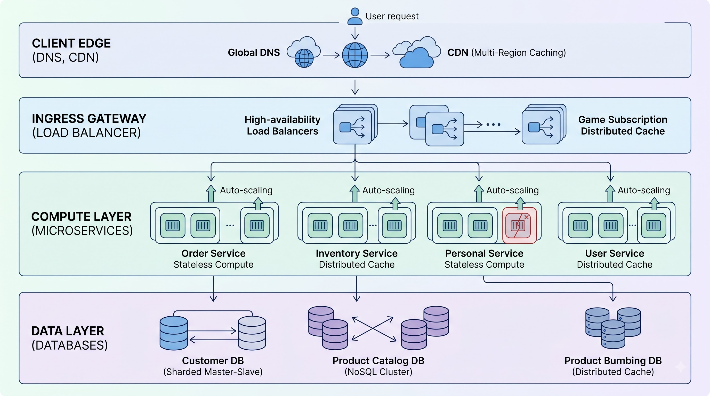

* **System Design** is the software engineering discipline of defining the architecture, software modules, data models, interfaces, protocols, and deployment infrastructure of a system to satisfy functional specifications while guaranteeing rigorous non-functional requirements (NFRs)—such as low latency, high availability, massive scalability, partition tolerance, and security boundaries.
* **Single Points of Failure (SPOF)**: An un-partitioned or un-replicated architecture where a single node, hardware component, or database server crash immediately takes down the entire global service.
* **Cascading Failures**: Occur when a failure or slow network bottleneck in one service causes upstream thread pools or connection sockets to block, leading to resource exhaustion and eventual collapse across the entire network cluster.
* **Resource Exhaustion**: Wasting crucial hardware capacity (such as CPU cycles, memory, and file descriptors) on redundant SSL handshakes, network serialization overhead, or database row-lock contentions rather than computing core business logic.
* **Data Corruption**: Uncoordinated concurrent writes to a shared, non-replicated or unsynchronized data store that result in race conditions, overwrites, and inconsistent states across distributed databases.
* **System Design Layers**: Architecture represents a **vertical slice** spanning across all system tiers, including the **Client Edge** (DNS, local cache, CDN), the **Ingress Gateway Layer** (Load Balancer, API Gateway, WAF), the **Compute Layer** (stateless microservices, container fabrics), and the **Data Layer** (caches, databases, queues).
* **The Architectural Lifecycle**: Production design operates through 5 strict steps: **Gathering Requirements** (defining functional specs and strict NFR metrics like $P_{99}$ latency and availability), **Capacity Estimation** (back-of-the-envelope calculations for storage, CPU, RAM, and network bandwidth), **Data Modeling** (mapping SQL vs. NoSQL structures), **High-Level Design** (master block routing diagrams), and **Low-Level Deep-Dives** (bottleneck, caching, and partitioning designs).
* **Availability Metrics**: High availability is measured in "Nines." Achieving **99.99% availability ("Four Nines")** allows a system to suffer no more than **~52 minutes of total downtime per year**.
* **Distributed Elasticity**: Distributed architectures provide horizontal elasticity (adding cheap commoditized hardware servers to clusters rather than buying massive mainframes), reduce blast radiuses via domain fault isolation (e.g., billing crashing independently of search), and enable decentralized team code deployment.
* **Amazon's Decoupled Order Flow**: Amazon handles massive write traffic by placing checkout events directly into a highly scalable distributed **Message Queue** (like SQS). The frontend immediately returns a success status, while asynchronous background microservices consume messages and fulfill orders at their own pace, protecting primary databases from write spikes.

---

## 📘 Lec-2: What happens when you open a website/Mobile App? (End-to-End Request Flow)

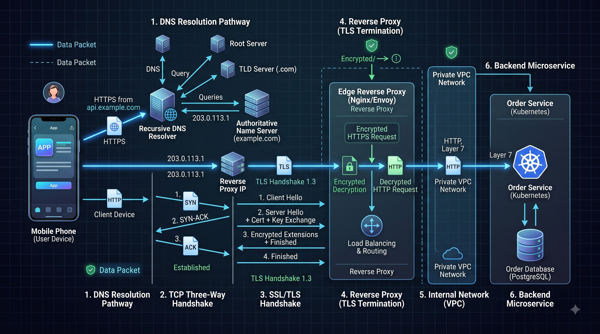

* **Application RAM Loading**: When a user taps an app (such as Hotstar), the Operating System (OS) loads the application's binary code from flash memory into system **RAM** to execute local layout code and initialize network sockets.
* **DNS Resolution Pathway**: The client resolves the domain name (e.g., `api.app.com`) to an IP address. The request queries local cache, then traverses the **ISP Recursive Resolver**, the **Root Nameserver**, the **TLD Nameserver**, and finally the **Authoritative Nameserver** to fetch the corresponding IP address.
* **DNS Caching Layers**: To minimize query times, DNS mapping records are heavily cached across multiple levels, including the web browser, the client OS cache, the local Router cache, and the **Internet Service Provider (ISP)** domain cache.
* **BGP Anycast Routing**: Large networks use Border Gateway Protocol (BGP) Anycast to advertise a single IP address from geographically distributed edge servers, automatically routing client packets to the topologically closest CDN PoP.
* **TCP Handshake (Three-Way)**: Before sending application data, the client and server establish a reliable connection via TCP. The exchange consists of sending a **SYN** (Synchronize) packet, receiving a **SYN-ACK** (Synchronize-Acknowledge) packet, and replying with an **ACK** (Acknowledge) packet.
* **TCP Socket Exhaustion**: If a system allows clients to connect directly to back-end databases without an intermediate proxy layer, operating systems quickly exhaust their physical file descriptors (`FD_SET`) under high concurrency.
* **Database I/O Bottleneck**: Disk-based database seeks (even on modern NVMe SSDs) operate in milliseconds ($10^{-3}$s). In-memory caching lookups (RAM) resolve in microseconds ($10^{-6}$s) or nanoseconds ($10^{-9}$s), providing a million-fold latency reduction.
* **SSL/TLS Handshake Overhead**: Negotiating secure tunnels involves heavy asymmetric public-key cryptography (Diffie-Hellman), consuming significant CPU cycles on application nodes if not terminated early at the edge.
* **Layer 7 Request Routing**: Once the secure TCP connection is active, the client transmits an HTTP/2 GET request. The request is received by a reverse proxy or Load Balancer, which decrypts the TLS packet and forwards it to the private microservices network.
* **Client-to-Database Path**: The dynamic request traverses the load balancer, hits an API Gateway, communicates with backend application containers, queries in-memory caching tiers (Redis), and only touches primary SQL databases if a cache-miss occurs.

---

## 📘 Lec-3: Load Balancers (Routing Algorithms, L4 vs. L7, Nginx vs. HAProxy)

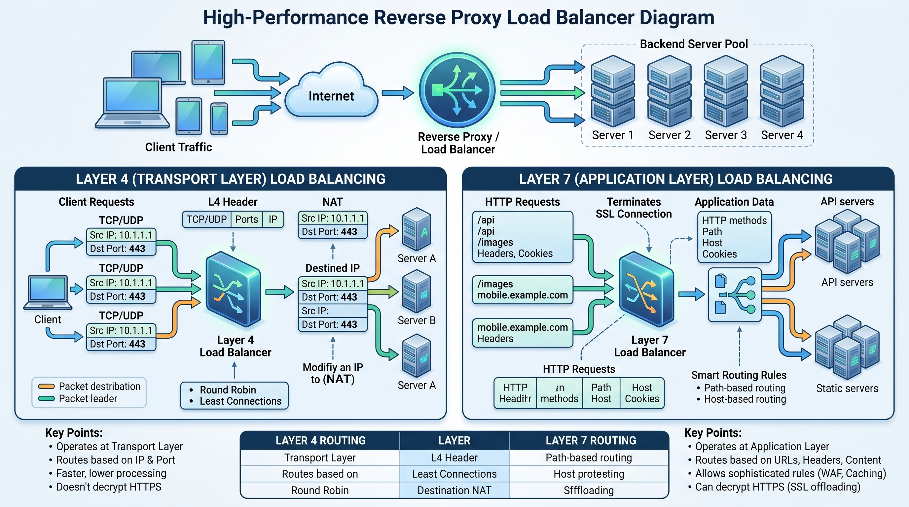

* **Load Balancer (LB)**: A high-performance reverse proxy that serves as a single entry point for client traffic, distributing incoming requests across a pool of healthy backend servers to prevent resource saturation on any single node.
* **Thread Pool Exhaustion**: Without a load balancer, a single server node handling peak traffic will saturate its local CPU scheduling threads and RAM buffers, causing the OS kernel's connection queue (`listen()` backlog) to overflow and drop new connection packets.
* **Edge vs. Internal Placement**: Load Balancers are placed at multiple logical boundaries: **Edge Ingress** (terminating SSL and distributing public traffic), **Internal Mesh** (routing service-to-service gRPC calls), and the **Database Read-Proxy Layer** (distributing queries across SQL replica pools).
* **Layer 4 Load Balancing (Transport)**: Operates at the transport layer (TCP/UDP) using only IP addresses and port numbers. It is fast, performs Network Address Translation (NAT) without inspecting application payloads, and consumes minimal CPU.
* **Layer 7 Load Balancing (Application)**: Operates at the application layer (HTTP/HTTPS/gRPC). It terminates the SSL/TLS connection, decrypts the request, and performs smart routing based on HTTP headers, cookies, query parameters, or URL path variables (e.g., routing `/images` to image servers).
* **Round Robin & Weighted Round Robin**: Sequential routing of requests to each server in the pool. Weighted Round Robin adjusts the distribution sequence according to predefined hardware weight values assigned to each node.
* **Least Connections & Least Latency**: Least Connections routes incoming requests to the server with the fewest active TCP sockets. Least Latency routes requests to the node demonstrating the lowest average response time, which is ideal for environments with dynamic, unequal workloads.
* **IP Hash Routing**: Hashes the client's IP address to map them consistently to the same backend server instance. This is highly useful for stateful applications requiring **sticky sessions**, but prone to load imbalances if many clients share an ISP gateway.
* **Hardware LBs (F5 Big-IP)**: Dedicated physical appliances featuring custom ASICs specifically engineered for line-rate packet switching and encryption. Extremely powerful, highly reliable, and expensive; typically used in massive enterprise data centers.
* **Software LBs (Nginx, HAProxy, Envoy)**: Standard software packages that run on commodity Linux servers or cloud VMs. Easily configurable, supporting dynamic scaling, scriptable routing, and cloud native container auto-discovery.

---

## 📘 Lec-4: Content Delivery Networks (CDNs, Edge Caching, and Latency Optimization)

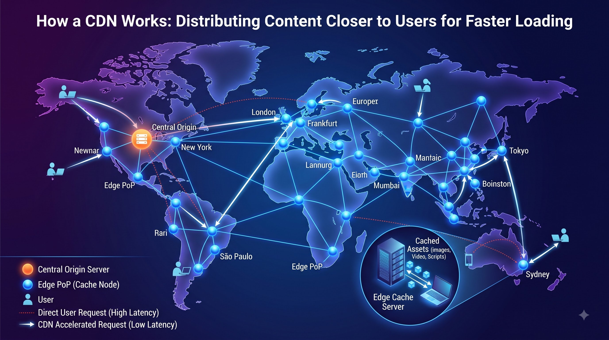

* **Content Delivery Network (CDN)**: A geographically distributed network of proxy servers deployed inside highly connected edge data centers—known as **Points of Presence (PoPs)**—designed to cache and deliver static and dynamic web content closer to users.
* **Latency Reduction Mathematics**: Physical fiber-optic signals are limited by the speed of light. A round-trip query from Tokyo to a centralized server in Virginia takes ~150-200ms. Routing to a local CDN edge PoP reduces round-trip times to **5-20ms**.
* **NIC & Compute Protection**: CDNs intercept traffic before it hits the central origin, protecting the primary datacenter's Network Interface Cards (NICs) from bandwidth saturation and saving database CPU cycles by caching static assets.
* **Anycast DNS Routing**: When a client requests a CDN-hosted asset, Anycast BGP routing resolves the domain name directly to the IP address of the topologically closest edge server PoP.
* **Hierarchical Cache Hits (Hot Path)**: When a request hits an edge node, the CDN parses the URI and looks up the asset in its local NVMe SSD index or memory-mapped LRU rings. If found and not expired (active TTL), it is returned instantly to the client.
* **Cache Miss Resolution (Cold Path)**: On a cache miss, the edge node queries parent cache shields or fetches the asset directly from the **Origin Server** over optimized private backbones, caching the asset locally for future client requests.
* **Cache Invalidation Protocols**: Data updates are synchronized using **Time-To-Live (TTL)** expiration headers, active **Purge APIs** (forcefully deleting cache blocks across the network), or **Cache-Busting** query parameters (e.g., appending version hashes `/style.css?v=2`).
* **Origin Shielding**: Placing a high-capacity proxy cache tier immediately in front of the origin server. It aggregates cache-miss requests from hundreds of global edge nodes, ensuring only a single master request hits the origin for any missing asset.
* **Static Assets**: Best suited for images, compressed video fragments, JS/CSS files, custom fonts, and static HTML landing pages.
* **Dynamic Content Acceleration**: Edge nodes can cache JSON API responses with low TTLs or optimize dynamic routes by maintaining persistent, pre-negotiated TCP/TLS connections to the origin, bypassing handshake latency.

---

## 📘 Lec-5: Forward Proxy vs. Reverse Proxy | System Design

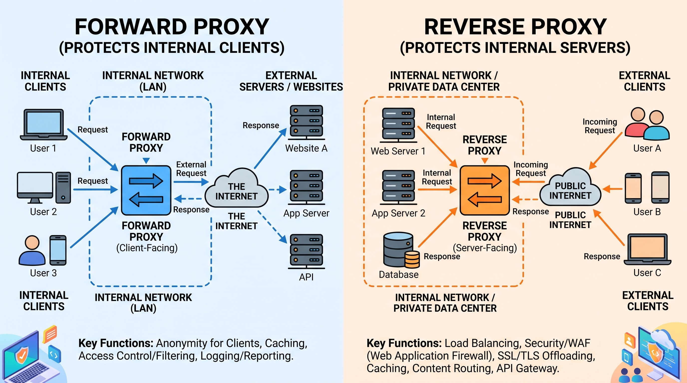

* **Forward Proxy**: An intermediary node positioned between a **group of private clients and the public internet**. It intercepts all outbound client requests, processes egress rules, and forwards requests to the internet on behalf of those clients.
* **Egress Anonymity & Masquerading**: The forward proxy replaces the client's internal private source IP address with its own public IP in packet headers, shielding the client's internal network topology from external web servers.
* **Egress Access Controls**: Used by corporate networks to enforce security filters, logging all egress traffic and blocking requests to specific external domains (e.g., disabling social media or malicious IP ranges).
* **Reverse Proxy**: An intermediary node positioned between the **public internet and a private pool of backend application servers**. It acts as the single public face of the system, receiving all public ingress traffic and routing it internally.
* **Ingress Security Isolation**: Hides the private IP addresses and microservice configuration of backend application instances, preventing direct port scanning, intrusion attempts, and volumetric DDoS attacks.
* **SSL/TLS Termination**: Decrypts HTTPS requests at the reverse proxy layer, terminating the heavy cryptographic math before passing clean, plaintext HTTP/1.1 or gRPC packets over secure private VLANs to backend compute nodes.
* **Compression & static caching**: Compresses HTTP responses using Gzip or Brotli algorithms before shipping them to clients, saving bandwidth, and caching compiled API responses to reduce compute workloads on internal app pools.
* **Architectural Trade-offs**: Forward proxies are managed and configured by the **client organization** to control and secure outbound behavior. Reverse proxies are deployed and controlled by the **service hosting platform** to load balance, scale, and secure inbound API requests.

---

## 📘 Lec-6: SSL Certificates & TLS Handshaking (Encryption in Transit)

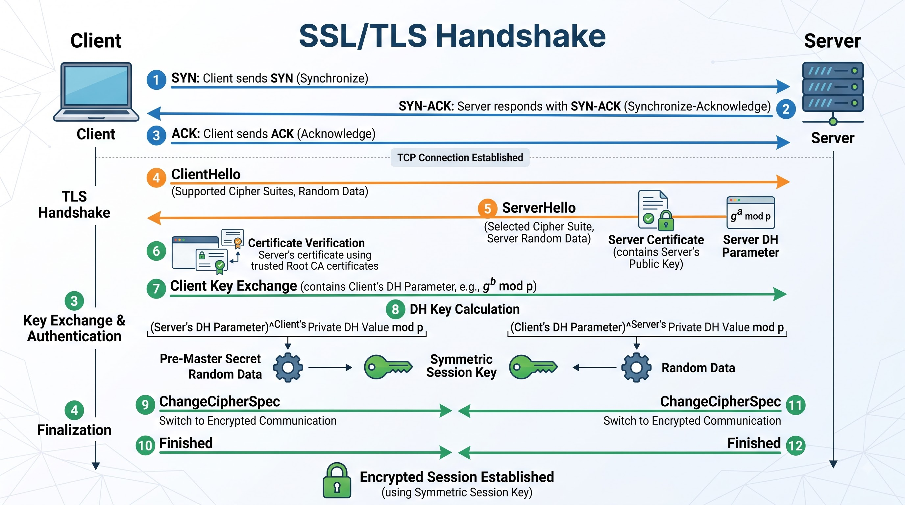

* **SSL/TLS Certificate**: A digital file containing a public key, domain ownership details, and a cryptographic signature from a trusted **Certificate Authority (CA)** (e.g., DigiCert, Let's Encrypt), mathematically binding a domain name to a verified identity.
* **Plaintext Packet Sniffing**: Without SSL/TLS, data (including passwords, session cookies, and financial payloads) is transmitted in cleartext, leaving it highly vulnerable to packet sniffing (Wireshark) and **Man-in-the-Middle (MitM)** tampering.
* **Symmetric vs. Asymmetric Cryptography**: TLS uses **Asymmetric Encryption** (slow, computationally expensive public/private key pairs) solely to safely negotiate a session key. Once negotiated, it uses **Symmetric Encryption** (fast AES-GCM or ChaCha20) for all main data transfer.
* **ClientHello (RTT 0)**: The client begins the handshake by sending its supported TLS versions, a list of cryptographic cipher suites, a random byte string ($Client\_Random$), and an elliptic-curve Diffie-Hellman public key share ($g^x$).
* **ServerHello (RTT 1)**: The server responds with its selected cipher suite, its own random byte string ($Server\_Random$), its Diffie-Hellman public key share ($g^y$), and its CA-signed SSL certificate.
* **Certificate Chain Validation**: The client halts the handshake to verify the digital signature on the certificate. It traces the cryptographic signature up through Intermediate CAs to a pre-installed Root CA certificate built into its OS/browser.
* **Diffie-Hellman Key Exchange (ECDHE)**: The client and server run DH mathematics using their respective private keys and the received public key shares ($g^x$ and $g^y$). This generates a shared secret ($g^{xy}$) without ever transmitting the secret over the network.
* **Symmetric Session Key Derivation**: Both parties apply a Pseudorandom Function (PRF) to combine the shared secret ($g^{xy}$), the $Client\_Random$, and the $Server\_Random$ to derive identical symmetric session keys for data encryption.
* **OCSP Stapling**: To prevent slow network queries to a CA to verify if a certificate is revoked, the server queries the CA periodically and "staples" a time-stamped, CA-signed status assertion directly into the TLS handshake payload.
* **Session Resumption (TLS False Start)**: Optimizes subsequent connections by caching session IDs or distributing encrypted **session tickets** to clients, allowing them to bypass the full handshake and begin encrypting data on RTT 0.

---

## 📘 Lec-7: Caching in System Design (Cache Eviction Policies & Redis vs. Memcached)

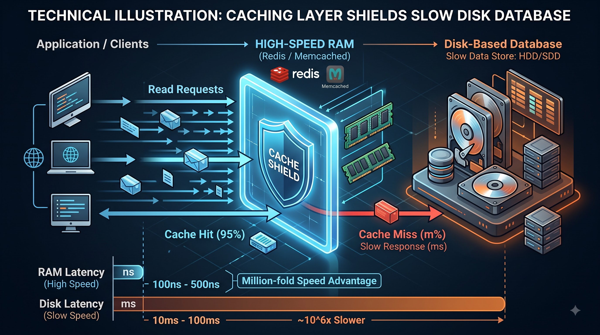

* **Caching**: The practice of storing copies of frequently or recently accessed data in an ultra-fast, temporary, in-memory storage layer (RAM) to bypass slow, disk-bound, or computationally expensive downstream database operations.
* **RAM vs. Disk Latency**: Disk-bound database seeks take milliseconds ($10^{-3}$s). In-memory caching lookups (RAM) resolve in **microseconds ($10^{-6}$s) or nanoseconds ($10^{-9}$s)**, providing a million-fold latency reduction.
* **Volatile Nature**: RAM is temporary storage. If power fails or the cache server reboots, cached data is lost. Therefore, cache layers must be treated as volatile speed boosters, backed by durable disk storage.
* **Caching Tier Placement**: Caches operate across the complete request flow: **Client** (Local/Session Storage), **CDN Edge** (static content), **Reverse Proxy** (web page bodies), **Application Process** (local JVM/Python heap caches), and **Distributed Clusters** (Redis/Memcached).
* **Distributed Memory Caches**: Clustered caching servers (such as Redis or Memcached) that sit between stateless application fleets and the sharded database layer, serving as a shared, high-speed key-value lookup pool.
* **Redis Characteristics**: A single-threaded, in-memory, data-structure store. It supports complex data types (Lists, Sets, Hashes, Sorted Sets), provides **disk persistence** (RDB snapshots and AOF logs), and handles native master-slave replication.
* **Memcached Characteristics**: A high-performance, multi-threaded, simple key-value memory store. It does not support complex data structures or disk persistence, but scales exceptionally well on multi-core server hardware for raw string values.
* **LRU (Least Recently Used) Eviction**: Automatically purges the cache key that has not been accessed for the longest duration when memory capacity is reached, keeping the "hottest" data active.
* **LFU (Least Frequently Used) Eviction**: Tracks the raw frequency count of read requests per key and purges keys with the lowest access count, optimizing for long-term historical popularity.
* **FIFO & LIFO Eviction**: First-In-First-Out (FIFO) evicts keys sequentially based on their ingestion timestamp. Last-In-First-Out (LIFO) deletes the most recently added key first, regardless of access patterns.

---

## 📘 Lec-8: Full Stack Request Flow Explained (DNS, CDN, Load Balancers, API Gateways Combined)

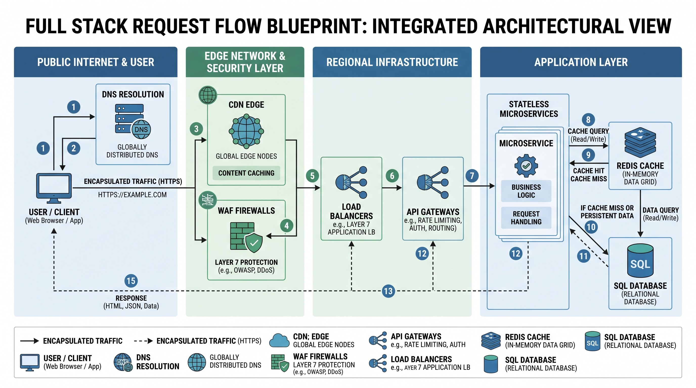

* **Integrated Latency Protection**: Combining multiple systems ensures that if a DNS lookup is cached, CDN edge nodes handle 80% of reads, API Gateways block malicious scripts, and Redis caches warm up, the database remains completely insulated from high-concurrency loads.
* **Step 1: Domain Resolution**: The user enters a URL. The browser queries the local OS cache and recursive DNS resolvers to resolve the domain to an Anycast CDN IP.
* **Step 2: CDN Edge Hit/Miss**: The client establishes a secure socket connection with the nearest CDN edge PoP. If the request is for static assets (e.g., images), the CDN serves them directly (Cache Hit) in 5-20ms.
* **Step 3: Ingress Infiltration & Firewalls**: Dynamic queries (e.g., `/api/checkout`) bypass CDN cache rings and route to ingress load balancers. **Web Application Firewalls (WAF)** scan headers and payloads for SQL Injection or Cross-Site Scripting (XSS) signatures.
* **Step 4: Layer 4 Distribution**: A Layer 4 Network Load Balancer (such as AWS NLB) receives raw TCP connection packets at high speed and distributes them across a fleet of Layer 7 Application Load Balancers (ALBs) using IP/Port NAT routing.
* **Step 5: Layer 7 API Gateway Routing**: The L7 ALB terminates the TLS tunnel, decrypts the HTTP/2 stream, and routes the request to the **API Gateway**. The gateway validates the client's JWT signature, checks rate-limit quotas, and forwards the clean request to internal microservices.
* **Step 6: Stateful Microservice Processing**: The stateless application container processes the request logic. It first queries a distributed Redis cache cluster using a unique key (e.g., `user:42:profile`).
* **Step 7: Database Query and Cache Ingestion**: On a Redis cache-miss, the application server opens a secure pool connection to the primary SQL database (e.g., MySQL), reads the required rows, populates the Redis cache with the retrieved rows (for subsequent requests), and returns the JSON payload to the client.
* **Auditing, Logging, and Monitoring**: Background daemons capture transaction traces, metric payloads (CPU, memory, database connection pool count), and execution logs, storing them in a central **Data Lake** (S3/Elasticsearch) for post-execution audit and analysis.

---

## 📘 Lec-9: What are APIs & API Gateways

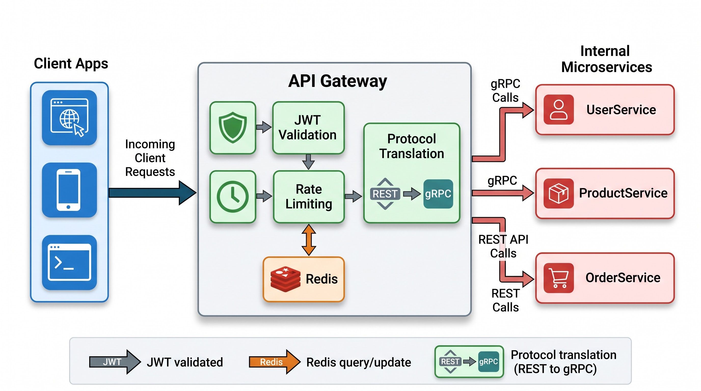

* **Application Programming Interface (API)**: A formal software contract defining the exact endpoints, request formats, data schemas, and expected responses, enabling independent applications to interact programmatically over a network.
* **API Gateway**: A reverse proxy positioned at the entry boundary of a microservices private network. It acts as a single point of entry, intercepting all client calls and routing them to internal backend services.
* **API Exposure Vulnerabilities**: Without an API Gateway, every microservice must expose public IP addresses, configure public SSL certificates individually, and implement duplicated security, rate-limiting, and validation code.
* **Tight Client-Backend Coupling**: Direct client connections force frontend apps to maintain physical IP addresses and endpoints for dozens of internal services. If service boundaries are refactored or split, client-side code breaks immediately.
* **Protocol Bridging and Aggregation**: Web clients cannot natively handle complex, high-performance binary protocols (like gRPC over HTTP/2) used within private service networks. The API Gateway bridges this by exposing standard public REST/JSON endpoints and translating them to internal gRPC or AMQP protocols.
* **Request Interception Mechanics**: A client issues an HTTPS call (e.g., `POST /v1/checkout`). The gateway intercepts the request and verifies the client’s identity using integrated JWT validation or OAuth checks.
* **Redis-Backed Rate Limiting**: The gateway hashes the client's API token or source IP and queries a high-speed Redis cluster to verify if the client has exceeded their allowed transactional quota (e.g., max 100 requests per minute), returning an HTTP 429 error if breached.
* **Intelligent Request Routing**: The gateway matches the request path, performs path rewriting if necessary, and forwards the payload to the specific microservice container pool inside the private VPC.
* **Response Orchestration & Transformation**: The gateway collects responses from multiple backend microservices, aggregates the data into a single payload, strips out private internal server headers, and sends a clean, consolidated payload back to the client.

---

## 📘 Lec-10 & Lec-26: API Paradigms & Protocols (REST, SOAP, GraphQL, gRPC, & WebSockets)

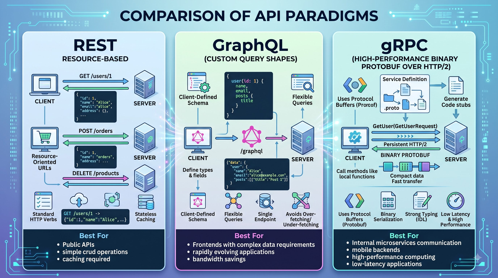

* **REST (Representational State Transfer)**: An architectural style designed around **resources** identified by URIs. It enforces a stateless client-server model and uses standard HTTP verbs (GET, POST, PUT, DELETE) and status codes (e.g., 200 OK, 404 Not Found) with JSON/XML payloads.
* **REST Trade-offs**: Simple to implement, universally compatible, and works well with browser-side caching. However, it can suffer from **Over-fetching** (retrieving unused fields) and **Under-fetching** (requiring multiple roundtrips to retrieve nested data, leading to N+1 query bottlenecks).
* **SOAP (Simple Object Access Protocol)**: A highly structured, strictly-typed XML-based messaging protocol. It relies on a formal, binding contract called a **WSDL (Web Services Description Language)** schema.
* **SOAP Security and Transaction Guarantees**: Built-in specifications for enterprise-grade transactional security (WS-Security) and ACID guarantees across distributed hops (WS-Coordination). However, the XML envelopes are highly verbose, consuming high CPU for serialization and significant network bandwidth.
* **GraphQL**: A query language and runtime engine that allows clients to define the exact shape and fields of the data they need in a single request.
* **GraphQL Resolvers**: The server exposes a single `/graphql` POST endpoint. The query engine parses the client's query, triggers parallel resolver functions across downstream databases or services, compiles the exact requested schema, and returns a tailored JSON response.
* **gRPC (Google Remote Procedure Call)**: A high-performance, open-source RPC framework that runs over **HTTP/2** and uses **Protocol Buffers (Protobuf)** as its binary serialization format.
* **gRPC Efficiency**: Features extremely fast binary serialization (yielding tiny payloads compared to JSON text) and supports native bidirectional streaming. This makes gRPC the industry standard for high-speed, low-latency communication *between internal microservices*.
* **WebSockets**: A protocol that establishes a persistent, full-duplex, bidirectional communication channel over a single, long-lived TCP connection.
* **WebSocket Handshake**: Begins as a standard HTTP GET request with an `Upgrade: websocket` header. Once the server accepts, the connection upgrades to a persistent binary socket. This eliminates HTTP header overhead and is ideal for real-time applications (chat, live notifications, financial tickers).

---

## 📘 Lec-11: Database Partitioning (Logical & Physical Local Splitting)

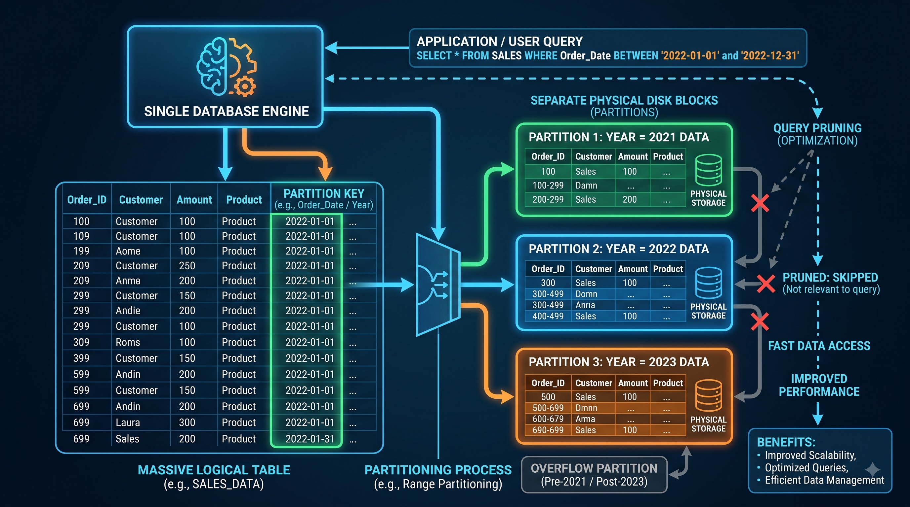

* **Database Partitioning**: The process of decomposing a large database table or index into smaller, more manageable physical subsets (partitions) **within a single database engine instance**. The table remains a single logical entity to the application, but the storage engine manages the data across separate physical disk blocks.
* **B-Tree Index Bloat**: As a single relational table grows to millions of rows, its B-Tree index depth increases. This forces the storage engine to perform more random disk-seek operations per query, degrading search speeds from $O(\log N)$ toward linear speeds as indexes overflow RAM.
* **Partition Key Selection**: The system architect designates a specific column (e.g., `created_at` or `country_code`) as the **Partition Key** to define partition boundaries on disk.
* **Range Partitioning**: Routes data based on predefined ranges of values. For example, partitioning an transaction table by year/month, storing old data in cheaper cold storage tablespaces.
* **List Partitioning**: Groups rows based on explicit, enumerated lists of values. For example, grouping sales rows by `region_id` (e.g., partition 1 stores region 101 and 102; partition 2 stores 201 and 202).
* **Hash Partitioning**: Applies a hash function to the partition key (e.g., `Hash(user_id) % Number of Partitions`) to distribute rows evenly across physical storage blocks, preventing data skew.
* **Partition Pruning**: When a query filters by the partition key (e.g., `WHERE created_at = '2026-09-07'`), the database query optimizer bypasses scanning all other partitions. It targets only the specific physical tablespace on disk containing that range, converting a full-table scan into a fast local disk read.
* **No Join Complexity**: Since partitioning occurs locally within a single database instance, the storage engine natively supports full SQL joins, triggers, and foreign keys across partitions.
* **Storage Limits**: While partitioning makes local indexes manageable, the entire database remains bounded by the physical hardware limits (CPU, disk capacity, and IOPS) of the **single host machine**.

---

## 📘 Lec-12: Database Sharding (Distributed Horizontal Scaling)

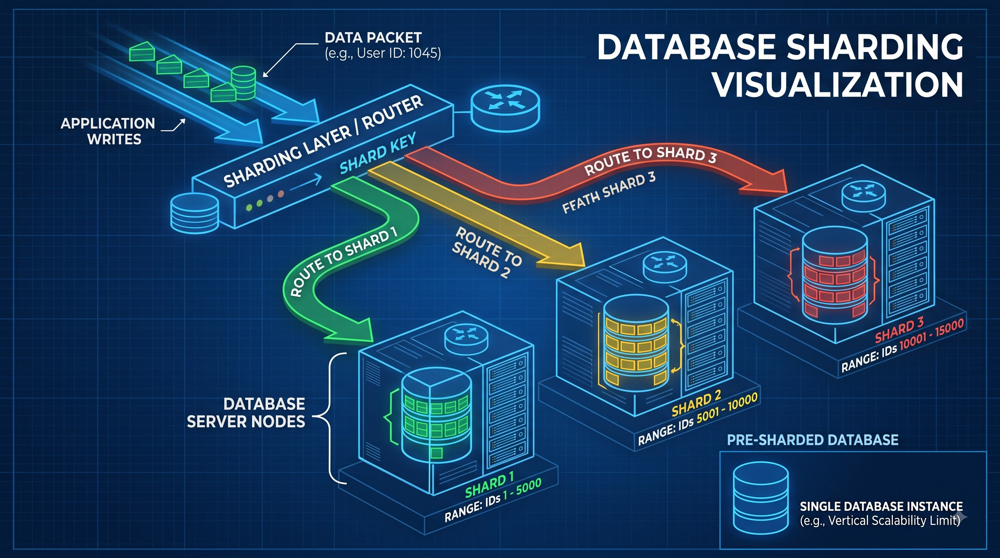

* **Database Sharding**: A database architecture pattern where a single logical dataset is horizontally partitioned and distributed across **multiple physically separate, autonomous database server nodes (shards)**. Each shard is a standalone database server hosting a subset of the overall data.
* **Write Throughput Limits**: A single SQL database node can only write as fast as its local disk IOPS and memory lock limits permit. Sharding multiplies write throughput by spreading write traffic across multiple independent server disks.
* **Shard Key Selection**: The architect defines a specific column (e.g., `user_id` or `tenant_id`) as the **Shard Key**. Every write or read query must include this key to let the system determine which physical server holds the target data.
* **Range-Based Sharding**: Routes data based on ranges of the shard key. Simple to map, but highly prone to server imbalances and hotspotting (e.g., new active users crowding the newest shard, leaving older shards idle).
* **Hash-Based Sharding**: Passes the shard key through a hash function and maps to a shard via a modulo operation (`Hash(ID) % Number of Shards`). This distributes reads and writes evenly, but makes adding or removing database nodes highly complex.
* **Directory-Based Sharding**: Queries an external lookup service or high-speed cache that stores the explicit map of key-to-shard server locations. Highly flexible but introduces an extra network hop and a single point of failure (SPOF) if the lookup service goes down.
* **Vitess & Citus Middleware**: High-scale databases use dedicated database middleware proxies (such as Vitess for MySQL or Citus for PostgreSQL) to intercept SQL queries, calculate target shard locations, route requests, and aggregate multi-shard results.
* **Cross-Shard Join Limitation**: Sharded architectures do not natively support SQL `JOIN` operations across separate physical machines. Joining sharded data requires executing manual joins in the application code, which introduces significant network latency.
* **Distributed Transaction Overhead**: Enforcing ACID consistency across multiple shards requires complex protocols like **Two-Phase Commit (2PC)** or the Saga Pattern, which significantly increases network overhead and write latency.

---

## 📘 Lec-13: CAP Theorem (Distributed Systems Trade-offs)

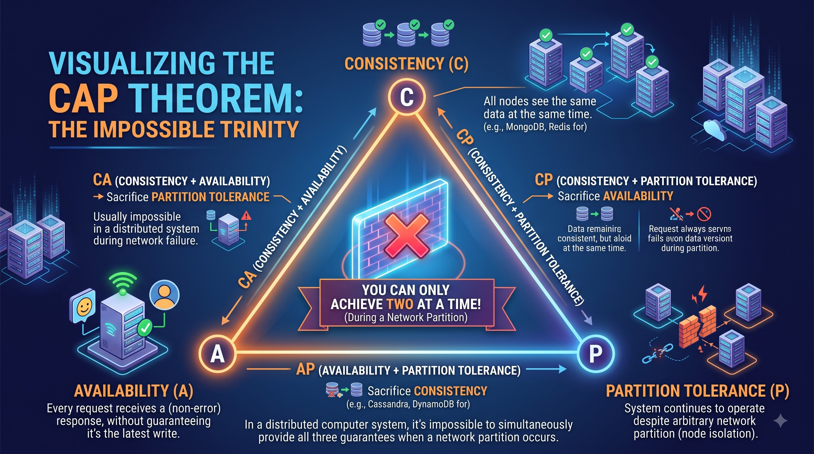

* **Consistency (Strong Consistency)**: Every read request receives the most recent write or an error. All nodes in the cluster return the exact same data state at the same time, giving clients the illusion of a single-node database.
* **Availability**: Every non-failing node returns a non-error response to every request (without a guarantee that it contains the most recent write). No request is blocked or rejected.
* **Partition Tolerance**: The system continues to operate despite an arbitrary number of messages being dropped or delayed by the network between nodes.
* **Network Partition Reality**: In any real-world distributed system, physical network cables can fail, switches can crash, and network packets will occasionally be lost (**P is inevitable**). Therefore, a distributed system must choose between **Consistency (C)** or **Availability (A)** during a partition.
* **CP (Consistency over Availability)**: If the system cannot replicate a write to all partitioned nodes to ensure strong consistency, it rejects the write or blocks the read, sacrificing Availability.
* **AP (Availability over Consistency)**: The system accepts writes and reads locally on partitioned nodes, returning stale or inconsistent data to clients in different regions, sacrificing Consistency.
* **CP Use Cases (e.g., Banking, Booking)**: Financial ledger databases (e.g., ATM balances) must be CP. If a network partition prevents replicating a withdrawal of $100 to all nodes, the system must block the transaction to prevent overdrafts.
* **AP Use Cases (e.g., Social Media, Streaming)**: Social networking systems (e.g., Instagram likes) are AP. If a partition prevents replicating a "like" count to other regions, the app still accepts likes and serves the old count, knowing background gossip protocols will eventually synchronize the data.
* **CA Fallacy**: A system cannot choose "CA" (Consistency + Availability) globally because it assumes the network will never experience a partition—an assumption that breaks under real-world scaling.

---

## 📘 Lec-14: Message Queue Systems (Asynchronous & Decoupled Architecture)

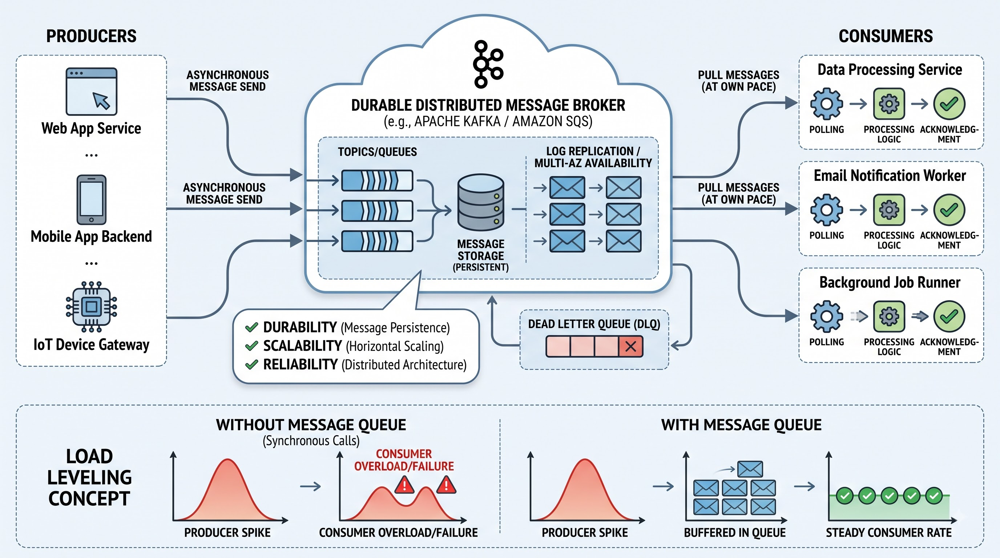

* **Temporal Decoupling**: Message queues remove the requirement for producers (request senders) and consumers (request processors) to be online, connected, or processing synchronously at the same time.
* **Asynchronous Middlewares**: High-performance message brokers (such as **Apache Kafka**, **RabbitMQ**, or **AWS SQS**) sit between microservices to route, serialize, buffer, and persist transactional payloads.
* **Load Leveling (Buffering)**: Acts as a physical shock-absorber during traffic spikes (e.g., flash sales, ticket drops). It stores sudden bursts of millions of requests in a queue and allows backend database workers to pull and process them at a safe, constant pace.
* **Durable Disk Persistence**: To prevent data loss during power outages or system crashes, production brokers persist messages directly to NVMe SSDs or append-only commit logs before acknowledging receipt to the producer.
* **Push Model (RabbitMQ)**: The message broker maintains active connections to consumers and pushes messages directly to them as they arrive in the queue. Extremely low latency, but can overwhelm consumers if they lack backpressure controls.
* **Pull Model (Apache Kafka)**: Consumers poll the broker in batches, retrieving messages and managing their own index position (**Offset**) along an immutable commit log. This gives consumers complete control over their processing rate.
* **Message Acknowledgments**: Consumers must send an **ACK** signal to the broker after successfully processing a message. If a consumer crashes before sending an ACK, the broker retains the message and routes it to another active consumer.
* **At-Least-Once Delivery**: The industry standard guarantee where the broker ensures every message is delivered. However, this introduces the possibility of duplicate deliveries if network failures block consumer ACK packets from reaching the broker.
* **Idempotency Requirement**: Because of potential duplicate deliveries, consumers must be designed to be **idempotent** (processing the exact same message multiple times must yield the same system state as processing it once).

---

## 📘 Lec-15: Scaling Strategies (Vertical vs. Horizontal Scaling)

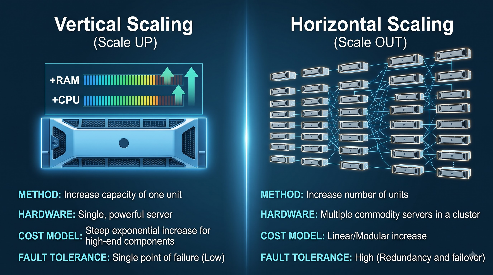

* **Scaling**: The architectural capability of a system to adjust its hardware capacity (compute power, memory throughput, network bandwidth) to maintain performance as transaction volume scales.
* **Vertical Scaling (Scaling Up)**: Upgrading the hardware of a **single physical or virtual server instance** by adding more CPU cores, RAM, or faster SSD storage.
* **Horizontal Scaling (Scaling Out)**: Adding **more independent server instances** to a cluster, distributing client workloads across them using an ingress load balancer.
* **Hardware Ceiling**: Vertical scaling hits a physical limit. There is a maximum amount of RAM and CPU cores that can fit onto a single server motherboard, making infinite growth impossible.
* **SPOF Risk**: A vertically scaled server remains a single point of failure. If the underlying motherboard, hypervisor, or power supply fails, the entire application crashes.
* **Cost Inefficiency**: Upgrading to high-end enterprise servers is exponentially more expensive than purchasing multiple standardized, commodity cloud VMs.
* **Zero Code Modification**: Vertical scaling requires no changes to application code, routing layers, or database engines, making it a fast short-term solution for low-traffic legacy systems.
* **Stateless Application Prerequisite**: Horizontal scaling requires application servers to be **entirely stateless**. No user session data can be stored in a server's local RAM; session states must be offloaded to a shared, high-speed Redis cluster.
* **Auto-Scaling Metrics**: Systems track metrics (e.g., CPU utilization > 70% or request queue depth) to automatically spin up new stateless application instances under load, scaling back down when traffic subsides.

---

## 📘 Lec-16 & Lec-31: Monolithic vs. Microservices Architecture

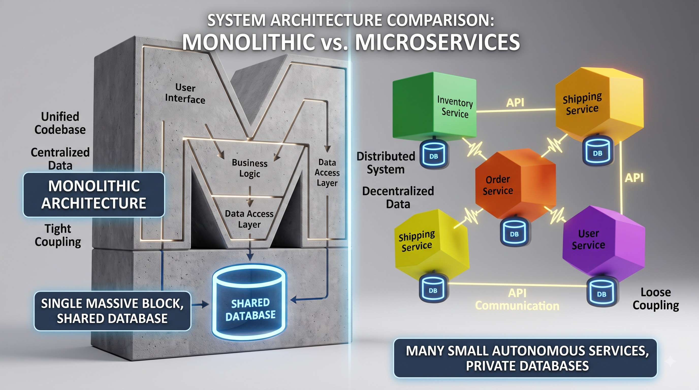

* **Monolithic Architecture**: An architectural pattern where all software modules, business domains, and deployment packages are compiled and executed together as a **single unified process**, sharing a centralized relational database.
* **Microservices Architecture**: An architectural style that decomposes an application into a suite of small, autonomous, loosely-coupled services. Each service represents a specific business domain, runs in its own process, manages its own private database (**Database-per-Service**), and communicates via lightweight protocols (gRPC, REST, or message brokers).
* **Blast Radius Vulnerability**: In a monolith, a single memory leak, null-pointer exception, or infinite loop in a secondary feature (such as generating PDF reports) crashes the entire process, taking down critical systems like payment and login.
* **Monolithic Database Lock Bottleneck**: Dozens of developers committing code to a single shared database schema leads to severe lock contentions, migration blockages, and schema update delays.
* **Inefficient Scaling**: If only one domain (e.g., Search) encounters high load, a monolith forces you to scale the entire application across larger instances, wasting expensive CPU and memory resources on idle code blocks.
* **Bounded Context Division**: Transitioning to microservices requires splitting monolithic code based on Domain-Driven Design (DDD) boundaries, assigning clear owners and contexts to each service.
* **Database Isolation Rule**: Under microservices, Service A **can never** query Service B's database directly. Any cross-service data dependency must resolve through network-based API calls (HTTP/gRPC) or asynchronous event streams.
* **gRPC Inter-Service Mesh**: Microservices utilize gRPC over HTTP/2 for high-speed, synchronous internal communication, utilizing Protobuf serialization to minimize network latency and CPU parsing cycles.
* **Event-Driven Decoupling**: For non-blocking, eventual-consistency flows, microservices publish events (e.g., `OrderPlaced`) to a central Kafka broker, allowing notification and inventory services to consume them asynchronously.

---

## 📘 Lec-17: Write-Through vs. Write-Back Caching Policies

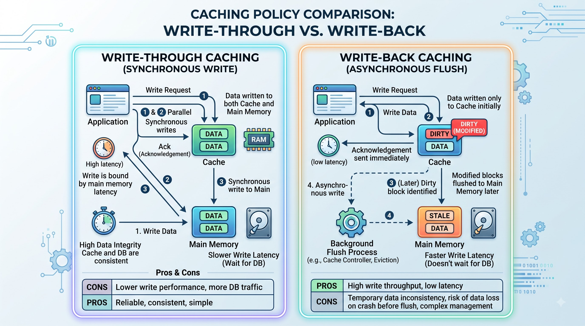

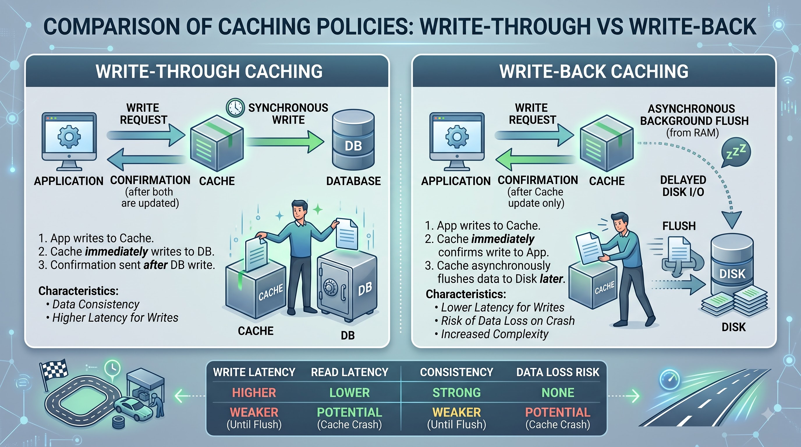

* **Write-Through Caching**: A synchronous write policy where data is written to both the high-speed Cache layer and the underlying database simultaneously before the transaction returns a "success" confirmation to the calling application.
* **Write-Through Advantages**: Ensures **strong data consistency** between the cache and the database. If the cache reboots immediately after a write, the database is guaranteed to have the update, eliminating stale reads.
* **Write-Through Latency Cost**: Writes are slow because they are bounded by the random-write speed of the underlying disk storage system. This policy is highly susceptible to write bottlenecks under heavy transaction spikes.
* **Write-Back (Write-Behind) Caching**: An asynchronous write policy where data is written exclusively to the high-speed cache layer first, which immediately returns a success status. Modified cache entries (marked as dirty blocks) are synchronized to the database later in background batches.
* **Write-Back High-Write Optimization**: Dramatically reduces write latency by avoiding direct database I/O. It can aggregate multiple writes to the same record in RAM (e.g., rapidly changing views or likes) and execute a single aggregated write to the database.
* **Write-Back Data Loss Risk**: If the cache server crashes or loses power before the dirty RAM blocks are flushed to disk, the data is lost permanently, creating a consistency gap between the client state and the database.
* **Thundering Herd Mitigation**: By serving as a high-speed write buffer, the write-back policy absorbs sudden transaction surges (e.g., social media viral posts), preventing connection pool exhaustion and thread starvation on primary databases.

---

## 📘 Lec-18: NoSQL Document Databases (JSON Storage & Dynamic Schemas)

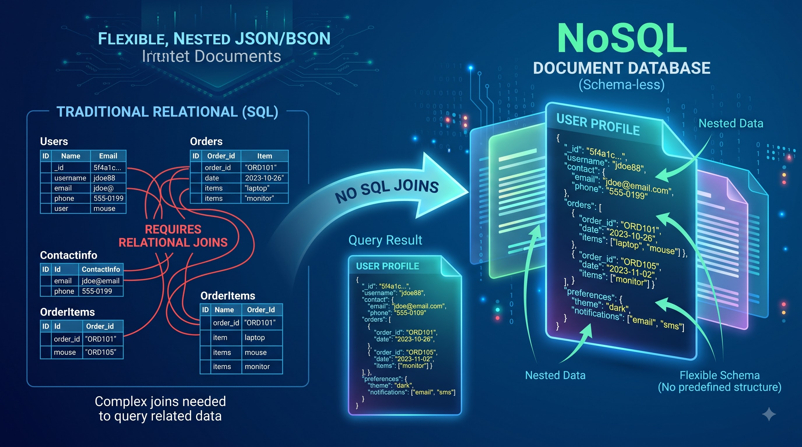

* **Relational Schema Inflexibility**: When storing objects with highly variable properties (such as an e-commerce catalog containing both smart TVs with resolutions and sports shoes with sizes), SQL tables require either hundreds of wasteful **NULL-filled columns** or complex, slow entity-attribute-value (EAV) designs.
* **Document Databases (e.g., MongoDB, CouchDB)**: Stores data in flexible, schema-less **documents** (typically JSON or binary BSON formats). This allows each record to have a completely different set of key-value attributes.
* **Denormalization (Self-Containment)**: Related data is nested directly inside a single document (e.g., embedding shipping addresses inside the parent user document), completely eliminating the need for relational joins.
* **Single-Document Read Performance**: Because all related data is stored contiguously in a single BSON block, the storage engine can retrieve the entire record in a single disk I/O operation, achieving extremely fast reads.
* **Nested Indexing**: The document engine builds B-Tree indexes on both top-level keys (`_id`, `email`) and deep nested fields (`addresses.postal_code`), allowing query engines to locate records without full-collection scans.
* **No Database-Level Joins**: Cross-document joins are not natively optimized. Performing joins requires executing manual queries in the application layer, which introduces significant network latency and CPU overhead.
* **MongoDB BSON Conversion**: MongoDB converts human-readable JSON text strings into **BSON (Binary JSON)** on ingestion, which is optimized for high-speed machine parsing and supports additional data types like `Date` and `BinData`.

---

## 📘 Lec-19: NoSQL Key-Value Databases (RAM-First Storage & Session Caching)

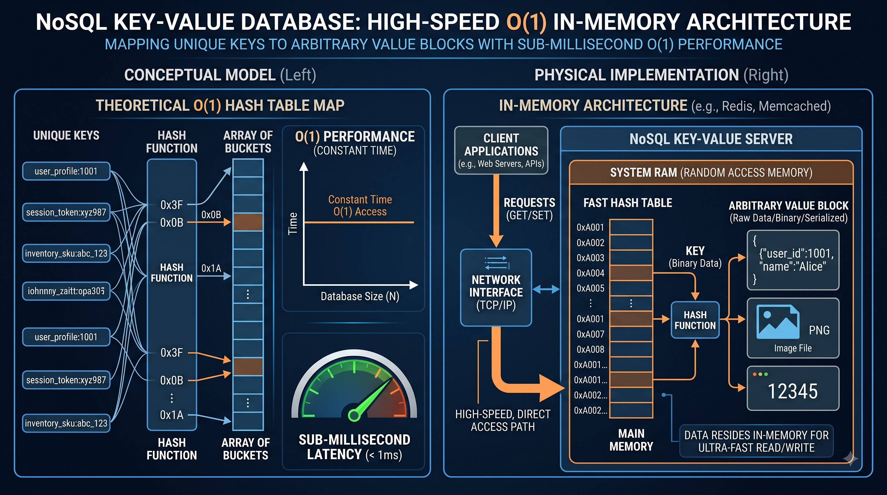

* **Key-Value Database (e.g., Redis, Memcached)**: The simplest type of NoSQL database, storing data as an associative array where a unique, indexable **Key** is mapped directly to an arbitrary **Value** block (strings, hashes, lists).
* **Hash Table $O(1)$ Performance**: Key-Value databases allocate an in-memory Hash Table index. The query engine hashes the key string, maps it directly to a memory offset address, and retrieves the value block in constant time, achieving **$O(1)$ time complexity**.
* **RAM-First Execution**: By storing datasets entirely in system RAM and bypassing disk seeks, key-value databases achieve read/write response times in **microseconds**, comfortably handling hundreds of thousands of operations per second.
* **Redis Single-Threaded Multiplexing**: Redis runs its core execution loop on a single main thread backed by an event multiplexer (using Linux `epoll` or macOS `kqueue`). This eliminates CPU context-switching overhead and expensive multi-threaded memory locks.
* **Redis Persistence Strategies**:
* **RDB (Redis Database Snapshot)**: Generates and writes point-in-time binary snapshots of the RAM state to disk asynchronously at regular intervals.
* **AOF (Append-Only File)**: Logs every write command received to an append-only disk file sequentially, enabling the complete memory state to be rebuilt upon system reboots.
* **Key-Value Disadvantages**: Highly limited querying capabilities. Because data is indexed strictly by key, searching by nested attributes forces the engine to run full-memory scans. It cannot natively perform aggregations (e.g., `SUM`, `AVG`) or complex table joins.
* **Production Use Cases**: High-speed session management (storing user tokens), real-time shopping carts, rate-limiting counters, and caching dynamic API payloads.

---

## 📘 Lec-20: Column-Family Databases (Cassandra, HBase)

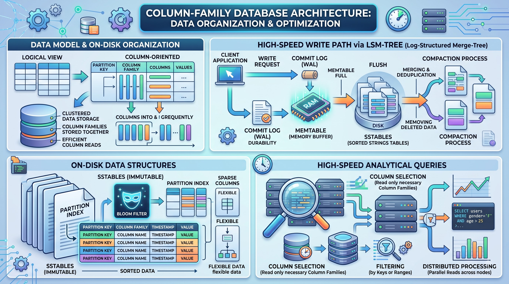

* **Column-Family Database**: A distributed, distributed NoSQL database that stores data in columns grouped into family structures rather than rows. Contiguous data on disk is organized by column rather than by row.
* **Relational Row-Store Limitation**: Relational databases write rows sequentially. If you run an analytical query (e.g., `SELECT AVG(salary) FROM employees`), the engine must load every column of every row into RAM, wasting I/O on unused columns.
* **Analytical Query Optimization**: Column-Family databases write column values contiguously on disk. Querying a single attribute loads only that specific column family's blocks into RAM, bypassing other columns and maximizing analytical read throughput.
* **Row Key & Column Families**: Each record is identified by a unique **Row Key** containing multiple **Column Families**. Each Column Family is a logical container holding dynamic columns with a name, value, and a 64-bit write timestamp.
* **LSM-Tree Write Path (Cassandra)**: Writes bypass relational block-locks. They append sequentially to an in-memory commit log (Write-Ahead Log) for durability, write to an in-memory sorted cache (**MemTable**), and are flushed to disk as immutable sorted string files (**SSTables**).
* **Background Compaction**: Since SSTables are immutable, updates and deletes create duplicate entries. Background threads continuously run **Compaction** to merge SSTables, resolve duplicate keys using the latest timestamp, and purge deleted records (marked with tombstones).
* **Active-Active Masterless Architecture**: Cassandra uses a masterless ring topology with Gossip protocols for node synchronization, providing linear horizontal scaling and high fault tolerance (any node can accept reads/writes).

---

## 📘 Lec-21: Graph Databases (Neo4j, Amazon Neptune)

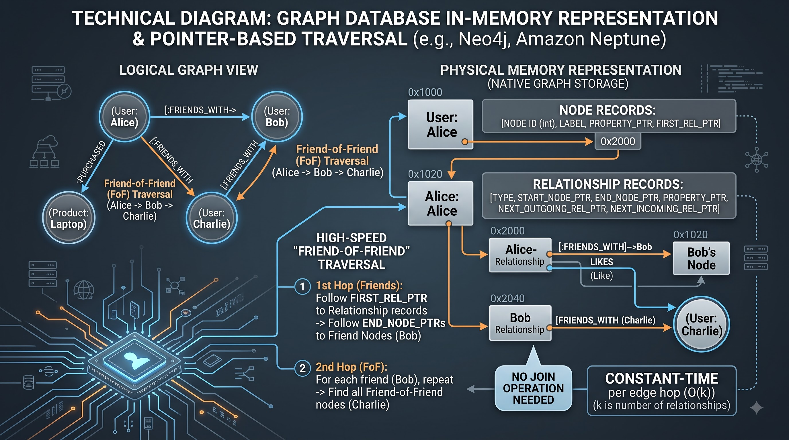

* **Graph Database**: A specialized NoSQL database that represents, stores, and queries data using **Nodes** (vertices representing entities), **Edges** (directed, labeled relationships), and **Properties** (key-value metadata attached to nodes or edges).
* **The Junction Table Bottleneck**: In SQL, modeling complex, many-to-many relationships (e.g., social networks, user followers, product recommendations) requires heavy junction tables and nested, recursive `JOIN` operations that degrade database performance.
* **Index-Free Adjacency**: Each node in a graph database stores **direct physical memory pointers** to its adjacent neighbor nodes.
* **Constant-Time Pointer Traversal**: Querying connections (e.g., "Find friends of friends") bypasses global database indices. The query engine simply traverses the physical memory pointers from node to node, executing the traversal in constant time $O(1)$ regardless of the overall size of the database.
* **Social Graph Modeling**: Ideal for mapping complex, deeply nested connections (e.g., Facebook's social graph, LinkedIn's professional connections).
* **Cypher Query Language**: Graph databases use expressive Cypher-like query languages designed to traverse nodes and edges intuitively (e.g., `MATCH (u:User)-[:FOLLOWS]->(c:Celebrity)`), simplifying graph query modeling.
* **Disadvantages**: Harder to scale horizontally across multi-node clusters because partitioning a unified graph across separate physical machines (graph partitioning problem) requires expensive cross-node pointer queries.

---

## 📘 Lec-22: ACID vs. BASE in System Design

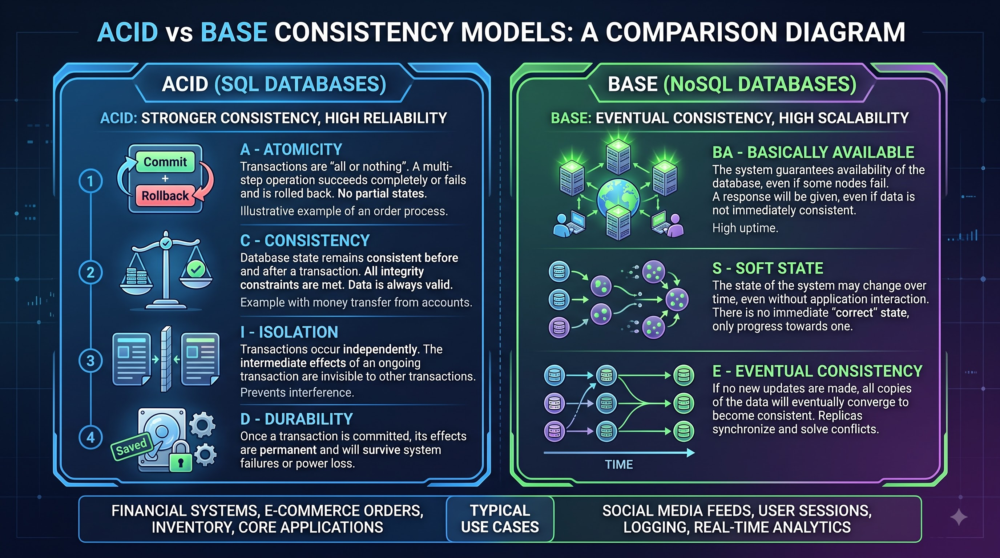

* **ACID Consistency Model**: A strict database transactional model prioritizing immediate correctness and mathematical integrity across all nodes, standard in relational engines (SQL).
* **ACID Properties**:
* **Atomicity**: All operations in a transaction succeed, or the entire transaction is rolled back completely ("All or Nothing").
* **Consistency**: A transaction can only transition the database from one valid state to another, maintaining all schema constraints and foreign keys.
* **Isolation**: Concurrent execution of transactions yields the same state as if they were run sequentially, preventing race conditions.
* **Durability**: Once a transaction is committed, it remains persisted in non-volatile storage (disk), surviving system crashes.
* **BASE Consistency Model**: A loose consistency model designed for high-scale distributed systems, standard in NoSQL databases.
* **BASE Properties**:
* **Basically Available**: The system guarantees availability; it will always respond to client requests, even if some nodes are down or partitioned.
* **Soft State**: The data state can change dynamically over time without active client interaction, reflecting background replication delays across nodes.
* **Eventual Consistency**: The system guarantees that if no new writes occur, all replicas will eventually synchronize and return the exact same data state.
* **The Saga Pattern**: Since microservices use Database-per-Service models and cannot use local ACID transactions, they implement the **Saga Pattern** (a sequence of local transactions where each service updates its DB and publishes an event; if a step fails, compensating transactions are fired to roll back previous states).

---

## 📘 Lec-23: SQL vs. NoSQL Databases

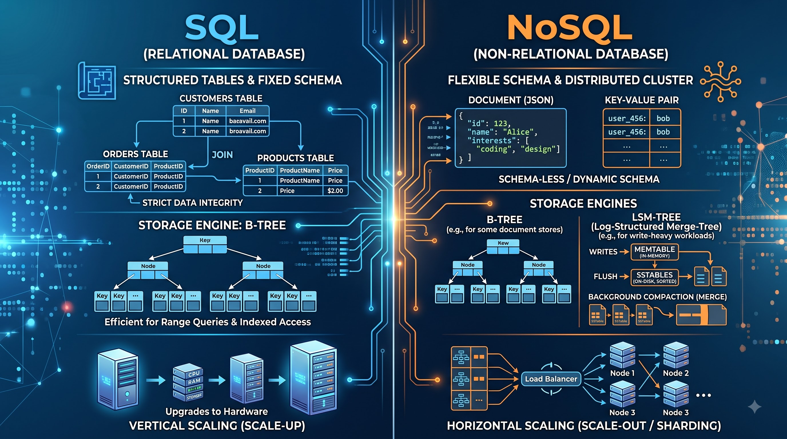

* **SQL (Relational Databases - e.g., MySQL, PostgreSQL, Oracle)**: Store data in rigid, tabular rows and columns with fixed schemas, strong relational integrity constraints, and built-in support for complex ad-hoc queries with table joins.
* **NoSQL (Non-Relational Databases - e.g., MongoDB, Redis, Cassandra, Neo4j)**: Store data in flexible, schema-less formats. They prioritize horizontal scale-out and high-speed writes over immediately consistent relationships.
* **Storage Engines (B-Tree vs. LSM-Tree)**:
* **SQL (B-Tree)**: Relational engines write data to balanced tree structures on disk. This optimizes random reads and range scans but requires expensive locking of disk blocks during writes, limiting write throughput.
* **NoSQL (LSM-Tree)**: Many NoSQL databases write sequentially to memory first, then flush to sorted files on disk. This optimizes write speeds and eliminates disk lock contentions, but makes random reads slower.
* **SQL Scaling (Vertical)**: Scaled by upgrading the physical resources of a single server. Scaling horizontally requires complex master-replica configurations and manual application-level partitioning.
* **NoSQL Scaling (Horizontal)**: Built from the ground up for distributed architectures, using automatic sharding, consistent hashing, and masterless configurations to distribute data across clusters of cheap machines.
* **Decision Framework**: Choose **SQL** when data schemas are highly structured, relationships are complex, and immediate ACID transactional consistency is non-negotiable. Choose **NoSQL** when schemas are dynamic, write volume is extremely high, and the system requires horizontal scaling under eventual consistency.

---

## 📘 Lec-24: Database Replication vs. Sharding

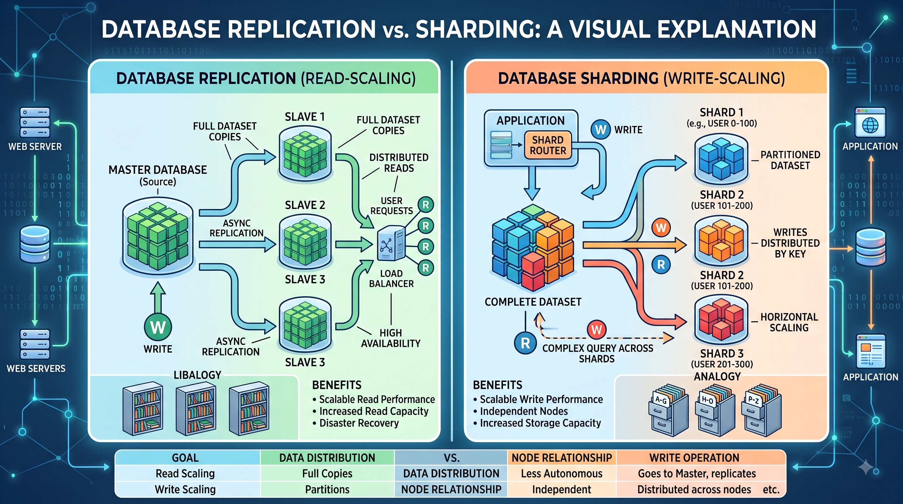

* **Database Replication**: The process of copying the complete database dataset across multiple active or passive server nodes (Master-Slave / Primary-Replica topology).
* **Disaster Recovery & High Availability**: Replication ensures that if the primary master database crashes, one of the passive read replicas can be elected to master within milliseconds, preventing platform outages.
* **Read-Scale Optimization**: Distributes high-concurrency read queries across multiple read replicas. This is highly effective for read-heavy workloads (such as browsing movie catalogs on Netflix), keeping the primary master node free to process writes.
* **Replication Replication Lag**: Follower replicas are synchronized asynchronously from the master's WAL. This creates a temporary window where replicas return stale or outdated data to clients.
* **Database Sharding**: The process of partitioning a single logical dataset horizontally and distributing different subsets of that data across **separate, autonomous physical database nodes**.
* **Write-Heavy Bottleneck Resolution**: Unlike replication (where every node must execute every write to maintain an identical dataset copy), sharding splits write traffic. A write targeting User 42 only touches Shard A, while a write for User 99 only touches Shard B, multiplying global write capacity.
* **Storage Capacity Expansion**: Sharding breaks a multi-terabyte dataset into smaller shards, allowing clusters to host datasets that exceed the physical disk storage limits of any single server machine.
* **Hybrid Production Architecture**: Enterprise platforms combine both approaches. They shard their global dataset horizontally across multiple nodes to distribute writes, and configure local master-replica replication on each shard to guarantee high availability and read scalability.

---

## 📘 Lec-25: Consistent Hashing

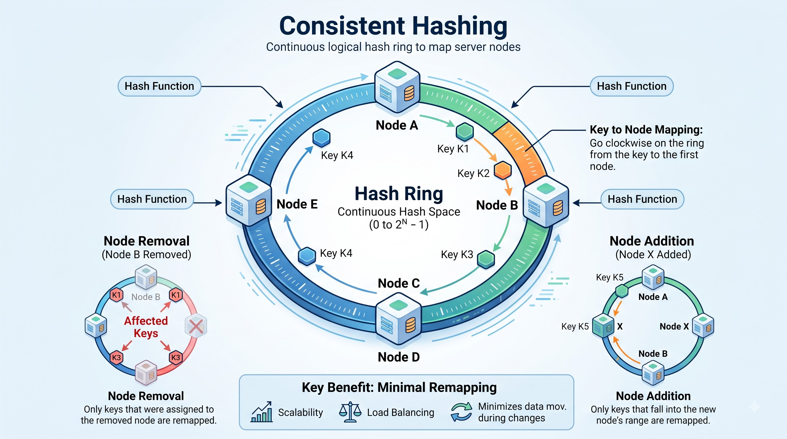

* **Consistent Hashing**: A distributed hashing paradigm that maps both database server nodes and client data keys onto a continuous, circular **logical hash ring**.
* **Traditional Hashing Bottleneck**: Naive sharding maps keys to servers using the modulo operator: $Hash(Key) % N$. If a server crashes or a new node is added (changing $N$), almost every single database key hashes to a different server number. This invalidates up to **99% of system caches**, triggering a thundering herd on primary databases.
* **The $1/N$ Guarantee**: Consistent Hashing guarantees that when a node is added or removed from a cluster of size $N$, only **$1/N$ of the overall keys** must be remapped to different servers.
* **Hash Ring Coordinates**: Both server nodes (using their IP/Hostname) and client data keys are mapped to specific coordinates along a continuous, circular space (typically $0$ to $2^{32}-1$).
* **Clockwise Association**: To locate its host server, a client key hashes to a coordinate on the ring and walks **clockwise** along the ring until it meets the first available server node.
* **Virtual Nodes (V-Nodes)**: To prevent physical server load imbalances and hotspots, each physical server is mapped to multiple **Virtual Nodes** distributed randomly across the ring. This ensures an even distribution of keys across the physical hardware.
* **Decentralized Lookup Routing**: Client routers can independently calculate a key's host server coordinate on the ring, eliminating the need to query a centralized metadata master node, which reduces network latency.

---

## 📘 Lec-27: API vs. SDK (Software Development Kit)

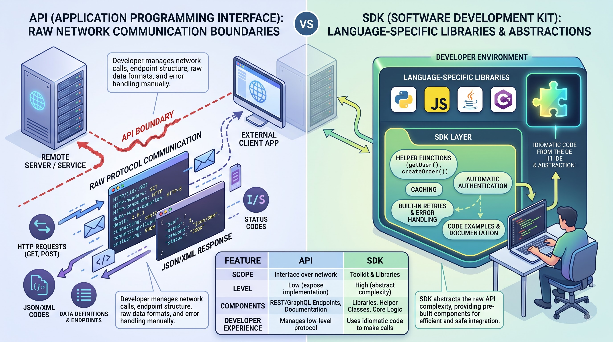

* **Application Programming Interface (API)**: A structured interface contract (such as an HTTP REST endpoint) enabling independent software services to communicate. It provides raw network communication boundaries for data exchange.
* **Software Development Kit (SDK)**: A comprehensive, language-specific software package containing helper libraries, compilers, code samples, documentation, and pre-configured APIs to simplify platform integration.
* **Abstraction of Common Patterns**: An API exposes raw endpoints. To use it, developers must write custom code to handle TCP connections, payload serialization, error retries, and rate limits. An SDK abstracts these complexities into clean, native language method calls (e.g., `sdk.charge()`).
* **Deployment Footprint**: APIs are hosted remotely on the server network, leaving zero footprint on client devices. SDKs are installed as compile-time dependencies (e.g., npm, pip) inside the client's application, adding to the compiled binary size.
* **API Versioning & Platform Independence**: APIs are language-agnostic; any system that can open a network socket can call an HTTP API. SDKs are tightly bound to specific programming languages and runtimes, requiring separate libraries for iOS, Android, and Java.
* **Production Integration Example**: Integrations like **Stripe** expose raw HTTP APIs. However, developers install Stripe's native language SDKs (such as Python or Node.js) because they automatically handle SSL handshake negotiations, cryptographic signatures, retry loops, and JSON payload serialization under the hood.

---

## 📘 Lec-28: Rate Limiting in System Design

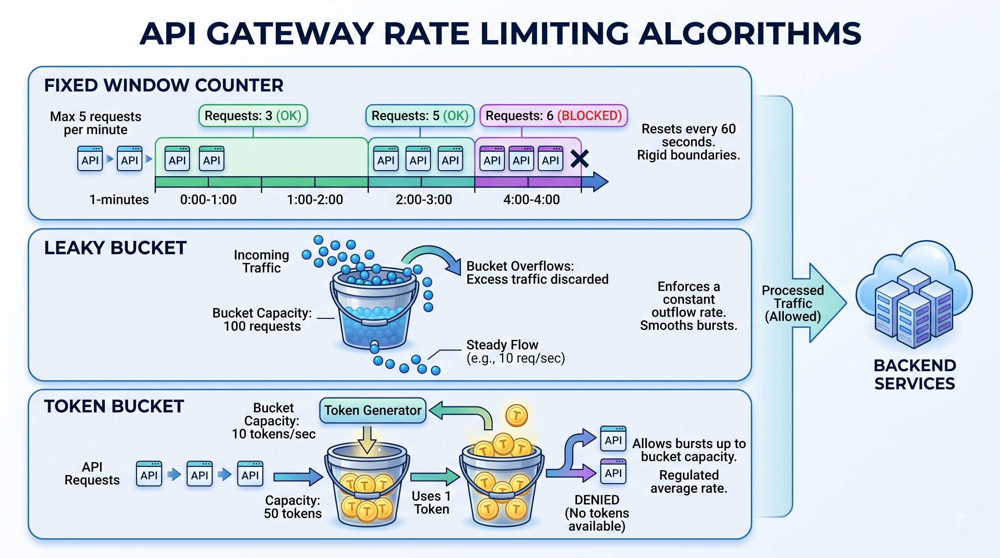

* **Rate Limiter**: An ingress traffic control service that monitors incoming request frequencies and blocks clients that exceed predefined limits, returning an **HTTP 429 Too Many Requests** error to protect backend servers.
* **DoS and Bruteforce Mitigation**: Without rate limiting, a buggy client-side loop or a malicious botnet can generate millions of requests per second, exhausting server thread pools, saturating network interfaces, and crashing databases.
* **System Placement**: Rate limiters are deployed at the outermost boundaries of a system, typically embedded within CDNs, Web Application Firewalls (WAF), load balancers, or **API Gateways** to block excessive traffic before it reaches backend services.
* **Fixed Window Counter**: Divides time into fixed intervals (e.g., 1-minute blocks) and tracks requests per user using a simple counter. It is simple to implement but highly susceptible to traffic bursts at boundary edges (double quota requests across a sub-second window).
* **Sliding Window Log**: Logs the exact timestamp of every request in a sorted set (e.g., Redis Sorted Set). On every request, it purges logs older than the sliding window, allowing it to calculate exact rates. Extremely accurate but consumes massive memory because it stores every request timestamp.
* **Sliding Window Counter**: A hybrid approach that tracks request counts in the current and previous fixed windows, computing a weighted average to approximate the rate dynamically without storing full timestamp logs.
* **Token Bucket**: Accumulates tokens in a bucket at a constant rate up to a maximum capacity. Each request consumes one token. If the bucket is empty, requests are dropped. This algorithm accommodates **sudden traffic bursts** while enforcing a long-term rate limit.
* **Leaky Bucket**: Ingests requests into a queue-based bucket at variable rates but releases (processes) them at a **strict, constant egress rate**. This smooths out traffic spikes but introduces latency for requests held in the queue.

---

## 📘 Lec-29: Session vs. JWT (Stateful vs. Stateless Auth)

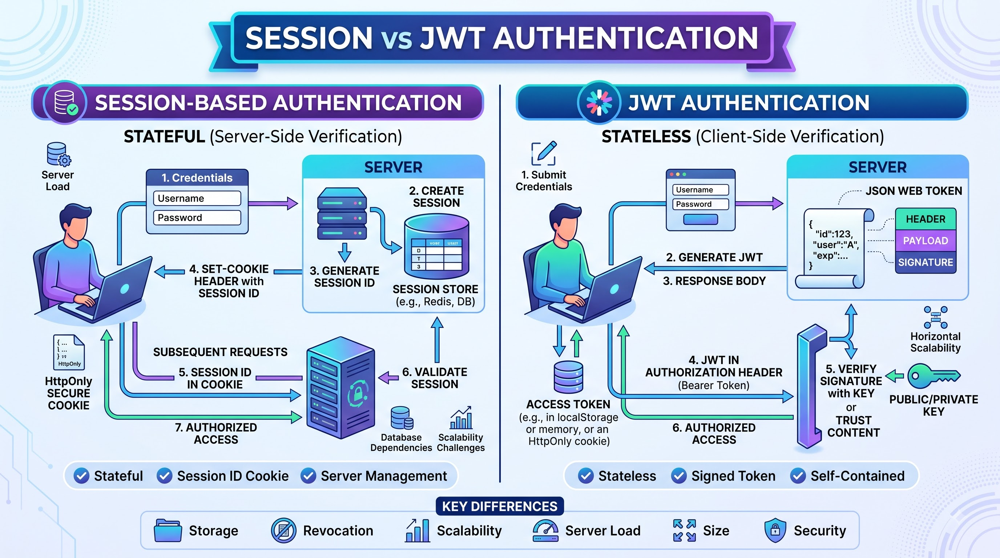

* **Session-Based Authentication**: A stateful model where the server verifies credentials, creates a session record in its database or Redis cache, and writes a unique, randomized **Session ID** cookie to the client.
* **Session Verification Loop**: On subsequent requests, the client transmits the Session ID cookie. The server's application instance must intercept this cookie, open a connection, and query the database/Redis cache to verify permissions.
* **JWT (JSON Web Token) Authentication**: A stateless model where the server verifies credentials, encodes user claims (e.g., User ID, roles, expiration time) into a JSON object, cryptographically signs it, and returns the token to the client.
* **Stateless Verification Loop**: On subsequent requests, the client transmits the JWT in the `Authorization: Bearer` header. The server decrypts and verifies the cryptographic signature locally using its public key, authorizing the request **without performing database lookups**.
* **Scale-Out Efficiency**: Sessions require a centralized cache (Redis) or sticky load-balancer routing to prevent auth checks from failing across horizontally scaled servers. JWTs enable stateless scaling; any microservice node can verify the signature independently.
* **Instant Revocation Capability**: Stateful sessions allow immediate revocation. Deleting a Session ID from Redis instantly logs out the user. JWTs cannot be natively revoked before their expiration time ($exp$) because they are self-contained and validated locally.
* **JWT Blocklist Strategy**: To force logouts or revoke compromised JWTs, systems maintain a temporary list of revoked tokens in a Redis cache with a TTL matching the token's expiration, checking this list during authorization.

---

## 📘 Lec-30: JWT Token Signature & Verification Mechanics

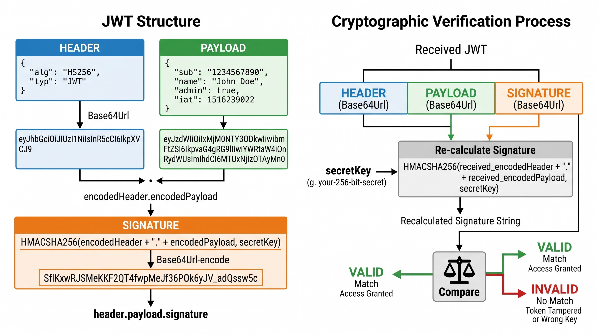

* **JSON Web Token (JWT)**: An open standard (RFC 7519) that defines a compact, URL-safe format for securely transmitting self-contained user claims between parties as a cryptographically signed JSON object.
* **Structure of a JWT**: A JWT consists of three distinct parts separated by dots (`.`): **Header**, **Payload**, and **Signature** ($Header.Payload.Signature$).
* **Base64URL Encoding**: The Header and Payload are simple JSON strings encoded in Base64URL. This is a reversible encoding format designed for safe transmission in HTTP headers—**it is not encryption**, and payloads can be decoded easily by anyone.
* **Header Contents**: Contains metadata specifying the token type (JWT) and the cryptographic hashing algorithm used to generate the signature (e.g., HMAC-SHA256 or RSA-256).
* **Payload Claims**: Contains the user claims—such as the user's ID (`sub`), roles, issue timestamp (`iat`), and the expiration timestamp (`exp`).
* **Signature Generation**: The server generates the signature by taking the Base64-encoded Header and Payload, combining them with a dot, and hashing them using its secret key and the algorithm specified in the header:
  $$	ext{Signature} = 	ext{HMAC-SHA256}(	ext{Base64}(Header) + "." + 	ext{Base64}(Payload), 	ext{Secret\_Key})$$
* **Cryptographic Integrity**: When a microservice receives the token, it recalculates the signature using the shared secret key or public key. If the calculated signature does not match the token's signature, the token has been tampered with, and the request is rejected.
* **Decoupled Verification Performance**: Because the signature can be verified locally using a public key, microservices can authorize requests in isolation, eliminating network hops and single points of failure.
* **Secret Key Security**: If an attacker gains access to the server's private secret key, they can forge valid signatures, generate administrative tokens, and bypass all platform security.

---

## 📘 Lec-32: Case Study: Tatkal Ticket Reservation System (IRCTC)

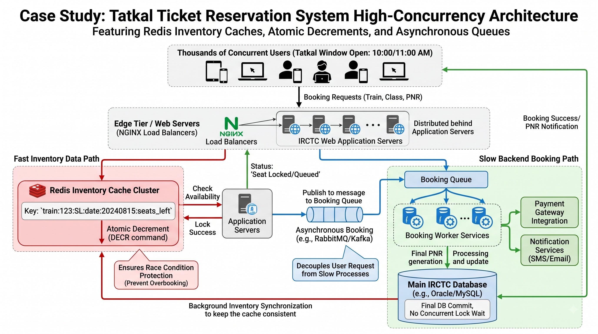

* **Key High-Concurrency Challenges**: At peak booking windows (e.g., 10 AM Tatkal hours), millions of users hit the system concurrently to book a limited pool of seats, which can exhaust database connection pools, create deadlock chains, and cause double bookings.
* **WAF and API Gateway Rate Limiting**: The system implements strict rate limiters at the API Gateway to drop automated script queries, bot sweeps, and repetitive form-submissions, ensuring only legitimate users enter the booking flow.
* **In-Memory Inventory Cache**: Active seat availability inventories are cached in Redis cluster rings. When a user queries train availability, the system performs sub-millisecond RAM lookups, completely insulating the primary SQL database.
* **Atomic Seat Decrements**: When a user attempts to lock a seat, the application server executes a **Lua Script** atomically in Redis. The script verifies seat availability and decrements the counter in Redis in a single atomic operation, preventing race conditions.
* **Asynchronous Order Queuing**: If the atomic Redis check confirms seat availability, the seat is temporarily locked, and the booking transaction is written to a highly durable **Message Queue** (e.g., Apache Kafka), returning a "Booking in Progress" status to the user in milliseconds.
* **Backend Transaction Processing**: Dedicated worker pools pull booking messages from the message queue sequentially. Workers open a database transaction, insert reservation records into MySQL/PostgreSQL, process payment gateway requests, and update the final booking status.
* **Row-Level Optimistic Locking**: Relational database tables use optimistic locking (`version` numbers) or pessimistic row-level locking (`SELECT FOR UPDATE`) to ensure that if any seat booking conflict arises on disk, the slower transaction is rejected.
* **Payment Rollback Loop**: If the payment gateway fails or a timeout occurs, a background coordinator service releases the Redis seat lock, increments the cached inventory counter, and returns the seat to the available pool.

---

## 📘 Lec-33: Case Study: Instagram Feed Generation & Media Scaling

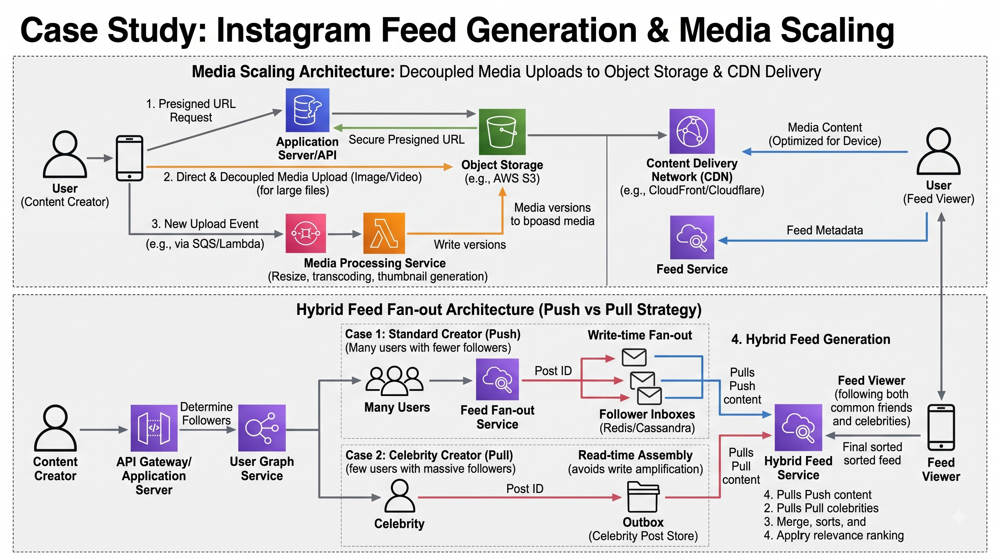

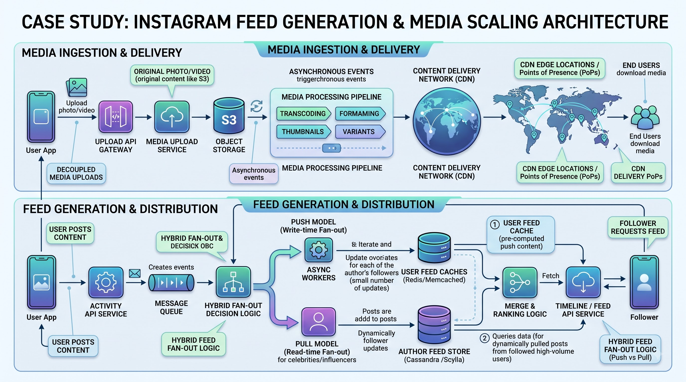

* **High-Write Social Media Scale**: Instagram handles massive media uploads and dynamic feed compilation for billions of users. Direct SQL joins on user follower tables during feed generation would cause database systems to fail under heavy read volume.
* **Decoupled Media Upload Path**: The client uploads a photo directly to an edge reverse proxy, which routes the binary file directly to **Object Storage (S3)**. This upload triggers background workers to transcode the video or compress the photo into multiple resolutions.
* **Dynamic Media Delivery (CDN)**: The transcode service registers the URLs of the resized media assets in a NoSQL Document database (MongoDB) and caches them globally across **CDN Edge PoPs** to ensure low-latency media delivery.
* **Social Graph Mapping**: User follow relationships are stored in a distributed NoSQL Graph database (Neo4j), which is optimized for constant-time neighbor pointer lookups.
* **Hybrid Feed Fan-Out (Push vs. Pull)**:
* **The Push Model (Fan-Out on Write)**: When a normal user uploads a post, background workers lookup their followers in Neo4j and inject the post ID directly into the pre-compiled Redis feed caches of all their followers, ensuring sub-100ms feed loading times.
* **The Pull Model (Fan-Out on Read)**: When a celebrity with 100M+ followers posts, pushing the post ID to 100 million follower caches would cause massive **write amplification** and exhaust server memory. Instead, the post is saved only to the celebrity's profile data store.
* **Hybrid Compilation**: When a follower refreshes their feed, the system pulls the pre-compiled posts from their Redis cache and merges them dynamically with recent posts pulled from the profiles of any celebrity accounts they follow.
* **Write-Back Counter Aggregation**: To prevent "like" surges on viral posts from locking database rows, like increments are written to high-speed write-back caches (Redis) and updated in primary SQL databases asynchronously in background batches.
