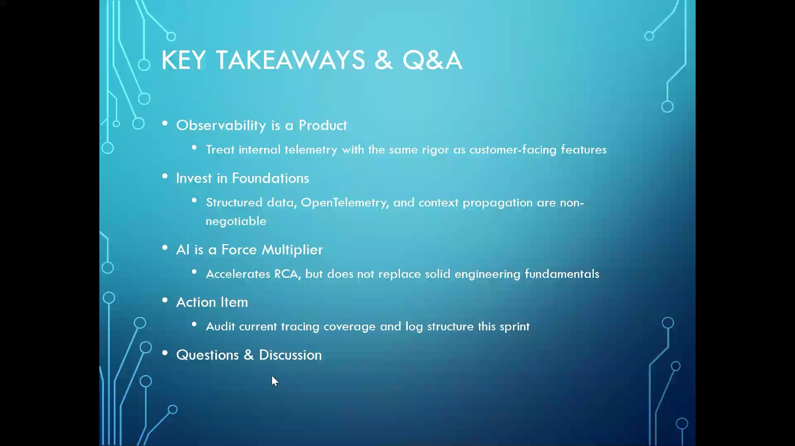

# Observability Fundamentals & AI-Assisted Root Cause Analysis - Meeting Recap

> **Generated by AI. Make sure to check for accuracy.**
Meeting notes:
Principles and Pitfalls of Observability: 
nishi led a comprehensive discussion on the fundamentals of observability, highlighting the limitations of traditional monitoring, the importance of structured logging, context propagation, high-throughput aggregation, and common pitfalls such as PII leakage, high cardinality, and unbounded logs, with input from AshishA and others.
	Observability Fundamentals: nishi explained that observability focuses on understanding failures in complex systems by analyzing external clues rather than relying solely on traditional monitoring, which is often insufficient for microservices and serverless architectures.
	Structured Logging and Context Propagation: nishi emphasized the need for structured logging using formats like JSON, including timestamps, user actions, and error details, and compared context propagation to luggage tracking, where unique identifiers help trace events across distributed systems.
	High-Throughput Aggregation Tools: nishi described tools such as OpenTelemetry Collector, Vector, and Fluent Bit, which aggregate large volumes of logs efficiently to prevent system crashes under heavy load, using the example of a banking app handling millions of events per second.
	Common Pitfalls in Observability: nishi outlined three major pitfalls: leaking personally identifiable information (PII), high cardinality (storing too many unique values like timestamps), and unbounded logs (logs growing uncontrollably), all of which can compromise security and system performance.
OpenTelemetry and Standardization: 
nishi discussed the role of OpenTelemetry as a universal standard for telemetry data, using analogies to global shipping labels, and explained its benefits for interoperability and future-proofing applications.
	OpenTelemetry as a Universal Translator: nishi explained that OpenTelemetry acts as a universal translator for telemetry data, enabling different software components to communicate using standardized formats, which simplifies integration and data analysis.
	Sampling Strategies: nishi described head-based, tail-based, and always-on sampling strategies for telemetry data, using the analogy of a security guard flipping a coin to decide which events to inspect, and highlighted the importance of capturing relevant traces for error and latency analysis.
	Benefits of Standardization: nishi highlighted that standardizing on OpenTelemetry allows organizations to switch tools or platforms without rewriting application code, as configuration changes can redirect data streams to new providers.
Distributed Tracing and Critical Path Analysis: 
nishi illustrated the importance of distributed tracing and critical path analysis in diagnosing performance bottlenecks, using real-world analogies such as food delivery and e-commerce checkout processes.
	Critical Path Analysis: nishi used the example of a delayed food order to explain how timeline charts and critical path analysis help identify bottlenecks in complex workflows, such as preparation, cooking, and delivery stages.
	Distributed Tracing in Practice: nishi emphasized that distributed tracing is essential for analyzing where delays occur in a system, allowing teams to pinpoint and address specific issues affecting performance.
Metrics, RED and USE Methods: 
nishi reviewed the RED (Rate, Errors, Duration) and USE (Utilization, Saturation, Errors) monitoring methods, clarifying their application to software services and hardware resources, and discussed solutions for high cardinality data.
	RED and USE Methods: nishi explained that RED focuses on monitoring service performance (rate of requests, error rates, and request duration), while USE targets hardware resources (utilization, saturation, and errors), helping teams monitor both software and hardware health.
	Handling High Cardinality: nishi suggested using specialized systems like VictoriaMetrics or ClickHouse to efficiently store and search high-cardinality data, which traditional databases struggle to manage.
Alerting, Reliability, and Observability Tooling: 
nishi addressed alert fatigue, the use of SLOs, SLIs, error budgets, and latency tracking, and compared open-source and commercial observability tools such as Grafana LGTM and Datadog.
	Combating Alert Fatigue: nishi discussed the importance of using SLOs, SLIs, and error budgets to reduce unnecessary alerts and focus on real emergencies, as well as tracking P99 and P99.9 latency for reliability.
	Observability Tooling Options: nishi compared open-source solutions like Grafana LGTM stack (Loki, Grafana, Tempo, Mimir) with commercial platforms like Datadog, noting that commercial tools offer cloud-hosted dashboards without the need to manage underlying databases.
AI-Assisted Log Correlation and Incident Analysis: 
nishi described how AI techniques, including NLP-based log parsing, anomaly detection, and intelligent clustering, can process massive log volumes during incidents, with support from a shared screen summarizing these methods.
	Needle in a Haystack Problem: nishi presented the challenge of identifying critical errors within hundreds of thousands of log lines generated during incidents, where most entries are noise and only a few are actionable.
	AI Techniques for Log Processing: nishi explained that AI uses NLP and templating algorithms (such as Drain and Spell) to parse logs, identify patterns, and group similar log entries, making it easier to detect the root cause of incidents.
	Anomaly Detection and Clustering: nishi described how AI detects anomalies by comparing current log patterns to historical data, flags unusual spikes, and clusters related logs to provide concise, actionable alerts linked to specific deployments or configuration changes.
    
Root Cause Analysis and LLMs in Observability: 
nishi walked through a scenario involving a streaming application outage, demonstrating how AI and LLMs assist in root cause analysis by mapping service dependencies, correlating signals, and automating incident summaries, with input from Amit and Abhijeet.
	Service Dependency Mapping: nishi explained how AI uses topology maps to trace errors through microservice chains, identifying the root cause of failures by following dependencies backward from the point of failure.
	Correlation Across Signals: nishi described how AI correlates metrics, traces, and events to build a chronological narrative of incidents, linking spikes in errors to slow database queries and recent configuration changes.
	LLM-Assisted Querying and Summarization: nishi illustrated how LLMs allow engineers to use natural language queries to investigate incidents, automatically generate incident summaries, and produce runbooks for remediation, while cautioning about the risks of auto-execution and the need for human oversight.
Building a Secure AI-Ready Data Foundation: 
nishi outlined best practices for designing AI-ready observability systems in high-volume environments like banking, emphasizing data quality, standardization, historical data storage, and privacy safeguards.
	Data Quality and Structure: nishi stressed the importance of enforcing strict schema layouts (e.g., JSON) for logs to ensure AI engines can accurately interpret and analyze system data.
	Standardization and Future-Proofing: nishi recommended building systems around open standards like OpenTelemetry to facilitate easy integration with new AI platforms and avoid costly code rewrites.
	Historical Data and Efficient Storage: nishi advised streaming telemetry data to low-cost cloud storage and using high-performance databases (e.g., ClickHouse, Snowflake) for machine learning workloads, enabling long-term trend analysis without impacting production systems.
	Privacy and Security Measures: nishi highlighted the necessity of automated PII scrubbing before data leaves the server environment, using middleware and security proxies to anonymize sensitive information and comply with privacy regulations.
Follow-up tasks:
Hands-On Observability Session: 
Prepare and deliver the hands-on observability session that was postponed due to Nishi's health, ensuring coverage of practical aspects discussed. (nishi)

--------------------------------------------------------
SUMMARY

Day 8 Summary – Python Intermediate Training

Trainer: Swayamprakash Parida
 Organizer: Chitra Dsouza
 Duration: 3 hours (you attended approximately 131 minutes).

Topics Covered
1. Python Multiple Assignment

The session started with Python's unique multiple-assignment capability.

Examples discussed:

a = b = c = 10


and

x, y, z = 5, 6, "LTIM"


Key learning:

Multiple variables can be assigned in a single statement.
Variables can hold different data types simultaneously.
This feature is more concise than many other programming languages.
2. Variable Swapping Techniques

A major hands-on exercise was swapping two variables.

Method 1 – Pythonic Swap
x, y = y, x


Trainer explained:

Values are evaluated from right to left.
No temporary variable required.
Unique Python feature.
Method 2 – Arithmetic Swap
x = x + y
y = x - y
x = x - y


Benefits:

Works in many programming languages.
No temporary variable needed.
Method 3 – Temporary Variable
temp = x
x = y
y = temp


Most traditional and easiest-to-understand approach.

3. User Input and Data Type Conversion

The trainer reinforced usage of:

input()


and

int(input())


Topics covered:

Accepting user input
Converting string input to integers
Handling multiple values entered by users
4. Assignment Operators

The session reviewed assignment concepts:

a = 10


and compound assignment behaviour.

Emphasis:

Right-side expression is evaluated first.
Result gets assigned to left-side variables.
5. Comparison Operators

Comprehensive discussion on Boolean comparisons.

Operators covered:

==
!=
>
<
>=
<=


Example:

a = 5
b = 8

a > b
a == b
a != b


Key takeaway:

Every comparison returns either:
True


or

False
``` 【1-5b4560】

## 6. Logical Operators

Three logical operators were introduced.

### AND

```python
and


Rule:

All expressions must be True.
OR
or


Rule:

At least one expression must be True.
NOT
not


Rule:

Reverses Boolean value.

Truth-table style explanations were provided using examples.

7. Boolean Logic and Expressions

The trainer explained how logical operators combine comparison expressions.

Example:

a > b and a > c


Used to build decision-making logic within programs.

8. Conditional Statements (Very Important Topic)

The second half of the session introduced decision making in Python.

IF Statement

Example:

if a > b:
    print("A is greater")


Concepts covered:

Condition evaluation
Boolean result
Indentation-based block execution
Flow of control
Python Indentation

Important Python-specific concept discussed.

Example:

if a > b:
    print("inside if")


Key points:

Python does not use {} braces.
Indentation defines scope.
Incorrect indentation generates syntax errors.
IF-ELSE Statement

Example:

if age > 18:
    print("Eligible")
else:
    print("Not Eligible")


Explained:

One path executes when condition is True.
Alternative path executes when condition is False.
ELIF Statement

The trainer introduced:

if
elif
else


Purpose:

Handle multiple conditions.
Prevent writing many nested IF statements.

Example logic:

if b > a:
    print("B greater")
elif a == b:
    print("Equal")
else:
    print("A greater")


Flow-control diagrams and practical examples were discussed.

Hands-On Exercises Given
Exercise 1

Swap two numbers entered by a user.

10 -> 20
20 -> 10


using multiple approaches.

Exercise 2

Find which number is greater.

x
y


using comparison operators.

Exercise 3

Voting Eligibility Program

Requirement:

Take age from user.


If age > 18:

Eligible for vote


Else:

Not eligible for vote


Used to explain if-else implementation.

Important Interview-Relevant Concepts from Day 8
Multiple Assignment in Python
Swapping variables without a temporary variable
User input and type conversion
Assignment operators
Comparison operators
Boolean values (True/False)
Logical operators (and, or, not)
Python indentation rules
if, if-else, and if-elif-else
Control flow and decision making
Likely Day 9 Continuation

At the end of the visible transcript, the trainer explicitly mentioned that List, Tuple, Set, and Dictionary data types would be covered later/tomorrow, indicating Day 9 likely moves into Python collections and advanced data structures.

------------------------------------------

Mental Model: Python Decision Engine

Think of a Python program as a smart security guard standing at a gate.

Every program follows this flow:

INPUT
  ↓
STORE DATA
  ↓
COMPARE
  ↓
DECIDE
  ↓
TAKE ACTION


Everything you learned on Day 8 fits into this model.

1. Variables = Containers

A variable is simply a labelled box.

age = 25
name = "Ashish"


Mental model:

Box "age"  → 25
Box "name" → Ashish


The program remembers information using these boxes.

2. Input = Asking Questions
age = int(input("Enter age: "))


Mental model:

Human → Program


The program knows nothing until somebody provides information.

Example:

Enter age: 22


Now:

age = 22

3. Comparison Operators = Asking Questions

Comparison operators always ask:

TRUE or FALSE ?


Example:

age > 18


Mental model:

Is age greater than 18?


Possible answers:

True


or

False


Think of comparison operators as question machines.

Expression	Questiona > b	Is A greater than B?
a < b	Is A smaller than B?
a == b	Are they equal?
a != b	Are they different?
4. Logical Operators = Combining Questions

Suppose a loan system says:

Age > 18
AND
Salary > 30000


Both must be true.

age > 18 and salary > 30000


Mental model:

Question 1 ✅
Question 2 ✅
        ↓
Approved

AND

All conditions true.

True AND True = True

OR

At least one condition true.

is_employee or is_customer


Mental model:

Employee?  ❌
Customer?  ✅

Access Granted

NOT

Reverses the answer.

not True


becomes

False


Mental model:

YES → NO
NO  → YES

5. IF Statement = Single Decision Gate
if age > 18:
    print("Eligible")


Mental model:

        Age > 18 ?
             │
         True│
             ▼
       Eligible


Only acts when condition is true.

6. IF-ELSE = Two Roads
if age > 18:
    print("Eligible")
else:
    print("Not Eligible")


Mental model:

        Age > 18 ?
        /       \
     Yes         No
      |           |
 Eligible   Not Eligible


This is the first real decision-making mechanism in programming.

7. ELIF = Multiple Doors

Example:

marks = 80

if marks >= 90:
    print("A")
elif marks >= 75:
    print("B")
elif marks >= 50:
    print("C")
else:
    print("Fail")


Mental model:

          Marks
             │
      ≥90 ?  ──► A
             │No
      ≥75 ?  ──► B
             │No
      ≥50 ?  ──► C
             │No
             ▼
           Fail


The program checks conditions from top to bottom.

8. Swapping Variables = Exchanging Boxes

Before:

x = 10
y = 20


Python swap:

x, y = y, x


After:

x = 20
y = 10


Mental model:

Box A ↔ Box B


Python performs this elegantly without needing a temporary box.

9. Indentation = Defining Ownership

Unlike Java:

if(age>18){
   System.out.println("Eligible");
}


Python uses spaces.

if age > 18:
    print("Eligible")


Mental model:

IF owns every indented line below it.


Example:

if age > 18:
    print("Eligible")
    print("Can Vote")


Both belong to the IF block.

Ultimate Day 8 Mental Model

Everything learned on Day 8 can be reduced to:

Take Input
      ↓
Store in Variables
      ↓
Ask Questions (Comparisons)
      ↓
Combine Questions (and/or/not)
      ↓
Make Decisions (if/elif/else)
      ↓
Execute Action

Real World Example

Voting Eligibility

age = int(input("Enter age: "))

if age >= 18:
    print("Can Vote")
else:
    print("Cannot Vote")


Mental flow:

User enters age
      ↓
Program stores age
      ↓
Checks age >= 18
      ↓
TRUE/FALSE
      ↓
Chooses path
      ↓
Displays result

