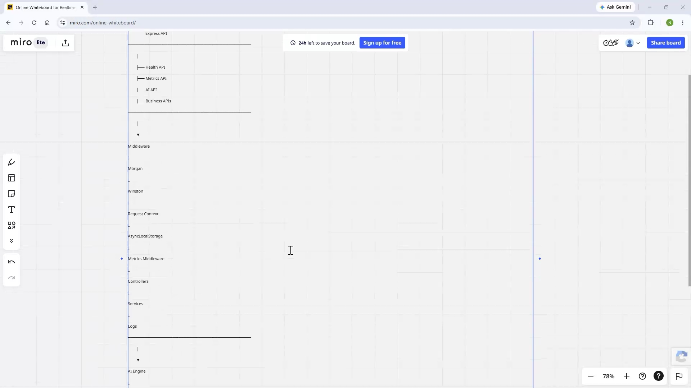
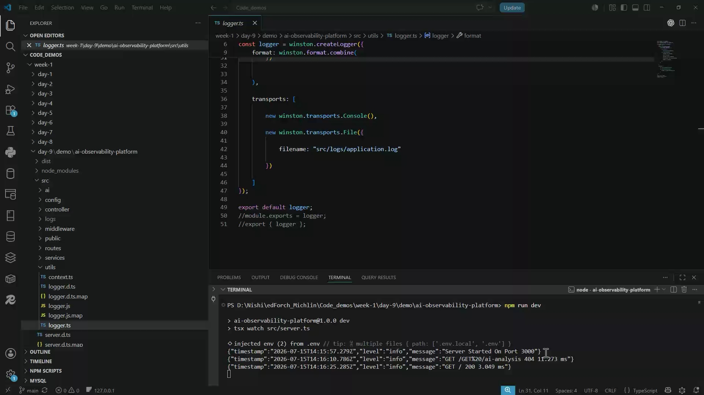
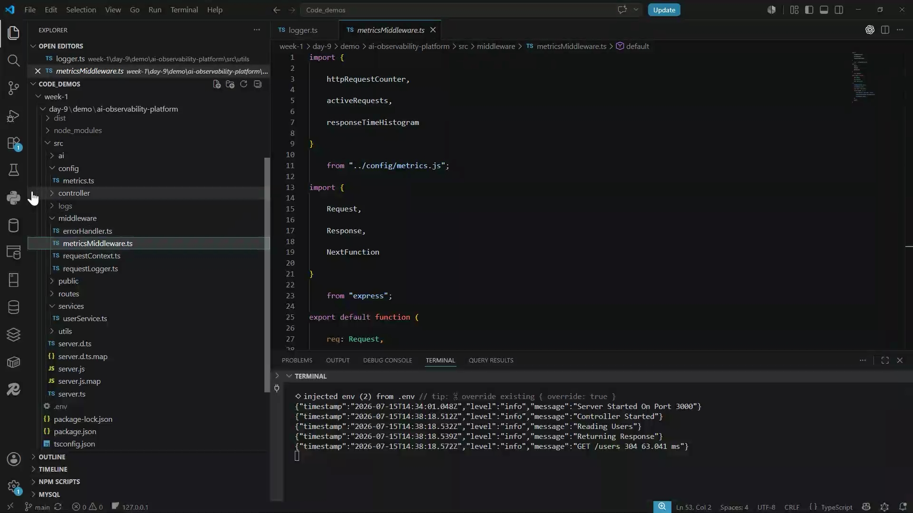
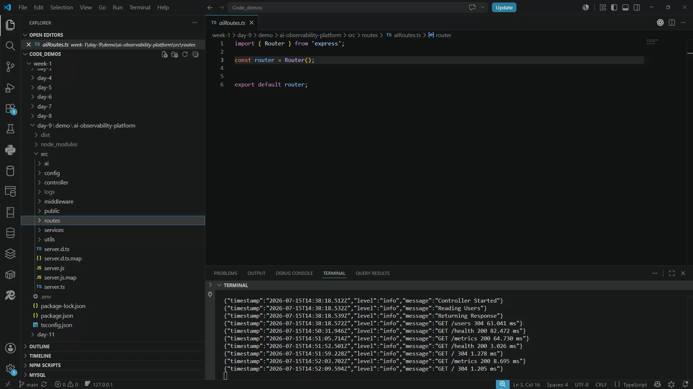

Generated by AI. Make sure to check for accuracy.
Meeting notes:
Overview and Architecture of AI Observability Platform: 
nishi provided an in-depth walkthrough of the AI observability platform project, explaining its architecture, core components, and the phased approach to building features such as logging, tracing, metrics, health checks, and AI-assisted analysis, with input and clarifying questions from Abhijeet and AshishA.
	Project Introduction and Scope: nishi introduced the observability platform project, highlighting that it is inspired by ELK stack and Datadog, implemented in Node.js and TypeScript, and designed to help engineers detect, investigate, and resolve issues using AI-assisted analysis. The project is available on GitHub, with the HTML dashboard still under development.
	System Architecture and Flow: nishi described the system architecture, where users interact via a web browser, requests are handled by an Express API, and an observability layer manages logging, tracing, metrics, health checks, and analysis. The architecture includes middleware for logging (Morgan, Winston), request context, and an AI engine for log analysis and recommendations, all visualized on a dashboard.
	Phased Development Approach: The project is structured into phases: Phase 1 covers Express server setup and folder structure; Phase 2 adds logging; Phase 3 introduces tracing; Phase 4 implements metrics; Phase 5 integrates the AI engine for root cause analysis; and Phase 6 aims to complete the dashboard for unified monitoring.
	Core Features and Capabilities: Key features include structured logging, request tracing, health endpoints, metrics collection, and AI-assisted root cause analysis. The platform is designed to answer operational questions such as system health, error frequency, affected requests, and root causes, all accessible via a central dashboard.
    
Implementation of Logging, Error Handling, and Tracing: 
nishi detailed the implementation of logging using Winston and Morgan, the setup of error handling middleware, and the introduction of request and correlation IDs for distributed tracing, with Abhijeet contributing to the discussion on logging libraries.
	Logging Setup with Winston and Morgan: nishi explained the use of Winston for application and error logging, and Morgan for HTTP request logging. The logger writes logs to both the console and files (application.log and error.log), with log levels and formats configured for clarity.
	Error Handling Middleware: An error handler middleware was implemented to capture errors and write them to error.log, preventing application crashes from exposing sensitive information. nishi noted an issue where error logs were not being captured as expected and assigned this as a task for participants to resolve.
	Request and Correlation ID Management: To support distributed tracing, nishi introduced middleware that generates unique request IDs and correlation IDs using async local storage. This enables tracking of individual requests and their propagation across services, facilitating easier debugging and end-to-end traceability.
	Log Structure and Traceability: Logs are enriched with request and correlation IDs, timestamps, and messages, making it possible to trace the flow of a single request through the system and across services. nishi clarified the distinction between request IDs (unique per service) and correlation IDs (consistent across services for a transaction).
    
Metrics, Health Checks, and Monitoring Endpoints: 
nishi described the integration of metrics collection using the prom-client library, the implementation of health and metrics endpoints, and the use of middleware to track application performance and resource usage.
	Metrics Collection with prom-client: The prom-client library was used to expose application metrics in a format compatible with monitoring systems. Metrics include request counts, errors, logins, orders, memory usage, CPU usage, and active requests, all tracked via a dedicated middleware.
	Health and Metrics Endpoints: Health and metrics endpoints were added to the application, providing real-time status, uptime, memory usage, Node.js version, and other operational data. These endpoints facilitate monitoring and can be scraped by external systems for alerting and visualization.
	Monitoring Layer and Future Integration: The monitoring layer is designed to work locally but is structured to allow future integration with external dashboards and monitoring tools. The endpoints and metrics provide a foundation for comprehensive observability.
    
AI-Assisted Log Analysis and Root Cause Engine: 
nishi outlined the design and planned implementation of a rule-based AI engine for log analysis, including components for log reading, parsing, correlation, pattern detection, classification, and root cause analysis, with a dedicated API endpoint for AI analysis.
	AI Engine Architecture: The AI engine consists of several modules: log reader (reads log files), log parser (converts logs to objects), correlation engine (groups logs by request), pattern detector (identifies repeated messages), classifier (categorizes errors), and root cause engine (summarizes issues and recommendations).
	AI Analysis API Endpoint: An API endpoint for AI analysis is planned, which will process logs, detect patterns, classify errors, and provide root cause summaries in JSON format. The endpoint is not yet functional as the AI modules are still under development.
	Planned Output and Dashboard Integration: The AI analysis will output summaries, patterns, classifications, and root causes, intended for display on the dashboard. The system is designed to provide actionable insights and recommendations for operational issues.
    
Dashboard Development and User Interface Plans: 
nishi discussed the ongoing development of the dashboard interface, which will display system health, metrics, AI analysis results, and support auto-refresh, with plans to complete the HTML and styling components.
	Dashboard Features and Data Display: The dashboard will present total requests, errors, memory and CPU usage, health status, and AI root cause summaries. It will auto-refresh every five seconds and include charts for response times, errors, and AI recommendations.
	Implementation Status and Next Steps: The HTML and JavaScript for the dashboard are partially complete, with styling and some interactive features pending. nishi plans to finish the interface and update the project on GitHub.
Introduction to Agent Loop Engineering Fundamentals: 
nishi introduced the concept of agent loop engineering, outlining its four core phases (perceive, reason, act, evaluate) and its relevance for building autonomous AI agents, with plans to cover this topic in detail in the next session.
	Agent Loop Phases and Principles: The agent loop consists of perceiving input, reasoning with memory and prompts, acting via code or API calls, and evaluating results to determine if the goal is met or if the loop should continue. nishi emphasized the importance of token management, deterministic tool execution, and convergence limits in agent loop design.
	Planned Discussion and Requirements: nishi plans to demonstrate agent loop engineering in the next session, contingent on participants having access to an LLM. The topic will include practical applications and design considerations for AI-enabled systems.
Capstone Project Assignment and Training Wrap-Up: 
nishi announced the capstone project requirement for the end of the training, explaining that a template will be provided on GitHub and participants will need to showcase their applications and answer knowledge questions.
	Capstone Project Instructions: Participants are required to complete a capstone project, with a synopsis or template to be uploaded to GitHub. The project must be showcased on the last day of training, and nishi will assess participants' understanding through questions.
	Participation and Interaction Encouraged: nishi encouraged active participation in sessions and reminded everyone to prepare for the capstone, as it is a mandatory part of the training.
Follow-up tasks:
Error Log Collection Correction: 
Update the project so that error logs are correctly collected in a separate error.log file, distinct from application logs, to facilitate easier debugging. (the team)
Capstone Project Preparation: 
Prepare a capstone project based on the template that will be uploaded to the GitHub account and be ready to showcase it at the end of the training. (the team)
Capstone Project Template Upload: 
Upload the capstone project synopsis or template to the GitHub account under the Capstone folder for participants to access. (nishi)


-------------------------------------
SUMMARY

# Meeting Summary – AI Observability Platform & Agent Loop Engineering

**Presenter:** Nishi  
**Topic:** Day 9 training session covering an AI-enabled observability platform in Node.js/TypeScript and an introduction to Agent Loop Engineering.

## Key Topics Covered

### 1. AI Observability Platform Demo

Nishi demonstrated an enterprise-style observability platform built using:

* Node.js
* TypeScript
* Express
* Winston
* Morgan
* AsyncLocalStorage
* Metrics collection
* Rule-based AI analysis engine

The goal of the project is to help engineers understand application behaviour through:

* Logs
* Metrics
* Tracing
* Health checks
* AI-assisted root cause analysis

The presenter compared observability to a car dashboard: rather than opening the engine every time, engineers use indicators to understand application health.

### 2. Architecture Explained

The demonstrated architecture included:

* Browser/client layer
* Express API
* Observability layer
  * Request logging
  * Structured logging
  * Tracing
  * Metrics
  * Health checks
* AI analysis engine
* Dashboard layer

The platform is intended to answer:

* What happened?
* How often did it happen?
* Which request was affected?
* Why did it happen?
* Is the application healthy?

### 3. Logging Implementation

The session covered:

* Winston-based logging
* Application logs
* Error logs
* Morgan request logging
* Centralised error handling

Important assignment given by Nishi:

* Fix the implementation so that `error.log` captures errors correctly and separately from normal application logs.

### 4. Request ID vs Correlation ID

A detailed discussion focused on distributed tracing.

**Request ID**

* Generated within a service
* Tracks a request inside that service

**Correlation ID**

* Remains constant across multiple services
* Used to trace a business transaction end-to-end

Example discussed:

* User Service → Request ID 101
* Payment Service → Request ID 102
* Notification Service → Request ID 103
* Same Correlation ID shared across all services

Nishi explained that this enables tools such as Jaeger, Zipkin and OpenTelemetry to reconstruct full request flows across distributed systems.

### 5. AsyncLocalStorage

The trainer introduced AsyncLocalStorage for carrying request-specific context through asynchronous execution.

Use cases:

* Store Request ID
* Store Correlation ID
* Automatically enrich logs with tracing information

This enables easier debugging in applications serving many concurrent users.

### 6. Monitoring & Metrics

The project includes:

**Metrics Collection**

* Request counts
* Error counts
* Active requests
* Response times

**Health Endpoint**
Returns:

* Status
* Uptime
* Memory usage
* Node version
* Timestamp

A Prometheus-compatible metrics endpoint was also demonstrated using the `prom-client` package.

### 7. Rule-Based AI Engine Design

The trainer introduced an AI analysis pipeline that will eventually analyse application logs.

Components described:

* Log Reader
* Log Parser
* Correlation Engine
* Pattern Detector
* Classifier
* Root Cause Engine
* AI Controller
* AI Routes

Expected AI outputs:

* Request summaries
* Pattern detection
* Error classification
* Root cause analysis
* Recommendations

Examples:

* "Database timeout"
* "Unauthorized"
* "File not found"

would be categorised and analysed automatically.

### 8. Dashboard (Work in Progress)

Nishi mentioned the dashboard is only partially completed.

Planned dashboard features:

* System health
* Total requests
* Active requests
* Memory usage
* CPU usage
* AI root-cause recommendations
* Response-time charts
* Error charts
* Auto-refresh every 5 seconds
* Live monitoring view

The HTML/CSS/JavaScript layer is still under development.

### 9. Agent Loop Engineering Fundamentals (Preview)

Introduction to autonomous AI agent design.

Four core phases:

1. **Perceive**
   * Input
   * Context

2. **Reason**
   * Memory
   * System prompts

3. **Act**
   * Code execution
   * API calls

4. **Evaluate**
   * Check results
   * Continue loop or stop

Nishi used an air-conditioner/thermostat analogy to explain how agents:

* Observe state
* Decide action
* Execute
* Verify outcome
* Repeat until goal completion

This topic will continue in the next session.

## Action Items

### For All Participants

* Clone and review the Day 9 observability project once GitHub updates are complete.
* Fix the error logging task (`error.log` separation).
* Prepare for a mandatory capstone project.
* Check Nishi's GitHub for the capstone template/synopsis.
* Be ready to showcase the project on the final training day.

### Your Participation

* You confirmed the whiteboard visibility during the demo.
* You asked about the missing Day‑9 project in the GitHub repository during the meeting chat.
* At the end of the session, you asked whether the assignment could be shared in chat. Nishi replied that the capstone template would instead be uploaded to the GitHub repository because it was too large to paste into the Teams chat.

### Relevant Meeting Chat Items

* GitHub repository shared by Nishi.
* Microsoft Forms link shared by Nishi for participants to complete.

\[SHAREDSCREEN:6]

\[SHAREDSCREEN:7]


-----------------------------------------------

# 🚗 AI-Powered Car Dashboard for Software Systems

Imagine you're driving a car.

You don't open the engine every minute to check if it's healthy.

Instead you rely on:

* Speedometer → Performance
* Fuel Gauge → Resource Usage
* Engine Warning Light → Errors
* GPS Route → Request Tracing
* Mechanic Diagnosis → AI Root Cause Analysis

That's exactly what this project is building.

# Level 1: Observability = "See Inside Without Opening"

```
Application
    |
    v
Logs + Metrics + Traces + Health
    |
    v
Observability
```

The application is a black box.

Observability creates windows into that box.

### 3 Pillars

```
Logs     -> What happened?
Metrics  -> How much / how often?
Traces   -> Where did the request travel?
```

Examples:

| Pillar | Example                                               |
| ------ | ----------------------------------------------------- |
| Log    | User login failed                                     |
| Metric | 200 requests/sec                                      |
| Trace  | User Service → Payment Service → Notification Service |

This is the foundation of the entire project.

# Level 2: Request Journey

Think of a user request as a parcel.

```
User
 |
 v
API
 |
 v
Business Logic
 |
 v
Database
 |
 v
Response
```

During the journey:

* Logs are written
* Metrics are collected
* Traces are generated

The platform captures everything happening along the path.

# Level 3: Request ID vs Correlation ID

This is the most important interview concept from the session.

## Mental Model

### Request ID = Aadhaar inside one service

```
User Service
Request ID = R1001
```

Helps track activity **inside** one service.

### Correlation ID = Parcel Tracking Number

```
Correlation ID = ABC123

User Service           -> ABC123
Payment Service        -> ABC123
Notification Service   -> ABC123
```

Every service gets its own Request ID but keeps the same Correlation ID.

Think:

```
Request ID
    = local tracking

Correlation ID
    = end-to-end tracking
```

# Level 4: AsyncLocalStorage

Think of it as a backpack carried by every request.

```
Request
   |
   +--> Backpack
          |
          +--> Request ID
          +--> Correlation ID
```

Whenever any code executes:

```typescript
logger.info(...)
```

it can automatically access that backpack.

No need to pass IDs everywhere.

# Level 5: Logging Layer

The logger is the CCTV camera.

```
User Action
     |
     v
 Logger
     |
     +--> application.log
     |
     +--> error.log
```

Application log:

```
Server Started
User Created
Request Processed
```

Error log:

```
Database Down
401 Unauthorized
Timeout
```

The assignment given was to correctly separate and capture errors in `error.log`.

# Level 6: Metrics Layer

Think of a hospital monitor.

```
Heart Rate
Blood Pressure
Temperature
```

For applications:

```
Requests
Errors
Memory Usage
Response Time
CPU Usage
```

Metrics answer:

```
"How healthy is the application?"
```

not

```
"Why did it fail?"
```

That's the key difference from logs.

# Level 7: Health Endpoint

Health endpoint acts like a quick medical check-up.

```
GET /health
```

Returns:

* Status
* Uptime
* Memory
* Node Version
* Timestamp

If health is UP:

✅ Application alive

If DOWN:

❌ Something is wrong.

# Level 8: AI Engine Mental Model

The entire AI section can be remembered like this:

## AI Detective

The AI behaves like a detective investigating logs.

```
Step 1 -> Read Logs
Step 2 -> Understand Logs
Step 3 -> Group Related Logs
Step 4 -> Find Patterns
Step 5 -> Classify Errors
Step 6 -> Give Root Cause
Step 7 -> Suggest Fix
```

Architecture:

```
Log Reader
    |
    v
Log Parser
    |
    v
Correlation Engine
    |
    v
Pattern Detector
    |
    v
Classifier
    |
    v
Root Cause Engine
```


# Level 9: Error Classification

Think of a doctor assigning diseases.

```
JWT Expired
    ->
Authentication Problem

Database Timeout
    ->
Database Problem

File Not Found
    ->
Storage Problem
```

The classifier converts raw errors into meaningful categories.

# Level 10: Dashboard

The dashboard is the control room.

```
Logs
Metrics
Health
AI Analysis
```

all arrive in one location.

```
                 Dashboard
                      |

    |         |          |          |
 Health    Metrics     Logs      AI
```

Goal:

"No need to inspect every service manually."

# Level 11: Agent Loop Engineering

Very important for tomorrow's topic.

### Mental Model = Smart Thermostat

```
Check Room Temperature
        |
        v
Need Cooling?
        |
        v
Turn AC On
        |
        v
Check Again
```

Repeat until goal achieved.

AI agents work similarly:

```
Perceive
    |
Reason
    |
Act
    |
Evaluate
    |
Repeat
```

This is the complete Agent Loop.

# 30-Second Interview Summary

> "The project demonstrates an AI-enabled observability platform built with Node.js and TypeScript. It combines structured logging (Winston), request tracing (Request ID and Correlation ID using AsyncLocalStorage), metrics monitoring, health checks, and a rule-based AI engine. The AI engine reads logs, correlates requests, detects patterns, classifies errors, and generates root-cause recommendations. A dashboard aggregates health, metrics, logs, and AI insights into a single operational view."

This single mental model is enough to remember **the entire Day‑9 training flow**:
